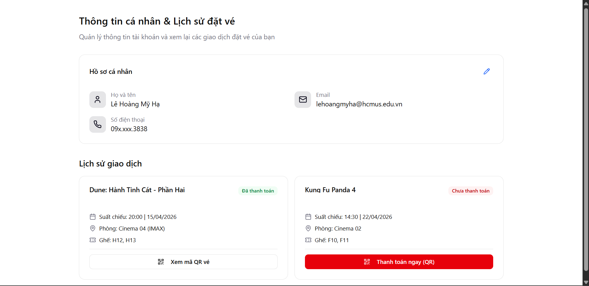
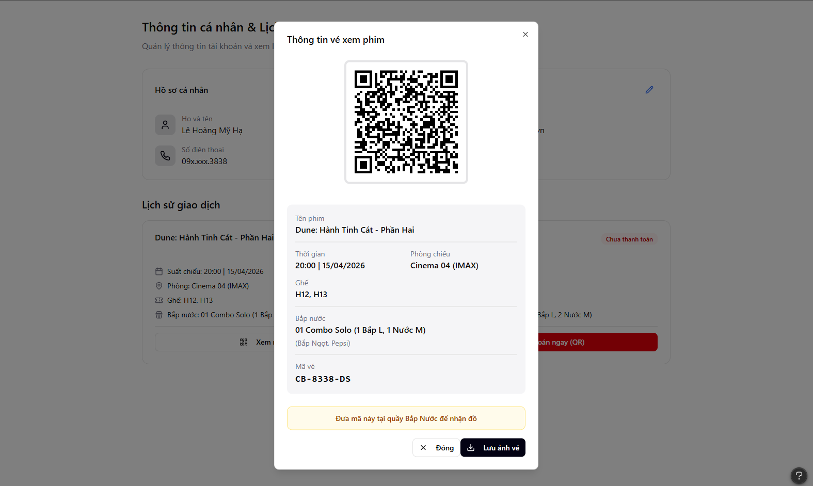
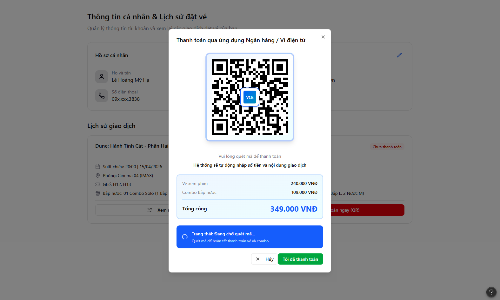
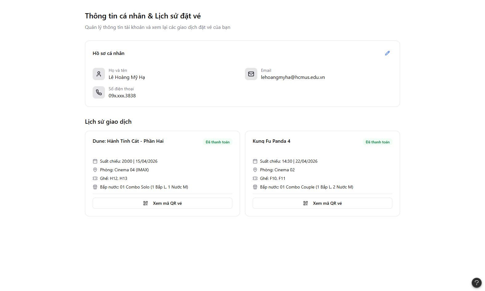
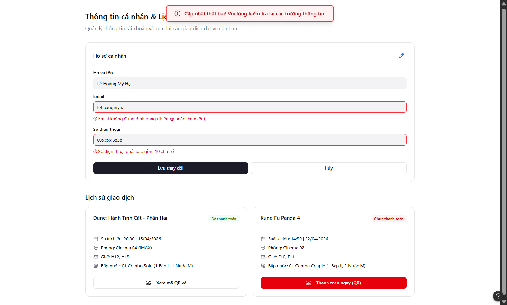
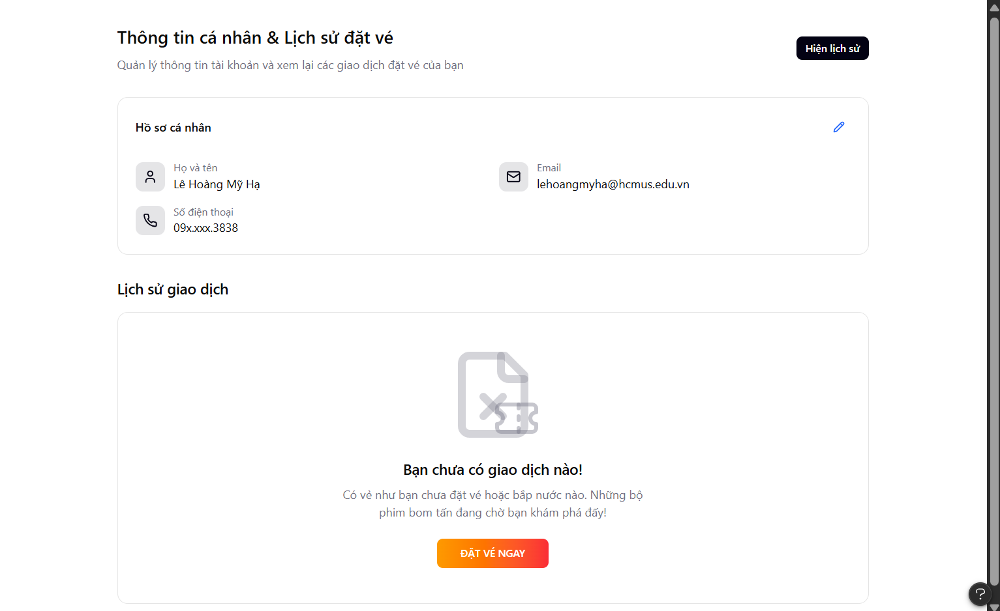

# Project Proposal

## Table of Contents
1. [Member Contribution Assessment](#member-contribution-assessment)
2. [Problem Statementt](#problem-statement)
3. [Requirements Overview](#3-proposed-solution)
4. [Requirements Analysis](#4-requirements-analysis)
5. [AI Usage Declaration](#5-ai-usage-declaration)
6. [Presentation](#6-presentation)
7. [Reflective Report](#7-reflective-report)

---

## 1. Member Contribution Assessment

**23120038 - Lê Hoàng Mỹ Hạ - Contribution (100%)**

**23120047 - Nguyễn Gia Huy - Contribution (100%)**

**23120049 - Nguyễn Thanh Huyền - Contribution (100%)**

**23120060 - Trần Kim Ngân - Contribution (100%)**

## 2. Problem Statement
> Written by:  
Reviewed by:

## 3. Requirements Overview

### 3.1 Stakeholders
> Written by:  
Reviewed by:

### 3.2 Requirements
#### 3.2.1 Functional Requirements Specification
> Written by:  
Reviewed by:

#### 3.2.2 Non-Functional Requirements Specification
> Written by:  
Reviewed by:

## 4. Requirements Analysis
### 4.1 Use Case Model
> Written by:  
Reviewed by:

### 4.2 Use Case Specification

#### 4.2.1 User Authentication
> Written by:  
Reviewed by:

#### 4.2.2 Movie Browsing and Search
> Written by:  
Reviewed by:

#### 4.2.3 Seat Selection and Booking
> Written by:  
Reviewed by:

#### 4.2.4 Online Payment Processing
> Written by:  
Reviewed by:

#### 4.2.5 Profile and Booking History Management
> Written by: Lê Hoàng Mỹ Hạ  
Reviewed by:  

---

**1. Đặc tả Use Case**

| Mục                            | Nội dung                                                                                                                                                                                                                                                                                                                                                                                    |
| :----------------------------- | :------------------------------------------------------------------------------------------------------------------------------------------------------------------------------------------------------------------------------------------------------------------------------------------------------------------------------------------------------------------------------------------ |
| **Use case ID**                | UC005                                                                                                                                                                                                                                                                                                                                                                                       |
| **Use Case**                   | Quản lý thông tin cá nhân và lịch sử đặt vé                                                                                                                                                                                                                                                                                                                                                 |
| **Brief Description**          | Cho phép người dùng xem, chỉnh sửa thông tin cá nhân, tra cứu lịch sử đặt vé/bắp nước và thực hiện thanh toán các giao dịch chưa hoàn tất.                                                                                                                                                                                                                                                  |
| **Actor**                      | Người dùng (User)                                                                                                                                                                                                                                                                                                                                                                           |
| **Pre-Condition**              | Người dùng đã đăng nhập thành công vào hệ thống.                                                                                                                                                                                                                                                                                                                                            |
| **Result**                     | Thông tin cá nhân được cập nhật hoặc thông tin chi tiết vé/mã thanh toán được hiển thị.                                                                                                                                                                                                                                                                                                     |
| **Main Scenario**              | 1. Người dùng chọn mục **"Tài khoản của tôi"**. 2. Hệ thống hiển thị hồ sơ cá nhân và danh sách lịch sử giao dịch (phim, suất chiếu, ghế, bắp nước). 3. Vé đã thanh toán: nhấn **"Xem mã QR"** để nhận diện tại rạp. 4. Vé chưa thanh toán: nhấn **"Thanh toán ngay (QR)"** để hiển thị mã VietQR. 5. Người dùng chỉnh sửa thông tin bằng biểu tượng **bút** và nhấn **"Lưu"**. |
| **Alternative Scenarios**      | **A1. Thông tin không hợp lệ:** Nếu email/số điện thoại sai định dạng, hệ thống hiển thị viền đỏ và thông báo lỗi. **A2. Lịch sử trống:** Nếu chưa có giao dịch, hệ thống hiển thị màn hình trống và nút **"Đặt vé ngay"**.                                                                                                                                                              |
| **Non-Functional Constraints** | - Thời gian truy xuất dữ liệu < 2 giây. - Tích hợp thanh toán VietQR. - Mật khẩu được mã hóa bằng bcrypt trước khi lưu trữ.                                                                                                                                                                                                                                                           |

---

**2. Prototype & Mockups**  
- Link figma: [Profile and Booking History Management](https://www.figma.com/make/TyfblB8AsyicccnM4SzNDb/SE_4.2.5_v1?t=ASFJ0rAdWIlo7pkW-1)

**2.1 Giao diện chính (Interface)**

Màn hình tổng quan hiển thị thông tin cá nhân và danh sách các vé đã đặt. Vé chưa thanh toán được làm nổi bật với nút hành động.

  

<em>Hình 4.2.5.1: Giao diện quản lý thông tin cá nhân và lịch sử đặt vé</em>

---

**2.2 Thông tin mã QR vé (QR Ticket Information)**

Hiển thị khi người dùng chọn **"Xem mã QR"** đối với vé đã thanh toán thành công. Mã QR được sử dụng để nhận vé và bắp nước tại rạp.

  

<em>Hình 4.2.5.2: Mã QR vé hiển thị thông tin sau khi thanh toán</em>

---

**2.3 Thanh toán QR (QR Payment)**

Hiển thị khi người dùng chọn **"Thanh toán ngay"**. Hệ thống tạo mã VietQR với thông tin thanh toán được điền sẵn.

  

<em>Hình 4.2.5.3: Thanh toán vé bằng mã VietQR</em>

**Kết quả sau khi thanh toán:**  
  

  

<em>Hình 4.2.5.3: Thanh toán vé bằng mã VietQR</em>

---

**2.4 Kịch bản A1: Thông tin không hợp lệ (Invalid Information)**

Minh họa trường hợp người dùng nhập sai định dạng thông tin cá nhân. Các trường lỗi được highlight để cảnh báo.

  

<em>Hình 4.2.5.4: Hiển thị lỗi khi nhập thông tin không hợp lệ</em>

---

**2.5 Kịch bản A2: Lịch sử trống (Empty History)**

Giao diện thân thiện dành cho người dùng chưa có giao dịch, kèm nút điều hướng để bắt đầu đặt vé.

  

<em>Hình 4.2.5.5: Giao diện khi chưa có lịch sử giao dịch</em>

#### 4.2.6 AI-Powered Movie Recommendation (Chatbot)
> Written by: Lê Hoàng Mỹ Hạ  
Reviewed by:

| Mục                            | Nội dung                                                                                                                                                                                                                                                                                                                                                                                          |
| :----------------------------- | :------------------------------------------------------------------------------------------------------------------------------------------------------------------------------------------------------------------------------------------------------------------------------------------------------------------------------------------------------------------------------------------------ |
| **Use case ID**                | **UC006**                                                                                                                                                                                                                                                                                                                                                                                         |
| **Use Case**                   | **Trợ lý AI tư vấn phim và suất chiếu**                                                                                                                                                                                                                                                                                                                                                           |
| **Brief Description**          | Người dùng tương tác với chatbot để nhận gợi ý phim dựa trên sở thích cá nhân và dữ liệu thực tế của rạp.                                                                                                                                                                                                                                                                                         |
| **Actor**                      | Người dùng (User / Guest)                                                                                                                                                                                                                                                                                                                                                                         |
| **Pre-Condition**              | Người dùng truy cập vào hệ thống (không bắt buộc đăng nhập).                                                                                                                                                                                                                                                                                                                                      |
| **Result**                     | Chatbot trả lời bằng ngôn ngữ tự nhiên kèm theo các gợi ý phim/suất chiếu phù hợp.                                                                                                                                                                                                                                                                                                                |
| **Main Scenario**              | 1. Người dùng nhập nội dung cần tư vấn vào khung chat *(ví dụ: "Tìm phim hành động chiếu tối nay")*. 2. Backend (FastAPI) nhận request và kích hoạt pipeline RAG. 3. Hệ thống truy vấn Vector DB (ChromaDB) để lấy ngữ cảnh phim và lịch chiếu. 4. Ollama (LLM) tổng hợp dữ liệu và sinh câu trả lời. 5. Hệ thống hiển thị phản hồi + các **movie cards** để người dùng đặt vé nhanh. |
| **Alternative Scenarios**      | **A1. Không tìm thấy phim phù hợp:** AI xin lỗi và gợi ý các phim đang hot. **A2. Lỗi kết nối AI:** Nếu Ollama không phản hồi, hệ thống chuyển sang fallback hoặc thông báo *"Chatbot đang bảo trì"*.                                                                                                                                                                                          |
| **Non-Functional Constraints** | - Đảm bảo tính chính xác (không "hallucinate" lịch chiếu). - UI chat thân thiện, hỗ trợ tiếng Việt tốt.                                                                                                                                                                                                                                                                                        |

**Prototype/Mockup:**
`[Link Figma / Ảnh giao diện chatbot]`

#### 4.2.7 Movie and Showtime Management (Admin)
> Written by:  
Reviewed by:

#### 4.2.8 Sales Statistics and Reporting (Admin)
> Written by:  
Reviewed by:

## 5. AI Usage Declaration

## 6. Presentation

## 7. Reflective Report