# Project Proposal

## Table of Contents
1. [Member Contribution Assessment](#1-member-contribution-assessment)
2. [Problem Statementt](#2-problem-statement)
3. [Requirements Overview](#3-requirements-overview)
4. [Requirements Analysis](#4-requirements-analysis)
5. [AI Usage Declaration](#5-ai-usage-declaration)
6. [Presentation](#6-presentation)
7. [Reflective Report](#7-reflective-report)

---

## 1. Member Contribution Assessment

**23120038 - Lê Hoàng Mỹ Hạ - Contribution (100%)**
  - Viết mô tả nghiệp vụ (Problem Statement), đặc tả Use Case quản lý thông tin cá nhân/lịch sử đặt vé và đặc tả trợ lý AI (Chatbot).

**23120047 - Nguyễn Gia Huy - Contribution (100%)**
  - Viết đặc tả yêu cầu chức năng và phi chức năng, đặc tả Use Case xác thực người dùng và duyệt phim/tìm kiếm.

**23120049 - Nguyễn Thanh Huyền - Contribution (100%)**
  - Xây dựng sơ đồ Use Case (Use Case Model), đặc tả Use Case chọn ghế/đặt vé và thanh toán trực tuyến.

**23120060 - Trần Kim Ngân - Contribution (100%)**
  - Xác định các Stakeholders, đặc tả Use Case quản lý phim/suất chiếu và thống kê/báo cáo doanh thu.

## 2. Problem Statement
> Written by: 23120038 - Lê Hoàng Mỹ Hạ   
Reviewed by: 23120049 - Nguyễn Thanh Huyền

### 2.1 Mô tả nghiệp vụ

Các rạp chiếu phim hiện nay đang đối mặt với áp lực ngày càng tăng khi nhu cầu đặt vé tăng cao và kỳ vọng của khách hàng ngày càng hướng đến sự tiện lợi số. Các phương thức đặt vé truyền thống — tại quầy hoặc qua điện thoại — ngày càng bộc lộ nhiều hạn chế: tạo ra hàng đợi dài vào giờ cao điểm, dễ xảy ra sai sót trong phân công ghế, không cung cấp thông tin tình trạng ghế theo thời gian thực, và thiếu hạ tầng dữ liệu cần thiết để theo dõi doanh thu cũng như hành vi khách hàng một cách hiệu quả.

**CineBook** là hệ thống đặt vé và quản lý rạp chiếu phim trực tuyến dựa trên nền tảng web, được xây dựng nhằm giải quyết toàn diện các hạn chế trên. Hệ thống phục vụ hai nhóm người dùng chính:

**Khách hàng (User)** có thể đăng ký và đăng nhập vào tài khoản cá nhân, xem danh sách phim đang chiếu và sắp chiếu với thông tin chi tiết (nội dung, thể loại, diễn viên, đánh giá), tra cứu lịch chiếu theo ngày và phòng chiếu, và chọn ghế trực quan qua sơ đồ ghế theo thời gian thực. Sau khi xác nhận đặt chỗ, khách hàng tiến hành thanh toán qua mã QR và nhận vé điện tử. Mô-đun lịch sử giao dịch cho phép khách hàng xem lại toàn bộ các lần đặt vé trước đó. Ngoài ra, hệ thống tích hợp **trợ lý AI** được xây dựng trên kiến trúc RAG (Retrieval-Augmented Generation), cho phép chatbot đưa ra gợi ý phim và suất chiếu phù hợp dựa trên sở thích cá nhân và dữ liệu hiện có của hệ thống.

**Quản trị viên (Admin)** có quyền truy cập vào bảng điều khiển quản lý để thực hiện các nghiệp vụ back-office: quản lý kho phim (thêm, sửa, xóa), tạo lịch chiếu hàng loạt trên nhiều phòng chiếu, cấu hình sơ đồ rạp và sắp xếp ghế ngồi, đăng tin tức và nội dung khuyến mãi, theo dõi doanh thu qua mô-đun báo cáo. Các chức năng này giúp giảm thiểu công sức phối hợp thủ công và hỗ trợ ra quyết định kinh doanh dựa trên dữ liệu.

---

### 2.2 Môi trường hoạt động

CineBook được thiết kế dưới dạng **ứng dụng web**, có thể truy cập từ bất kỳ trình duyệt hiện đại nào mà không cần cài đặt phần mềm phía client. Hệ thống vận hành trên các tầng môi trường sau:

| Tầng | Công nghệ |
|---|---|
| **Client** | Trình duyệt hỗ trợ HTML5 (Google Chrome, Microsoft Edge, Mozilla Firefox) |
| **Frontend** | React.js, Tailwind CSS   |
| **Backend / Server** | FastAPI (Python, tương thích ASGI), cung cấp các RESTful API endpoint |
| **Giao tiếp API** | RESTful API qua HTTPS; định dạng trao đổi dữ liệu JSON |
| **Cơ sở dữ liệu** | PostgreSQL (lưu trữ quan hệ cho người dùng, phim, lịch chiếu, giao dịch) |
| **Vector Database** | ChromaDB (phục vụ truy xuất ngữ nghĩa trong pipeline RAG của AI) |
| **AI Runtime** | Ollama (engine chạy LLM cục bộ, triển khai mô hình ngôn ngữ lớn on-premises) |
| **Tài liệu API** | Swagger UI (tự động sinh bởi FastAPI, dùng để đặc tả và kiểm thử API) |

**Yêu cầu phần cứng phía server:**
- CPU: Tối thiểu 4 cores (đáp ứng xử lý đồng thời API và LLM inference)
- RAM: Tối thiểu 16 GB (cần thiết để chạy Ollama/LLM ổn định)
- Lưu trữ: Tối thiểu 20 GB SSD trống (cho model weights, database và tài nguyên media)

**Yêu cầu phía client:**
- Bất kỳ thiết bị nào (máy tính, laptop, điện thoại) có trình duyệt web hiện đại và kết nối internet.

---

### 2.3 Ràng buộc thiết kế & triển khai

Các ràng buộc sau đây chi phối các quyết định thiết kế và lựa chọn triển khai trong suốt dự án:

**Ngôn ngữ lập trình & Framework**
Backend phải được triển khai bằng **Python** sử dụng framework **FastAPI**. Frontend phải được xây dựng bằng **React.js** kết hợp **Tailwind CSS**. Không sử dụng ngôn ngữ hay framework chủ đạo nào khác cho hệ thống core nhằm đảm bảo tính nhất quán trong nhóm phát triển.

**Cơ sở dữ liệu**
Cơ sở dữ liệu quan hệ chính phải là **PostgreSQL**. Toàn bộ dữ liệu ứng dụng — tài khoản người dùng, thông tin phim, lịch chiếu, trạng thái ghế và bản ghi thanh toán — phải được lưu trữ trong schema có cấu trúc, được chuẩn hóa. **ChromaDB** được sử dụng như vector store thứ cấp, phục vụ riêng cho tầng retrieval của trợ lý AI.

**Xử lý đồng thời & Tính toàn vẹn ghế**
Hệ thống phải xử lý các yêu cầu đặt ghế đồng thời mà không cho phép đặt trùng hoặc xung đột. Cơ chế khóa ghế (ví dụ: optimistic locking hoặc database-level transaction) phải được triển khai ở tầng backend để ngăn race condition trong thời điểm lưu lượng cao.

**Bảo mật**
Xác thực người dùng phải được triển khai theo cơ chế chuẩn (ví dụ: xác thực token JWT). Mật khẩu phải được lưu trữ bằng thuật toán băm một chiều (ví dụ: bcrypt). Toàn bộ dữ liệu liên quan đến thanh toán và bản ghi giao dịch phải được bảo vệ khỏi truy cập trái phép.

**Tiêu chuẩn tài liệu API**
Tất cả endpoint backend phải được mô tả đầy đủ và có thể kiểm thử qua **Swagger UI**, được tự động sinh bởi FastAPI. Đặc tả endpoint phải bao gồm schema request/response, yêu cầu xác thực và mã lỗi.

**Thành phần AI**
Trợ lý AI phải được triển khai bằng **Ollama** để chạy LLM cục bộ, theo kiến trúc **RAG**: câu hỏi của người dùng được xử lý bằng cách truy xuất ngữ cảnh liên quan từ dữ liệu nội bộ của hệ thống (qua ChromaDB) trước khi đưa vào mô hình ngôn ngữ. Thiết kế này đảm bảo độ chính xác của phản hồi và ngăn dữ liệu nghiệp vụ nhạy cảm bị gửi ra các dịch vụ AI bên ngoài.

**Kiến trúc module hóa**
Hệ thống phải được thiết kế theo kiến trúc phân tầng, module hóa (3-Tier: Presentation → Logic → Data) để cho phép thay thế hoặc mở rộng độc lập từng thành phần (ví dụ: đổi module thanh toán, nâng cấp mô hình AI, hoặc chuyển sang cloud database) mà không cần viết lại toàn bộ hệ thống.

**Tài liệu dự án**
Toàn bộ tài liệu dự án — bao gồm yêu cầu (SRS), tài liệu thiết kế (ERD, UML, sơ đồ kiến trúc) và kế hoạch kiểm thử — phải tuân theo tiêu chuẩn tài liệu được quy định bởi môn học và lưu trữ trong thư mục `/docs` của repository dự án.

## 3. Requirements Overview

### 3.1 Stakeholders
> Written by: 23120060 - Trần Kim Ngân  
Reviewed by: 23120047 - Nguyễn Gia Huy

| Stakeholder | Mô tả |
| :---- | :---- |
| Project Sponsor | Người đưa ra yêu cầu, định hướng và đánh giá dự án có đạt chuẩn mong muốn hay không. |
| End-User | Những người sử dụng web để tìm kiếm thông tin phim, xem lịch chiếu, tương tác với trợ lý AI để được tư vấn chọn phim và thực hiện các giao dịch như đặt vé và thanh toán vé. | 
| System Administrator | Quản trị viên hệ thống có trách nhiệm quản lý dữ liệu về kho phim (thêm, xoá, sửa phim), suất chiếu và phòng chiếu. Theo dõi báo cáo doanh thu người dùng. |
| Development team | Nhóm kỹ sư phần mềm (bao gồm phụ trách Frontend, Backend và AI) chịu trách nhiệm phân tích yêu cầu, thiết kế kiến trúc, lập trình, kiểm thử và triển khai ứng dụng. |
| Third-party providers | Các hệ thống và dịch vụ ngoại vi được tích hợp vào ứng dụng như cổng thanh toán điện tử ví MôM, VNPay hay thẻ ngân hàng và hoặc các API cho LLM để hỗ trợ tính năng chatbot. |
| Film Distributors | Các đơn vị cung cấp bản quyền phim, trailer, hình ảnh quảng bá và lịch khởi chiếu chính thức để hệ thống cập nhật dữ liệu. |
| Project Manager | Người điều phối tiến độ, phân chia công việc giữa các mảng Frontend, Backend, AI. |
| Infrastructure Provider | Các đơn vị cung cấp dịch vụ lưu trữ dữ liệu và máy chủ, giúp hệ thống vận hành ổn định và bảo mật. |
| Customer Support | Tiếp nhận và xử lý các khiếu nại của khác hàng liên quan đến chính sách, giao dịch thanh toán hoặc lỗi kỹ thuật mà trợ lý AI chưa giải quyết được. |

### 3.2 Requirements
#### 3.2.1 Functional Requirements Specification
> Written by: 23120047 - Nguyễn Gia Huy  
Reviewed by: 23120060 - Trần Kim Ngân

Bảng dưới đây liệt kê các yêu cầu chức năng của hệ thống CineBook, được phân nhóm theo actor và nhóm nghiệp vụ. Mỗi yêu cầu được gán một mã định danh duy nhất phục vụ truy xuất trong tài liệu thiết kế và kiểm thử.

| ID | Nhóm chức năng | Mô tả yêu cầu | Actor |
| :--- | :--- | :--- | :--- |
| FR-01 | Xác thực & Tài khoản | Hệ thống cho phép người dùng đăng ký tài khoản mới bằng email và mật khẩu. | User |
| FR-02 | Xác thực & Tài khoản | Hệ thống cho phép người dùng đăng nhập bằng email và mật khẩu; phiên làm việc được duy trì qua JWT token. | User |
| FR-03 | Xác thực & Tài khoản | Hệ thống cho phép người dùng đăng xuất, huỷ token hiện tại. | User |
| FR-04 | Xác thực & Tài khoản | Hệ thống cho phép người dùng xem và chỉnh sửa thông tin cá nhân (họ tên, số điện thoại, mật khẩu). | User |
| FR-05 | Duyệt phim & Tìm kiếm | Hệ thống hiển thị danh sách phim đang chiếu và sắp chiếu kèm thông tin chi tiết (tên, thể loại, đạo diễn, diễn viên, mô tả, poster, đánh giá, thời lượng). | User / Guest |
| FR-06 | Duyệt phim & Tìm kiếm | Hệ thống cho phép tìm kiếm phim theo tên, thể loại hoặc từ khoá. | User / Guest |
| FR-07 | Duyệt phim & Tìm kiếm | Hệ thống cho phép lọc phim theo trạng thái (đang chiếu / sắp chiếu) và thể loại. | User / Guest |
| FR-08 | Duyệt phim & Tìm kiếm | Hệ thống hiển thị lịch chiếu chi tiết của từng phim theo ngày và phòng chiếu. | User / Guest |
| FR-09 | Đặt vé & Chọn ghế | Hệ thống hiển thị sơ đồ ghế ngồi theo thời gian thực khi người dùng chọn suất chiếu. | User |
| FR-10 | Đặt vé & Chọn ghế | Hệ thống cho phép người dùng chọn ghế (tối đa theo quy định), khoá ghế tạm thời trong phiên đặt vé để tránh xung đột đồng thời. | User |
| FR-11 | Đặt vé & Chọn ghế | Hệ thống cho phép người dùng thêm bắp nước vào đơn hàng trước khi xác nhận. | User |
| FR-12 | Thanh toán | Hệ thống tạo mã VietQR tương ứng với tổng tiền đơn hàng và hiển thị cho người dùng quét. | User |
| FR-13 | Thanh toán | Hệ thống xác nhận thanh toán thành công và cấp vé điện tử (e-ticket) kèm mã QR nhận vé. | User |
| FR-14 | Lịch sử & Tài khoản | Hệ thống cho phép người dùng xem toàn bộ lịch sử đặt vé, trạng thái thanh toán và mã QR của từng vé. | User |
| FR-15 | Lịch sử & Tài khoản | Hệ thống cho phép người dùng thực hiện thanh toán cho các đơn vé chưa hoàn tất trực tiếp từ màn hình lịch sử. | User |
| FR-16 | Trợ lý AI | Hệ thống tích hợp chatbot AI (kiến trúc RAG + Ollama) cho phép người dùng hỏi và nhận gợi ý phim, suất chiếu phù hợp. | User / Guest |
| FR-17 | Quản trị - Phim | Admin có thể thêm, sửa, xoá thông tin phim trong hệ thống. | Admin |
| FR-18 | Quản trị - Lịch chiếu | Admin có thể tạo, chỉnh sửa và xoá suất chiếu; hệ thống kiểm tra và cảnh báo nếu trùng phòng/giờ. | Admin |
| FR-19 | Quản trị - Báo cáo | Admin có thể xem báo cáo doanh thu và số vé bán theo ngày/tuần/tháng, theo từng phim; xuất file Excel/CSV. | Admin |
| FR-20 | Quản trị - Báo cáo | Hệ thống hiển thị Dashboard tổng quan doanh thu, top phim bán chạy khi Admin đăng nhập. | Admin |

---

#### 3.2.2 Non-Functional Requirements Specification
> Written by: 23120047 - Nguyễn Gia Huy  
Reviewed by: 23120038 - Lê Hoàng Mỹ Hạ

Các yêu cầu phi chức năng xác định những tiêu chí chất lượng mà hệ thống CineBook phải đáp ứng trong quá trình vận hành.

| ID | Thuộc tính | Mô tả yêu cầu | Tiêu chí đo lường |
| :--- | :--- | :--- | :--- |
| NFR-01 | Hiệu năng (Performance) | Thời gian phản hồi của các API truy vấn dữ liệu thông thường (danh sách phim, lịch chiếu, tài khoản) phải dưới 2 giây trong điều kiện tải bình thường. | Thời gian phản hồi API ≤ 2 giây (P95) với 100 người dùng đồng thời. |
| NFR-02 | Hiệu năng (Performance) | Chatbot AI phải trả lời trong vòng 3 giây kể từ khi nhận câu hỏi. | Thời gian sinh phản hồi LLM ≤ 3 giây (P95). |
| NFR-03 | Hiệu năng (Performance) | Tải trang Dashboard doanh thu (Admin) không vượt quá 5 giây kể cả khi truy vấn dữ liệu lớn. | Thời gian load Dashboard ≤ 5 giây. |
| NFR-04 | Tính khả dụng (Availability) | Hệ thống phải đảm bảo uptime tối thiểu 99% trong môi trường production. | Tỷ lệ uptime ≥ 99% (theo dõi bằng monitoring service). |
| NFR-05 | Tính toàn vẹn dữ liệu (Integrity) | Không được phép hai người dùng đặt cùng một ghế trong cùng suất chiếu. Cơ chế khoá ghế (optimistic locking hoặc DB-level transaction) phải được áp dụng. | Zero case trùng ghế trong kiểm thử đồng thời (concurrent booking tests). |
| NFR-06 | Bảo mật (Security) | Xác thực người dùng phải sử dụng JWT token. Mật khẩu phải được băm bằng bcrypt trước khi lưu vào cơ sở dữ liệu. Toàn bộ giao tiếp client–server qua HTTPS. | Kiểm thử penetration test: không tìm thấy lỗ hổng xác thực cơ bản; mật khẩu không lưu plaintext. |
| NFR-07 | Bảo mật (Security) | Dữ liệu thanh toán và lịch sử giao dịch chỉ được truy cập bởi chính chủ tài khoản hoặc Admin. | Kiểm thử phân quyền: không truy cập trái phép dữ liệu người dùng khác. |
| NFR-08 | Khả năng bảo trì (Maintainability) | Hệ thống phải được thiết kế theo kiến trúc 3 tầng (Presentation – Logic – Data), module hóa để cho phép thay thế hoặc nâng cấp từng thành phần độc lập. | Kiến trúc được tài liệu hóa đầy đủ; thay đổi một module không yêu cầu refactor module khác. |
| NFR-09 | Khả năng mở rộng (Scalability) | Backend FastAPI phải hỗ trợ xử lý đồng thời (ASGI) và có thể scale ngang khi tải tăng. | Không có bottleneck đơn điểm tại API layer trong kiểm thử tải 500 req/s. |
| NFR-10 | Tính dễ sử dụng (Usability) | Giao diện người dùng phải responsive và hiển thị đúng trên các trình duyệt hiện đại (Chrome, Edge, Firefox) và các thiết bị có màn hình từ 360px trở lên. | Kiểm thử cross-browser trên 3 trình duyệt; responsive test trên mobile (360px) và desktop (1920px). |
| NFR-11 | Chuẩn tài liệu (Documentability) | Toàn bộ API endpoint phải được mô tả đầy đủ và kiểm thử được qua Swagger UI (tự động sinh bởi FastAPI). | 100% endpoint có schema request/response, mã lỗi và yêu cầu xác thực trong Swagger. |
| NFR-12 | Tính riêng tư AI (AI Privacy) | Dữ liệu nghiệp vụ nội bộ (lịch chiếu, thông tin phim, dữ liệu người dùng) không được gửi ra các dịch vụ AI bên ngoài. LLM phải chạy cục bộ qua Ollama. | Kiểm tra network traffic: không có request đến external AI API trong quá trình chatbot hoạt động. |

---

## 4. Requirements Analysis
### 4.1 Use Case Model
> Written by: 23120049 - Nguyễn Thanh Huyền    
Reviewed by: 23120060 - Trần Kim Ngân

  

### 4.2 Use Case Specification

#### 4.2.1 User Authentication
> Written by: 23120047 - Nguyễn Gia Huy  
Reviewed by: 23120049 - Nguyễn Thanh Huyền

**1. Đặc tả Use Case**

| Mục | Nội dung |
| :--- | :--- |
| **Use case ID** | UC001 |
| **Use Case** | Xác thực người dùng (Đăng ký / Đăng nhập / Đăng xuất) |
| **Brief Description** | Cho phép người dùng tạo tài khoản mới, đăng nhập vào hệ thống để truy cập các chức năng yêu cầu xác thực (đặt vé, xem lịch sử), và đăng xuất để kết thúc phiên làm việc. |
| **Actor** | Người dùng (User), Khách vãng lai (Guest) |
| **Pre-Condition** | Với đăng ký: email chưa tồn tại trong hệ thống. Với đăng nhập: người dùng chưa có phiên hợp lệ. Với đăng xuất: người dùng đang có phiên đăng nhập hợp lệ. |
| **Result** | Đăng ký thành công → tài khoản được tạo, người dùng được chuyển đến trang đăng nhập. Đăng nhập thành công → JWT token được cấp, người dùng truy cập được các chức năng yêu cầu xác thực. Đăng xuất thành công → token bị huỷ, phiên kết thúc. |
| **Main Scenario** | **[Đăng ký]** 1. Người dùng chọn **"Đăng ký"** trên trang chủ. 2. Hệ thống hiển thị form đăng ký (họ tên, email, mật khẩu, xác nhận mật khẩu). 3. Người dùng điền thông tin và nhấn **"Tạo tài khoản"**. 4. Hệ thống kiểm tra định dạng và tính duy nhất của email. 5. Hệ thống băm mật khẩu (bcrypt) và lưu tài khoản vào database. 6. Hệ thống thông báo **"Đăng ký thành công"** và chuyển sang trang đăng nhập.  **[Đăng nhập]** 1. Người dùng chọn **"Đăng nhập"** và nhập email, mật khẩu. 2. Hệ thống xác thực thông tin đăng nhập với database. 3. Hệ thống cấp JWT access token và lưu vào bộ nhớ phiên của client. 4. Người dùng được chuyển về trang chủ với trạng thái đã đăng nhập.  **[Đăng xuất]** 1. Người dùng nhấn **"Đăng xuất"** trên menu tài khoản. 2. Hệ thống huỷ token phía client. 3. Người dùng được chuyển về trang chủ ở trạng thái Guest. |
| **Alternative Scenarios** | **A1. Email đã tồn tại (khi đăng ký):** Hệ thống hiển thị thông báo *"Email này đã được sử dụng"* và yêu cầu dùng email khác hoặc đăng nhập. **A2. Thông tin không hợp lệ (khi đăng ký):** Nếu email sai định dạng, mật khẩu quá ngắn (< 8 ký tự), hoặc hai mật khẩu không khớp, hệ thống bôi đỏ trường lỗi và hiển thị thông báo tương ứng. **A3. Sai thông tin đăng nhập:** Nếu email không tồn tại hoặc mật khẩu không đúng, hệ thống hiển thị *"Email hoặc mật khẩu không chính xác"* mà không tiết lộ trường nào sai (bảo mật). Sau 5 lần thất bại liên tiếp, tài khoản bị khoá tạm thời 15 phút. |
| **Non-Functional Constraints** | - Mật khẩu phải được băm bằng bcrypt trước khi lưu; không lưu plaintext dưới bất kỳ hình thức nào. - Token JWT có thời hạn (expiry) để tự động hết hạn phiên. - Toàn bộ giao tiếp qua HTTPS để bảo vệ thông tin xác thực trên đường truyền. - Thời gian phản hồi đăng nhập/đăng ký < 2 giây. |

---

**2. Prototype & Mockups**
- Link figma: [User Authentication](https://www.figma.com/make/8LhctmXMLSqwJT4hfQUYfd/User-Authentication-Flow-UI?t=QXBmYQxDDrEqlH7q-1&preview-route=%2Fmovie%2F4)

**2.1 Giao diện Đăng ký (Register)**

Màn hình cho phép người dùng tạo tài khoản mới với các trường họ tên, email, mật khẩu và xác nhận mật khẩu.

  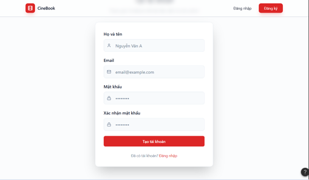

<em>Hình 4.2.1.1: Giao diện Đăng ký tài khoản</em>

---

**2.2 Giao diện Đăng nhập (Login)**

Màn hình đăng nhập yêu cầu người dùng nhập email và mật khẩu để truy cập hệ thống.

  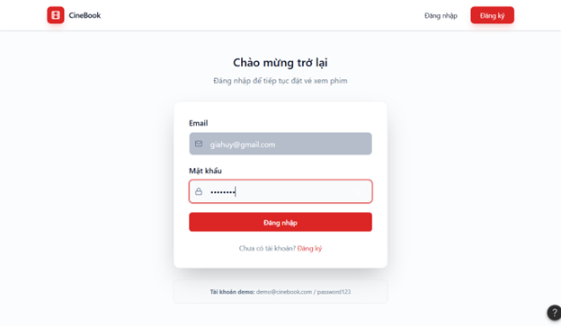

<em>Hình 4.2.1.2: Giao diện Đăng nhập</em>

---

**2.3 Kịch bản A2: Thông tin không hợp lệ (Validation Error)**

Các trường không hợp lệ được highlight viền đỏ kèm thông báo lỗi cụ thể giúp người dùng sửa nhanh.

  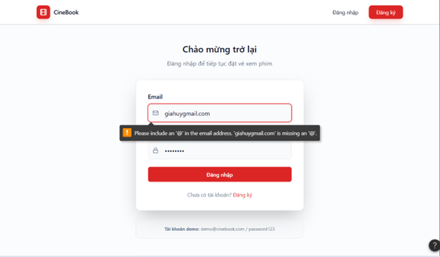

<em>Hình 4.2.1.3: Hiển thị lỗi khi thông tin nhập vào không hợp lệ</em>

---

**2.4 Kịch bản A3: Sai thông tin đăng nhập (Login Failed)**

Thông báo lỗi chung không tiết lộ trường nào sai nhằm ngăn chặn tấn công brute-force.

  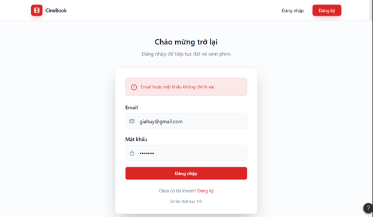

<em>Hình 4.2.1.4: Thông báo khi thông tin đăng nhập không chính xác</em>

---

#### 4.2.2 Movie Browsing and Search
> Written by: 23120047 - Nguyễn Gia Huy   
Reviewed by: 23120038 - Lê Hoàng Mỹ Hạ

**1. Đặc tả Use Case**

| Mục | Nội dung |
| :--- | :--- |
| **Use case ID** | UC002 |
| **Use Case** | Duyệt phim và Tìm kiếm |
| **Brief Description** | Cho phép người dùng (kể cả khách vãng lai chưa đăng nhập) xem danh sách phim đang chiếu và sắp chiếu, xem chi tiết từng phim, tìm kiếm theo tên/từ khoá, và lọc theo thể loại hoặc trạng thái chiếu; từ đó chọn xem lịch chiếu để tiến hành đặt vé. |
| **Actor** | Người dùng (User), Khách vãng lai (Guest) |
| **Pre-Condition** | Hệ thống có ít nhất một phim trong database. Người dùng không bắt buộc phải đăng nhập để thực hiện use case này. |
| **Result** | Người dùng xem được thông tin chi tiết phim và danh sách suất chiếu theo ngày/phòng, có thể chọn suất chiếu để tiếp tục quy trình đặt vé (UC003). |
| **Main Scenario** | 1. Người dùng truy cập trang chủ hoặc trang **"Phim"**. 2. Hệ thống hiển thị danh sách phim chia thành hai tab: **"Đang chiếu"** và **"Sắp chiếu"**, mỗi phim hiển thị poster, tên, thể loại và rating. 3. Người dùng nhập từ khoá vào thanh tìm kiếm hoặc chọn bộ lọc thể loại. 4. Hệ thống trả về danh sách phim khớp với tiêu chí tìm kiếm/lọc theo thời gian thực. 5. Người dùng nhấn vào poster/tên phim để xem trang chi tiết. 6. Hệ thống hiển thị trang chi tiết phim: mô tả, diễn viên, đạo diễn, thời lượng, đánh giá, trailer (nếu có) và lịch chiếu theo ngày. 7. Người dùng chọn ngày và suất chiếu mong muốn. 8. Hệ thống chuyển người dùng đến màn hình chọn ghế (UC003) nếu đã đăng nhập, hoặc yêu cầu đăng nhập nếu chưa. |
| **Alternative Scenarios** | **A1. Không tìm thấy kết quả:** Nếu không có phim nào khớp với từ khoá/bộ lọc, hệ thống hiển thị thông báo *"Không tìm thấy phim phù hợp"* và gợi ý xoá bộ lọc hoặc thử từ khoá khác. **A2. Phim sắp chiếu chưa có suất chiếu:** Trang chi tiết hiển thị thông báo *"Lịch chiếu chưa được cập nhật"* và nút **"Nhận thông báo"** (nếu đã đăng nhập). **A3. Người dùng chưa đăng nhập chọn suất chiếu:** Hệ thống hiển thị popup yêu cầu đăng nhập và cung cấp liên kết đến trang đăng nhập/đăng ký, sau đó tiếp tục flow đặt vé. |
| **Non-Functional Constraints** | - Thời gian tải danh sách phim và trả về kết quả tìm kiếm < 2 giây. - Hệ thống tìm kiếm hỗ trợ tìm kiếm không phân biệt hoa thường và không dấu (ví dụ: "phim hanh dong" tìm được "Phim Hành Động"). - Giao diện responsive, hiển thị đúng trên cả mobile và desktop. - Poster phim phải được tối ưu hoá (nén) để tải nhanh trên đường truyền chậm. |

---

**2. Prototype & Mockups**
- Link figma: [Movie Browsing and Search](https://www.figma.com/design/q0s1MHPJKqY6eAHnGhwmVZ/CineBook---User-Authentication?node-id=0-1)

**2.1 Giao diện trang chủ / Danh sách phim (Movie List)**

Trang chủ hiển thị banner phim nổi bật, danh sách phim đang chiếu và sắp chiếu với poster và thông tin cơ bản.

  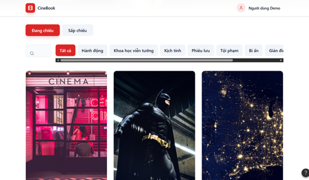

<em>Hình 4.2.2.1: Giao diện danh sách phim đang chiếu và sắp chiếu</em>

---

**2.2 Giao diện Tìm kiếm & Lọc (Search & Filter)**

Người dùng có thể tìm kiếm theo tên phim và lọc theo thể loại; kết quả cập nhật theo thời gian thực.

  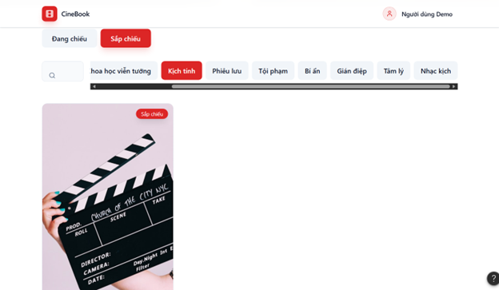

<em>Hình 4.2.2.2: Giao diện tìm kiếm và lọc phim</em>

---

**2.3 Giao diện Chi tiết phim (Movie Detail)**

Trang chi tiết cung cấp đầy đủ thông tin về phim, trailer nhúng và lịch chiếu theo ngày để người dùng chọn suất.

  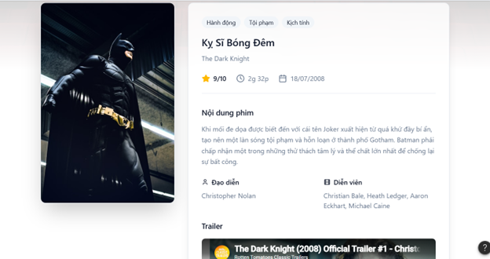

<em>Hình 4.2.2.3: Giao diện chi tiết phim và lịch chiếu</em>

---

**2.4 Kịch bản A1: Không tìm thấy kết quả (No Results)**

Giao diện thân thiện thông báo không có kết quả phù hợp và gợi ý hành động tiếp theo.

  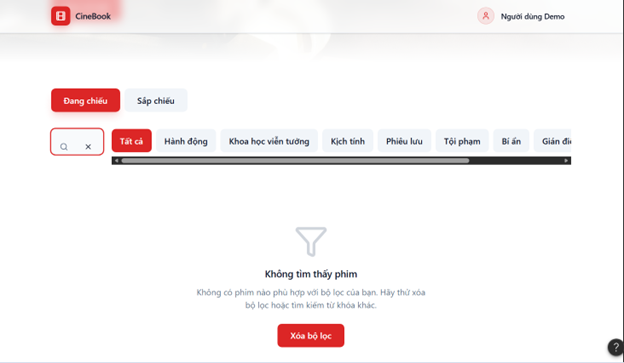

<em>Hình 4.2.2.4: Giao diện khi không tìm thấy phim phù hợp</em>

---

#### 4.2.3 Seat Selection and Booking
> Written by: 23120049 - Nguyễn Thanh Huyền    
Reviewed by: 23120047 - Nguyễn Gia Huy

**1. Đặc tả Use Case**  

| Use Case ID | UC003 |  
| :--- | :--- |  
| Use Case | Chọn Ghế và Đặt Vé |  
| Brief Description | Cho phép người dùng chọn các ghế còn trống trên sơ đồ phòng chiếu trực quan theo thời gian thực cho một suất chiếu đã chọn và bắt đầu quá trình đặt vé. |  
| Actor | User |  
| Pre-Condition | **1**. Người dùng đã chọn một bộ phim và suất chiếu cụ thể.   **2**. Người dùng đã đăng nhập vào hệ thống. |  
| Result | Các ghế đã chọn được chuyển sang trạng thái tạm giữ, và người dùng được chuyển đến bước thanh toán. |  
| Main Scenario | **1**. Hệ thống hiển thị sơ đồ ghế ngồi trực quan (ghế trống, ghế đã bán, ghế đang chọn).   **2**. Người dùng nhấn chọn một hoặc nhiều ghế có trạng thái "Trống".   **3**. Hệ thống kiểm tra tính khả dụng của ghế theo thời gian thực.   **4**. Người dùng nhấn nút "Xác nhận đặt vé".   **5**. Hệ thống khóa các ghế đã chọn trong một khoảng thời gian quy định (ví dụ: 5–10 phút) và tạo mã đặt vé tạm thời |  
| Alternative Scenarios | **A1. Ghế vừa có người chọn**: Nếu người khác vừa chọn đúng ghế đó cùng lúc, hệ thống hiển thị thông báo lỗi "Ghế đã được chọn" và cập nhật lại sơ đồ.   **A2. Vượt quá số lượng ghế**: Nếu người dùng chọn quá số ghế quy định (ví dụ: > 8 ghế), hệ thống sẽ yêu cầu giảm số lượng. |  
| Non-Functional Constraints | **Đồng bộ hóa**: Phải ngăn chặn việc đặt trùng ghế (double-booking) bằng cơ chế Optimistic Locking ở mức cơ sở dữ liệu.   **Hiệu năng**: Sơ đồ ghế phải tải và phản hồi hành động chọn trong vòng 2 giây. |  

**2. Prototype & Mockups**  
- Link figma: [Seat Selection and Booking](https://stash-fix-82365242.figma.site/)    

Màn hình bấm chọn ghế và hiển thị tổng giá tiền  
  

Nhấn vào Confirm Booking, hiển thị màn hình loading chuyển user tới giao diện thanh toán  
  

#### 4.2.4 Online Payment Processing
> Written by: 23120049 - Nguyễn Thanh Huyền    
Reviewed by: 23120038 - Lê Hoàng Mỹ Hạ

**1. Đặc tả Use Case**  

| Use Case ID | UC004 |  
| :--- | :--- |  
| Use Case | Thanh toán Trực tuyến |  
| Brief Description | Thực hiện giao dịch tài chính an toàn cho các ghế đã chọn thông qua dịch vụ thanh toán bên thứ ba (VietQR). | 
| Actor | Người dùng (User), Cổng thanh toán (Payment Gateway - Tác nhân phụ) |  
| Pre-Condition| **1**. Người dùng đã hoàn thành bước chọn ghế (UC003).   **2**. Hệ thống đã tạo đơn hàng tạm thời với tổng số tiền cần thanh toán. |  
| Result | Trạng thái đặt vé được cập nhật thành "Đã bán", ghế được giữ vĩnh viễn, và vé điện tử được tạo. |
| Main Scenario | **1**. Hệ thống hiển thị tổng tiền và tạo mã VietQR duy nhất cho giao dịch.   **2**. Người dùng quét mã QR bằng ứng dụng ngân hàng và hoàn tất chuyển khoản.   **3**. Cổng thanh toán gửi thông báo (callback/webhook) về cho hệ thống.   **4**. Hệ thống xác thực chữ ký giao dịch và số tiền nhận được.   **5**. Hệ thống cập nhật trạng thái đơn hàng thành "Thành công" và hiển thị thông báo cho người dùng. |  
| Alternative Scenarios | **A1. Hết thời gian thanh toán**: Nếu người dùng không thanh toán trong thời gian giữ ghế, hệ thống tự động giải phóng ghế và hủy đơn hàng.   **A2. Thanh toán thất bại**: Nếu cổng thanh toán báo lỗi, hệ thống thông báo cho người dùng và cho phép thử lại. |  
| Non-Functional Constraints | **Bảo mật**: Mọi giao dịch phải được mã hóa; không lưu trữ dữ liệu ngân hàng nhạy cảm (mã PIN/Mật khẩu) trên máy chủ CineBook.   **Độ tin cậy**: Hệ thống phải xử lý được các phản hồi bất đồng bộ từ ngân hàng để đảm bảo cập nhật trạng thái ngay cả khi người dùng đóng trình duyệt. |  

**2. Prototype & Mockups**    
- Link figma: [Online Payment Processing](https://weight-serifs-23181036.figma.site/)  

Màn hình hiển thị mã QR thanh toán    
    

Màn hình xác nhận thanh toán thành công    
    

#### 4.2.5 Profile and Booking History Management
> Written by: 23120038 - Lê Hoàng Mỹ Hạ  
Reviewed by: 23120060 - Trần Kim Ngân

---

**1. Đặc tả Use Case**

| Mục                            | Nội dung                                                                                                                                                                                                                                                                                                                                                                                    |
| :----------------------------- | :------------------------------------------------------------------------------------------------------------------------------------------------------------------------------------------------------------------------------------------------------------------------------------------------------------------------------------------------------------------------------------------ |
| **Use case ID**                | UC005                                                                                                                                                                                                                                                                                                                                                                                       |
| **Use Case**                   | Quản lý thông tin cá nhân và lịch sử đặt vé                                                                                                                                                                                                                                                                                                                                                 |
| **Brief Description**          | Cho phép người dùng xem, chỉnh sửa thông tin cá nhân, tra cứu lịch sử đặt vé/bắp nước và thực hiện thanh toán các giao dịch chưa hoàn tất.                                                                                                                                                                                                                                                  |
| **Actor**                      | Người dùng (User)                                                                                                                                                                                                                                                                                                                                                                           |
| **Pre-Condition**              | Người dùng đã đăng nhập thành công vào hệ thống.                                                                                                                                                                                                                                                                                                                                            |
| **Result**                     | Thông tin cá nhân được cập nhật hoặc thông tin chi tiết vé/mã thanh toán được hiển thị.                                                                                                                                                                                                                                                                                                     |
| **Main Scenario**              | 1. Người dùng chọn mục **"Tài khoản của tôi"**. 2. Hệ thống hiển thị hồ sơ cá nhân và danh sách lịch sử giao dịch (phim, suất chiếu, ghế, bắp nước). 3. Vé đã thanh toán: nhấn **"Xem mã QR"** để nhận diện tại rạp. 4. Vé chưa thanh toán: nhấn **"Thanh toán ngay (QR)"** để hiển thị mã VietQR. 5. Người dùng chỉnh sửa thông tin bằng biểu tượng **bút** và nhấn **"Lưu"**. |
| **Alternative Scenarios**      | **A1. Thông tin không hợp lệ:** Nếu email/số điện thoại sai định dạng, hệ thống hiển thị viền đỏ và thông báo lỗi. **A2. Lịch sử trống:** Nếu chưa có giao dịch, hệ thống hiển thị màn hình trống và nút **"Đặt vé ngay"**.                                                                                                                                                              |
| **Non-Functional Constraints** | - Thời gian truy xuất dữ liệu < 2 giây. - Tích hợp thanh toán VietQR. - Mật khẩu được mã hóa bằng bcrypt trước khi lưu trữ.                                                                                                                                                                                                                                                           |

---

**2. Prototype & Mockups**  
- Link figma: [Profile and Booking History Management](https://www.figma.com/make/TyfblB8AsyicccnM4SzNDb/SE_4.2.5-6?t=zCgvVZksUYXShR4e-20&fullscreen=1)

**2.1 Giao diện chính (Interface)**

Màn hình tổng quan hiển thị thông tin cá nhân và danh sách các vé đã đặt. Vé chưa thanh toán được làm nổi bật với nút hành động.

  

<em>Hình 4.2.5.1: Giao diện quản lý thông tin cá nhân và lịch sử đặt vé</em>

---

**2.2 Thông tin mã QR vé (QR Ticket Information)**

Hiển thị khi người dùng chọn **"Xem mã QR"** đối với vé đã thanh toán thành công. Mã QR được sử dụng để nhận vé và bắp nước tại rạp.

  

<em>Hình 4.2.5.2: Mã QR vé hiển thị thông tin sau khi thanh toán</em>

---

**2.3 Thanh toán QR (QR Payment)**

Hiển thị khi người dùng chọn **"Thanh toán ngay"**. Hệ thống tạo mã VietQR với thông tin thanh toán được điền sẵn.

  

<em>Hình 4.2.5.3: Thanh toán vé bằng mã VietQR</em>

Kết quả sau khi thanh toán:
  

  

<em>Hình 4.2.5.3: Thanh toán vé bằng mã VietQR</em>

---

**2.4 Kịch bản A1: Thông tin không hợp lệ (Invalid Information)**

Minh họa trường hợp người dùng nhập sai định dạng thông tin cá nhân. Các trường lỗi được highlight để cảnh báo.

  

<em>Hình 4.2.5.4: Hiển thị lỗi khi nhập thông tin không hợp lệ</em>

---

**2.5 Kịch bản A2: Lịch sử trống (Empty History)**

Giao diện thân thiện dành cho người dùng chưa có giao dịch, kèm nút điều hướng để bắt đầu đặt vé.

  

<em>Hình 4.2.5.5: Giao diện khi chưa có lịch sử giao dịch</em>

#### 4.2.6 AI-Powered Movie Recommendation (Chatbot)
> Written by: 23120038 - Lê Hoàng Mỹ Hạ  
Reviewed by: 23120047 - Nguyễn Gia Huy

**1. Đặc tả Use Case**  
| Mục                            | Nội dung                                                                                                                                                                                                                                                                                                                                                                                          |
| :----------------------------- | :------------------------------------------------------------------------------------------------------------------------------------------------------------------------------------------------------------------------------------------------------------------------------------------------------------------------------------------------------------------------------------------------ |
| **Use case ID**                | UC006                                                                                                                                                                                                                                                                                                                                                                                             |
| **Use Case**                   | Trợ lý AI tư vấn phim và suất chiếu                                                                                                                                                                                                                                                                                                                                                               |
| **Brief Description**          | Người dùng tương tác với chatbot để nhận gợi ý phim dựa trên sở thích cá nhân và dữ liệu thực tế của rạp.                                                                                                                                                                                                                                                                                         |
| **Actor**                      | Người dùng (User / Guest)                                                                                                                                                                                                                                                                                                                                                                         |
| **Pre-Condition**              | Người dùng truy cập vào hệ thống (không bắt buộc đăng nhập).                                                                                                                                                                                                                                                                                                                                      |
| **Result**                     | Chatbot trả lời bằng ngôn ngữ tự nhiên kèm theo các gợi ý phim/suất chiếu phù hợp.                                                                                                                                                                                                                                                                                                                |
| **Main Scenario**              | 1. Người dùng nhập nội dung cần tư vấn *(ví dụ: "Tìm phim hành động chiếu tối nay")*. 2. Backend (FastAPI) nhận request và kích hoạt pipeline **RAG**. 3. Hệ thống truy vấn **Vector DB (ChromaDB)** để lấy dữ liệu phim và lịch chiếu. 4. **Ollama (LLM)** tổng hợp thông tin và sinh câu trả lời. 5. Hệ thống hiển thị phản hồi kèm các **movie cards** để người dùng đặt vé nhanh. |
| **Alternative Scenarios**      | **A1. Không tìm thấy phim phù hợp:** AI xin lỗi và gợi ý phim đang hot. **A2. Lỗi hệ thống AI:** Nếu Ollama không phản hồi, hệ thống chuyển sang fallback hoặc hiển thị thông báo *"Chatbot đang bảo trì"*.                                                                                                                                                                                    |
| **Non-Functional Constraints** | - Đảm bảo tính chính xác (không hallucinate dữ liệu lịch chiếu). - Thời gian phản hồi < 3 giây. - Giao diện chat thân thiện, hỗ trợ tiếng Việt tốt.                                                                                                                                                                                                                                         |

---

**2. Prototype & Mockups**
- Link figma: [AI-Powered Movie Recommendation (Chatbot)](https://www.figma.com/make/TyfblB8AsyicccnM4SzNDb/SE_4.2.5-6?t=zCgvVZksUYXShR4e-20&fullscreen=1)  

**2.1 Giao diện chatbot mặc định (Default Chat Interface)**

Giao diện ban đầu khi người dùng mở chatbot, hiển thị các gợi ý truy vấn nhanh giúp tăng trải nghiệm.

  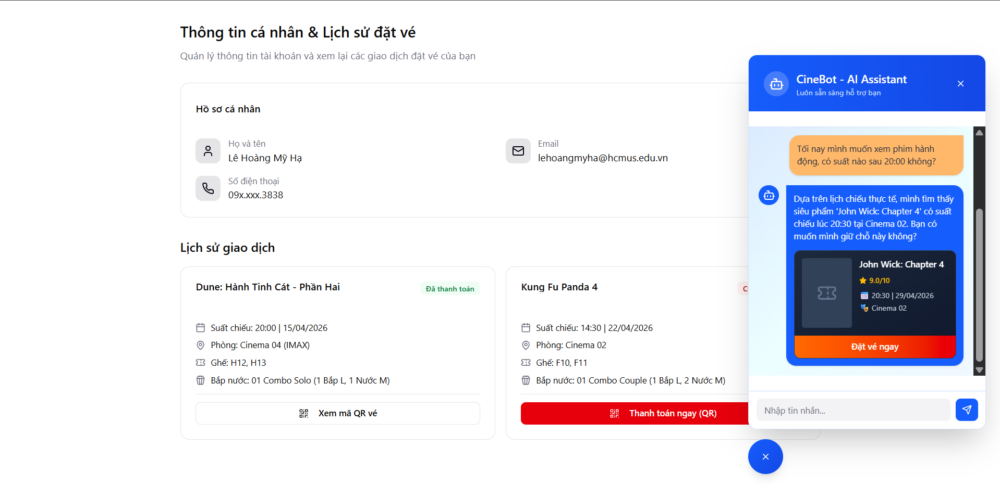

<em>Hình 4.2.6.1: Giao diện chatbot mặc định với các gợi ý nhanh</em>

---

**2.2 Biểu tượng chatbot (Chatbot Icon)**

Biểu tượng nổi (floating button) giúp người dùng truy cập nhanh vào chức năng tư vấn AI từ bất kỳ trang nào.

  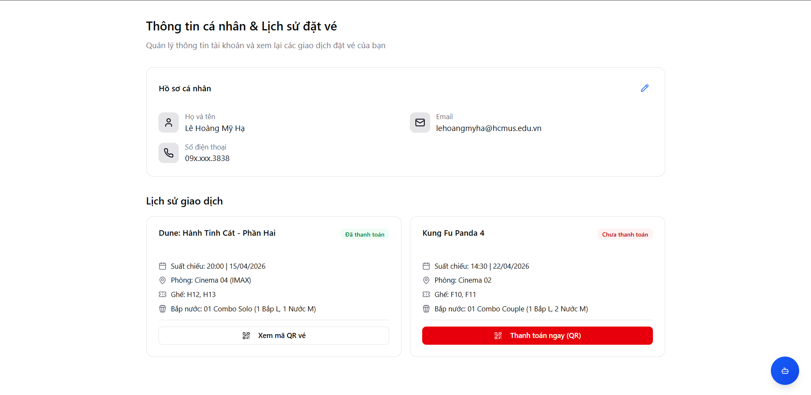

<em>Hình 4.2.6.2: Biểu tượng chatbot trên giao diện hệ thống</em>

---

**2.3 Kịch bản A1: Không tìm thấy phim phù hợp**

Trường hợp người dùng nhập yêu cầu không phù hợp với dữ liệu hiện có, hệ thống sẽ phản hồi thân thiện và đề xuất nội dung thay thế.

  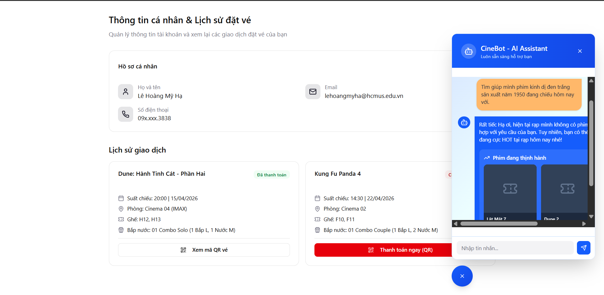

<em>Hình 4.2.6.3: Chatbot phản hồi khi không tìm thấy kết quả phù hợp</em>

---

**2.4 Kịch bản A2: Lỗi hệ thống AI**

Khi hệ thống AI (Ollama) không phản hồi, chatbot chuyển sang chế độ fallback và thông báo cho người dùng.

  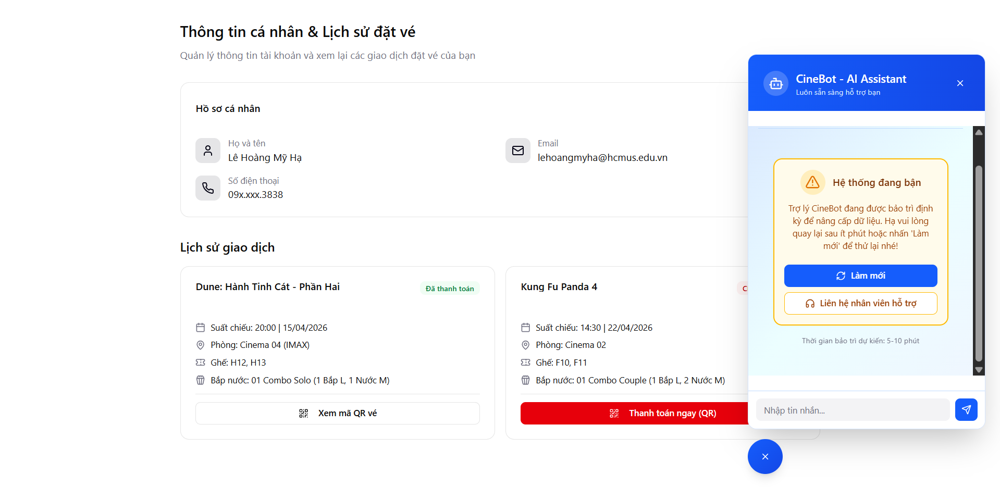

<em>Hình 4.2.6.4: Thông báo lỗi khi hệ thống AI không khả dụng</em>

---

#### 4.2.7 Movie and Showtime Management (Admin)
> Written by: 23120060 - Trần Kim Ngân  
Reviewed by: 23120049 - Nguyễn Thanh Huyền

**1. Đặc tả Use case**
| Mục | Nội dung | 
| :---------------------------------- | :---------------------------------- |
| **Use case ID** | UC007 |
| **Use case** | Movies and Showtimes Management |
| **Brief Description** | Use case này cho phép Quản trị viên (Admin) thêm mới, cập nhật, xóa thông tin phim (tên phim, thể loại, đạo diễn, poster) và thiết lập/quản lý lịch chiếu (ngày, giờ, phòng chiếu, giá vé). |
| **Actor** | System Administrator |
| **Pre-Condition** | Quản trị viên đã đăng nhập thành công vào hệ thống quản trị (Admin Dashboard) với quyền quản lý phim và lịch chiếu. |
| **Result** | Thông tin phim và lịch chiếu được cập nhật thành công vào cơ sở dữ liệu và hiển thị đồng bộ lên giao diện web của người dùng. |
| **Main Scenario** | 1. Admin chọn chức năng "Quản lý Phim & Suất chiếu" trên menu.  2. Hệ thống hiển thị danh sách các phim và suất chiếu hiện tại.  3. Admin chọn "Thêm mới" hoặc "Chỉnh sửa" một phim/suất chiếu cụ thể.  4. Hệ thống hiển thị biểu mẫu (form) nhập liệu.  5. Admin điền/sửa các thông tin (Tên phim, mô tả, poster, phòng chiếu, thời gian chiếu, v.v.) và nhấn "Lưu".  6. Hệ thống kiểm tra tính hợp lệ của dữ liệu (ví dụ: không bị trùng lịch phòng chiếu).  7. Hệ thống lưu thông tin vào cơ sở dữ liệu.  8. Hệ thống thông báo "Cập nhật thành công" và quay lại trang danh sách. |
| **Alternative Scenarios** | **A1: Dữ liệu không hợp lệ hoặc thiếu**:  - Tại bước 6, nếu dữ liệu trống hoặc sai định dạng, hệ thống bôi đỏ trường bị lỗi và hiển thị thông báo yêu cầu nhập lại. Admin sửa và tiếp tục.  **A2: Trùng lặp lịch chiếu (Conflict)**:  - Tại bước 6, nếu suất chiếu được xếp vào phòng/khung giờ đã có phim khác, hệ thống cảnh báo trùng lịch. Admin phải chọn phòng hoặc khung giờ khác. |
| **Non-Functional Constraints** | - Hiệu năng: Thao tác lưu dữ liệu và cập nhật lên web người dùng phải diễn ra dưới 3 giây.  - Tính khả dụng: Giao diện form cần trực quan, hỗ trợ kéo thả để upload hình ảnh poster phim. Hình ảnh tải lên tự động nén để tối ưu dung lượng. |

**2. Prototype & Mockups**
- Link figma: [Web Admin Panel Design](https://www.figma.com/make/a2588FEv8rBqInf5a0nVg5/Web-Admin-Panel-Design?fullscreen=1&t=XIIUU6VOv9npK3Eh-1)

**2.1 Giao diện danh sách phim**
- Giao diện hiển thị các phim hiện có:

  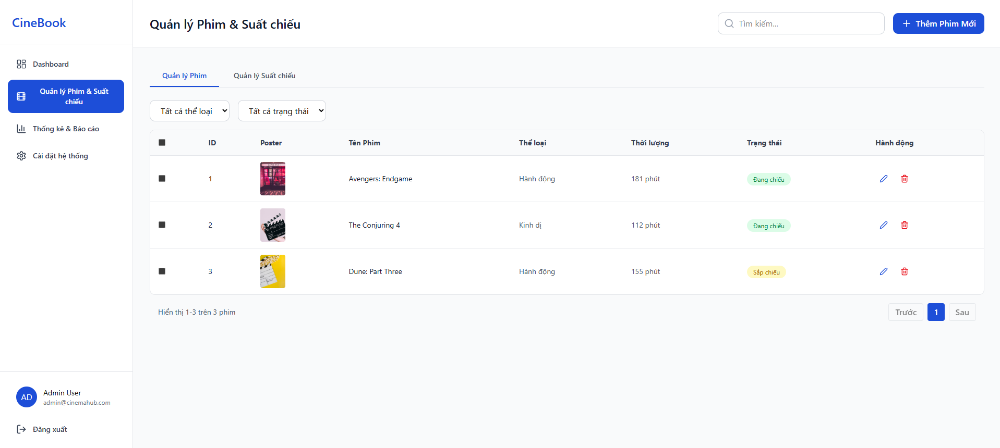

<em>Hình 4.2.7.1: Giao diện Danh sách phim</em>

- Khi bấm nút chỉnh sửa thông tin phim:

  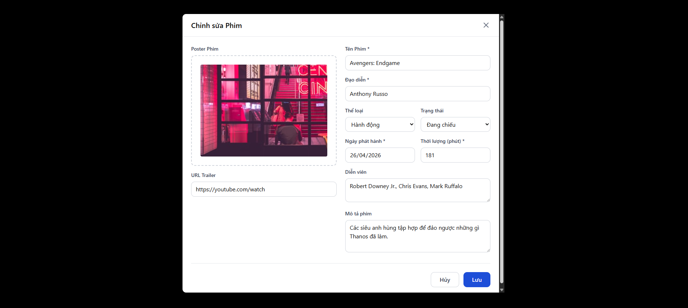

<em>Hình 4.2.7.2: Giao diện Chỉnh sửa phim hiện có</em>

- Khi bấm nút Thêm phim mới:

  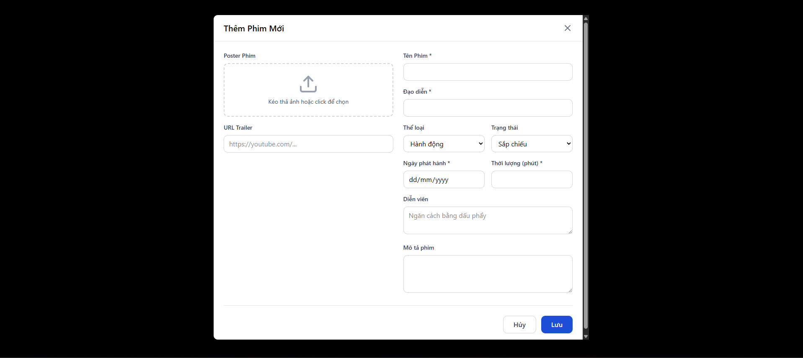

<em>Hình 4.2.7.3: Giao diện Thêm phim mới</em>

- Sau khi thêm phim:

  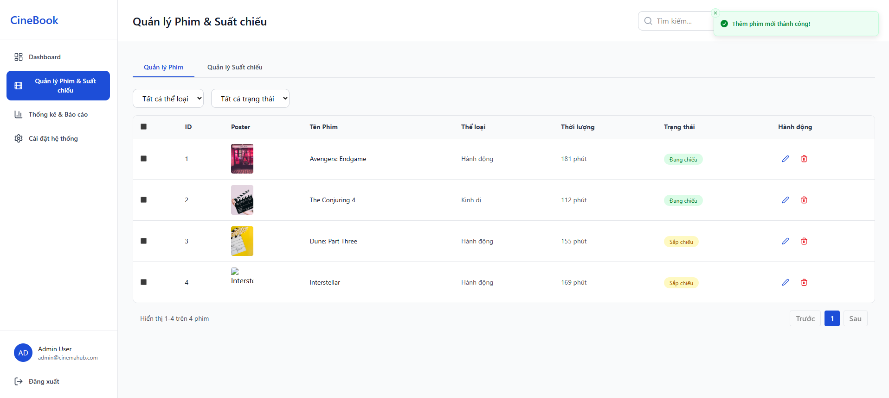

<em>Hình 4.2.7.4: Giao diện sau khi thêm 1 phim mới</em>

**2.2 Giao diện danh sách lịch chiếu**

- Hiện các lịch chiếu hiện có: 

  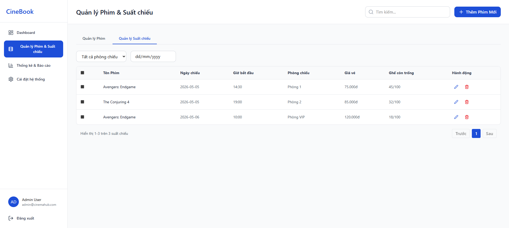

<em>Hình 4.2.7.5: Giao diện danh sách lịch chiếu của các phim</em>

- Thêm suất chiếu mới:

  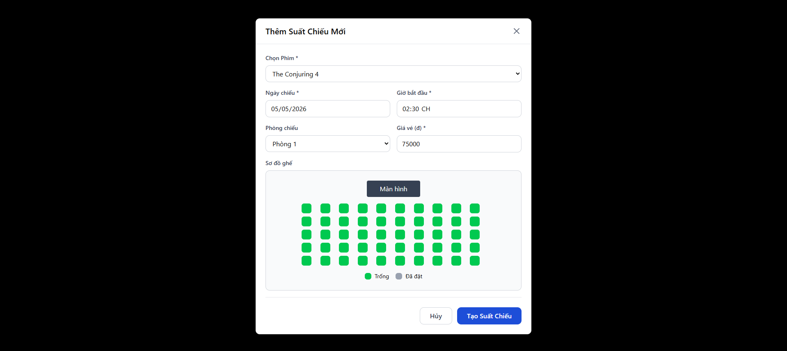

<em>Hình 4.2.7.6: Giao diện thêm suất chiếu mới</em>

- Chỉnh sửa suất chiếu đang có

  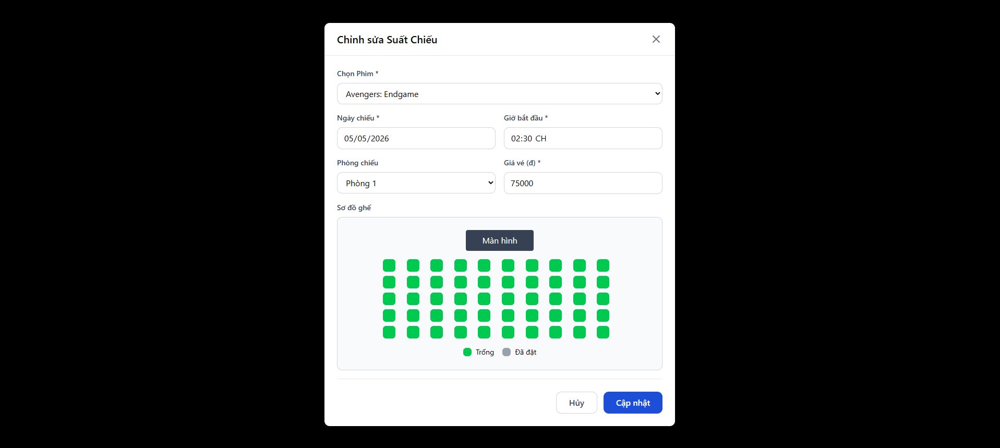

<em>Hình 4.2.7.7: Giao diện chỉnh sửa suất chiếu đang có</em>

**2.3 Kịch bản A1: Không điền đầy đủ thông tin khi thêm phim/Suất chiếu**

  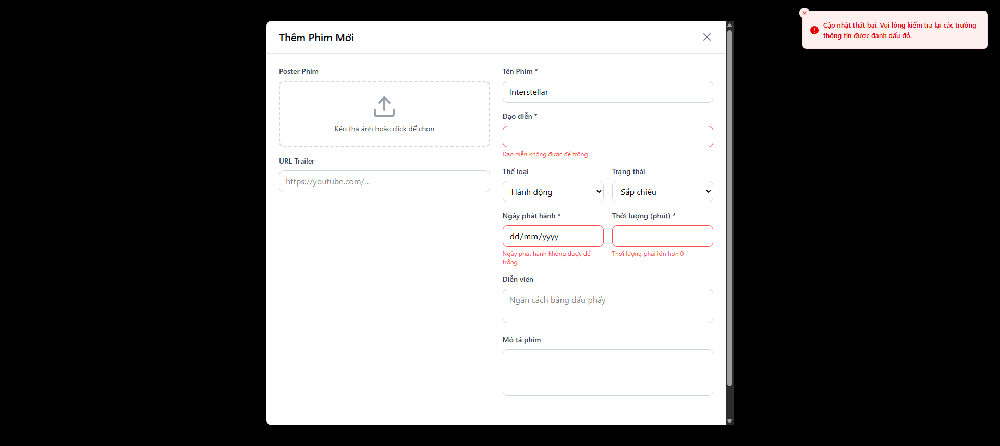

<em>Hình 4.2.7.8: Giao diện thông báo các thông tin còn thiếu</em>

**2.4 Kịch bản A2: Thêm suất chiếu bị trùng vào các suất chiếu hiện có**

  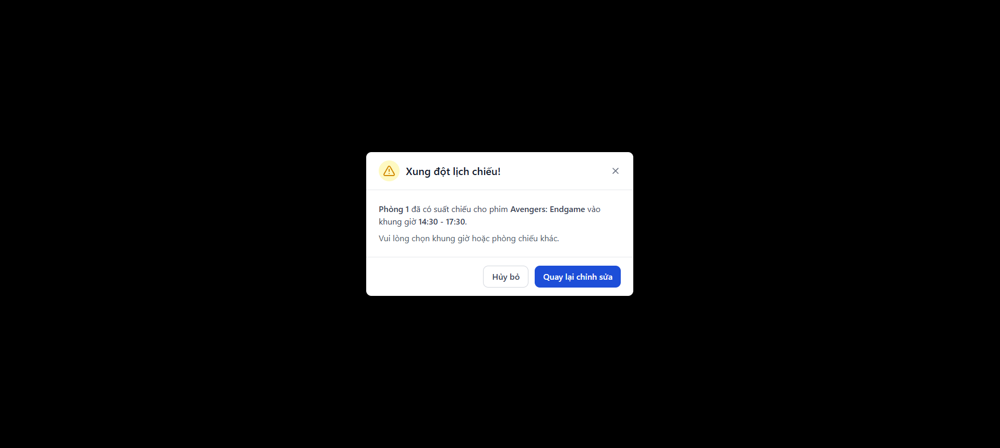

<em>Hình 4.2.7.9: Giao diện thông báo suất chiếu bị trùng</em>

#### 4.2.8 Sales Statistics and Reporting (Admin)
> Written by: 23120060 - Trần Kim Ngân  
Reviewed by: 23120049 - Nguyễn Thanh Huyền

| Mục | Nội dung | 
| :---------------------------------- | :---------------------------------- |
| **Use case ID** | UC008 |
| **Use case** | Sales Statistics and Reporting |
| **Brief Description** | Use case này cho phép Quản trị viên xem báo cáo doanh thu bán vé, số lượng vé đã bán và biểu đồ thống kê theo các tiêu chí (ngày/tuần/tháng, theo từng bộ phim). |
| **Actor** | System Administrator |
| **Pre-Condition** | Quản trị viên đã đăng nhập vào hệ thống. Hệ thống đã có dữ liệu về các giao dịch đặt vé thành công từ người dùng. |
| **Result** | Quản trị viên xem được các số liệu, biểu đồ thống kê chính xác và có thể xuất file báo cáo nếu cần. |
| **Main Scenario** | 1. Admin chọn chức năng "Thống kê & Báo cáo" trên menu.  2. Hệ thống tải dữ liệu tổng quan và hiển thị Dashboard mặc định (doanh thu tháng hiện tại, top phim bán chạy).  3. Admin chọn các bộ lọc mong muốn (ví dụ: Từ ngày - Đến ngày, Lọc theo phim cụ thể).  4. Admin nhấn nút "Xem báo cáo".  5. Hệ thống truy vấn dữ liệu từ database dựa trên bộ lọc.  6. Hệ thống tính toán, cập nhật lại các bảng dữ liệu số và biểu đồ (cột, tròn, đường).  7. Admin xem báo cáo thống kê trên màn hình. |
| **Alternative Scenarios** |**A1: Không có dữ liệu trong khoảng thời gian đã chọn:**  - Tại bước 5, nếu không có giao dịch nào thỏa mãn điều kiện lọc, hệ thống hiển thị thông báo "Không có dữ liệu giao dịch trong khoảng thời gian này" thay vì biểu đồ.  **A2: Xuất file báo cáo:**  - Sau bước 7, Admin nhấn nút "Export / Xuất file (Excel/CSV)". Hệ thống tổng hợp dữ liệu hiện tại, tạo file và tự động tải xuống máy của Admin. |
| **Non-Functional Constraints** | - Bảo mật: Chỉ Admin mới được phép xem dữ liệu doanh thu.  - Độ chính xác: Các phép toán cộng gộp doanh thu phải đảm bảo tính chính xác tuyệt đối 100%.  - Hiệu năng: Việc truy vấn dữ liệu lớn để vẽ biểu đồ không được làm đứng hệ thống, thời gian load không quá 5 giây. |

**2. Prototype & Mockups**
- Link figma: [Web Admin Panel Design](https://www.figma.com/make/a2588FEv8rBqInf5a0nVg5/Web-Admin-Panel-Design?fullscreen=1&t=XIIUU6VOv9npK3Eh-1)

**2.1 Giao diện Dashboard**

  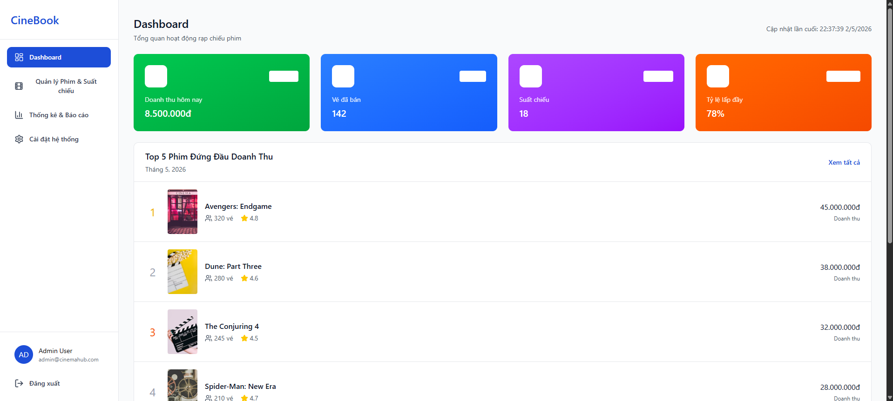

<em>Hình 4.2.8.1: Giao diện Dashboard tổng quan</em>

**2.2 Giao diện thống kê chi tiết**

  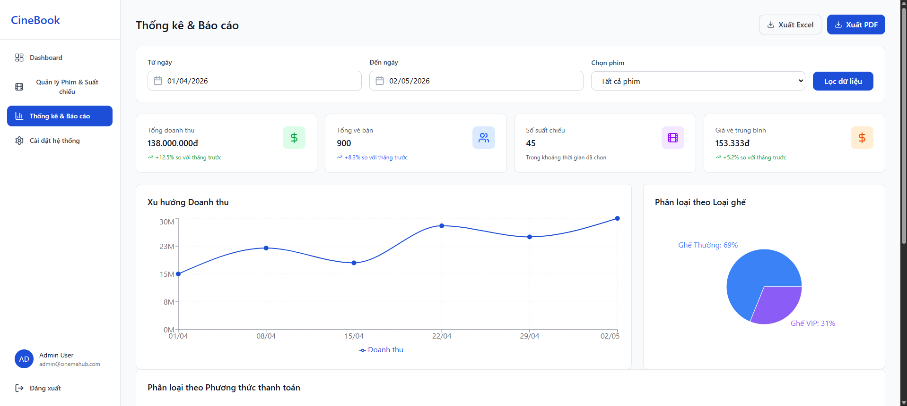

<em>Hình 4.2.8.2: Giao diện thống kê chi tiết theo từng phân loại</em>

**Kịch bản A1: Tìm thống kê chưa có dữ liệu trong database**

  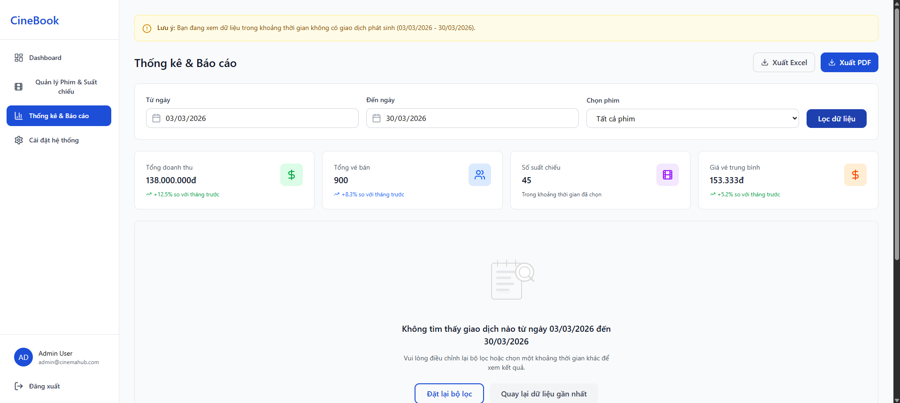

<em>Hình 4.2.8.3: Thông báo khoảng thời gian không có dữ liệu để thống kê</em>

**Kịch bản A2: Xuất file Excel/PDF**

  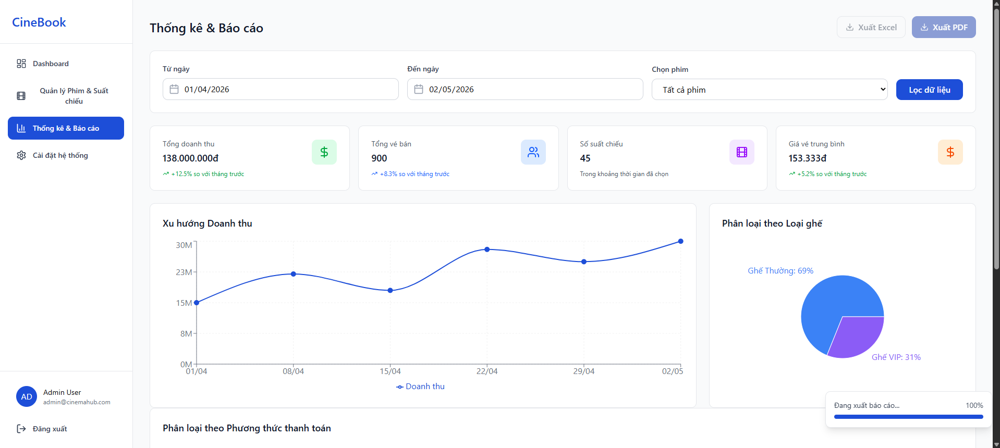

<em>Hình 4.2.8.4: Đang trích xuất file PDF thống kê</em>

## 5. AI Usage Declaration

- Gemini. Gemini Fast, Google, gemini.google.com. -> Hỗ trợ nội dung, ý tưởng cho việc viết báo cáo
- Figma (Figma AI & Plugins). Figma, figma.com -> Sử dụng FigmaMake để vẽ các prototype về các Use Case

## 6. Presentation

Video thuyết trình: [LINK](https://youtu.be/AqJ8dXVRyVs)

## 7. Reflective Report

### Những phần hữu ích nhất cho quá trình triển khai
Dựa trên quá trình làm việc, nhóm nhận thấy các phần sau đây đóng vai trò là "kim chỉ nam" cho việc lập trình và thiết kế hệ thống:

- Ràng buộc thiết kế & triển khai (Mục 2.3): Phần này cực kỳ hữu ích vì nó xác định rõ khung công nghệ (Tech Stack) bao gồm FastAPI, React.js, PostgreSQL và Ollama. Việc chốt phương án sử dụng  kiến trúc 3 tầng (3-Tier) giúp các thành viên Backend, Frontend và AI phối hợp nhịp nhàng mà không bị chồng chéo.

- Đặc tả yêu cầu phi chức năng (Mục 3.2.2): Các chỉ số như thời gian phản hồi API < 2 giây (NFR-01) hay tính toàn vẹn dữ liệu ghế ngồi (NFR-05) cung cấp tiêu chuẩn cụ thể để nhóm thực hiện kiểm thử. Ví dụ: yêu cầu về Optimistic Locking trong đặc tả là căn cứ kỹ thuật bắt buộc để xử lý vấn đề đặt trùng ghế.

- Đặc tả Use Case chi tiết (Mục 4.2): Đây là phần quan trọng nhất cho việc hiện thực hóa mã nguồn. Các kịch bản phụ (Alternative Scenarios) như xử lý khi "Hết thời gian thanh toán" (UC004) hay "Không tìm thấy phim" (UC006) giúp lập trình viên lường trước các lỗi logic và xử lý ngoại lệ (exception handling) một cách triệt để.

### Những phần ít quan trọng hơn cho việc triển khai (Unnecessary)
Dù mọi phần trong tài liệu đều có giá trị về mặt quản lý dự án, nhưng đối với việc trực tiếp viết code (implementation), một số mục có thể coi là thứ yếu:

- Danh sách các bên liên quan (Mục 3.1): Việc liệt kê các đối tượng như "Film Distributors" hay "Infrastructure Provider" mang tính chất định hướng quản lý và vận hành nhiều hơn. Đối với một lập trình viên đang xây dựng tính năng đặt vé, thông tin này không trực tiếp đóng góp vào logic xử lý của hệ thống.

### Tổng kết
Mẫu tài liệu này đã tạo ra một sự cân bằng tốt giữa quản lý cấp cao và chi tiết kỹ thuật. Việc tập trung kỹ vào Đặc tả Use Case và Ràng buộc hệ thống giúp nhóm giảm thiểu rủi ro sai lệch nghiệp vụ trong giai đoạn Implementation, đồng thời đảm bảo tính nhất quán của toàn bộ hệ thống CineBook.

