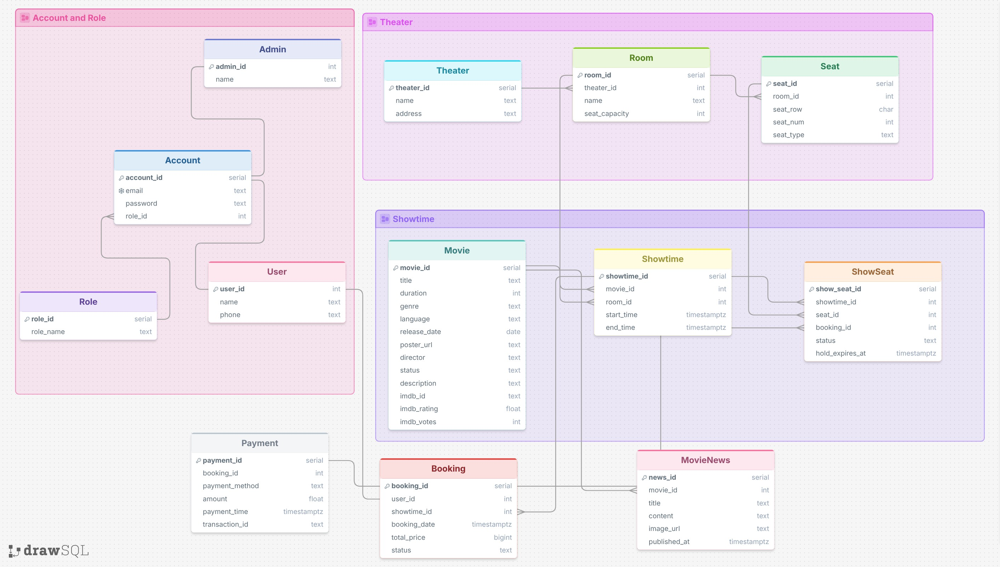
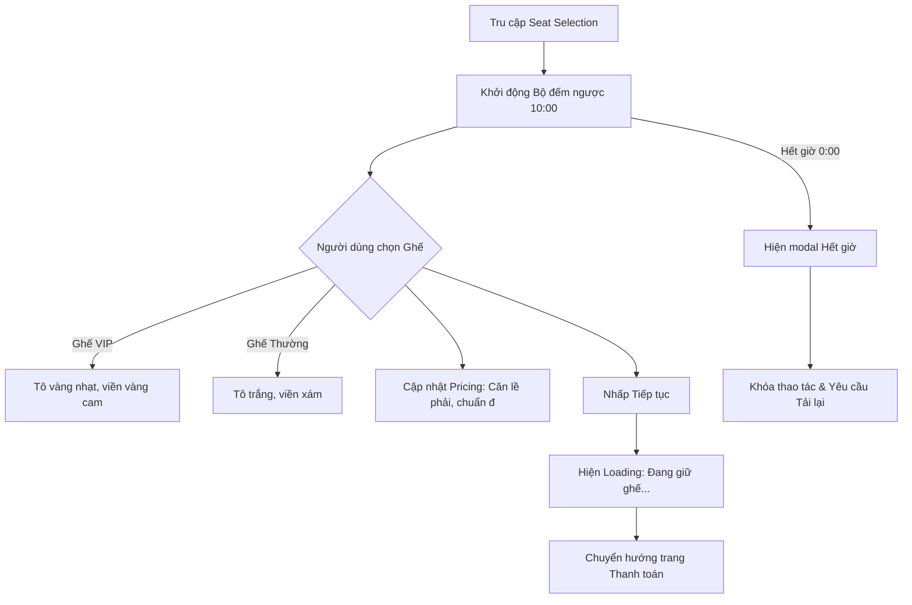

# Design

## Table of Contents
1. [Member Contribution Assessment](#1-member-contribution-assessment)
2. [Conceptual Model](#2-conceptual-model)
3. [Architectural Design](#3-architectural-design)
4. [Data Design](#4-data-design)
5. [UI/UX](#5-uiux)
6. [AI Usage Declaration](#6-ai-usage-declaration)
7. [Presentation](#7-presentation)
8. [Reflective Report](#8-reflective-report)

---

## 1. Member Contribution Assessment

**23120038 - Lê Hoàng Mỹ Hạ - Contribution (25%)**

**23120047 - Nguyễn Gia Huy - Contribution (25%)**

**23120049 - Nguyễn Thanh Huyền - Contribution (25%)**

**23120060 - Trần Kim Ngân - Contribution (25%)**

## 2. Conceptual Model
> Written by: 23120060 - Trần Kim Ngân   
Reviewed by:

  

### 1. Mô tả chi tiết các Thực thể
* **Theater:** Đại diện cho một chi nhánh rạp phim.
* **Room:** Đại diện cho một phòng chiếu cụ thể bên trong một rạp. Mỗi phòng sẽ có một sức chứa ghế cố định.
* **Seat:** Đại diện cho từng vị trí ghế ngồi vật lý riêng biệt bên trong một phòng chiếu, có nhiều loại ghế (Ghế thường, ghế VIP) tuỳ vào từng phòng chiếu.
* **Movie:** Đại diện cho một bộ phim đã được cấp phép bản quyền để trình chiếu trong toàn bộ chuỗi rạp.
* **Showtime:** Đại diện cho một khung giờ chiếu cụ thể được lên lịch cho một bộ phim tại một phòng chiếu nhất định.
* **User (Người dùng):** Đại diện cho khách hàng đã đăng ký tài khoản và tương tác với hệ thống để thực hiện đặt vé.
* **Admin:** Đại diện cho người vận hành hệ thống, quản lý phim, suất chiếu và doanh thu của rạp.
* **Booking:** Đại diện cho một giao dịch giữ chỗ thành công của khách hàng cho các vị trí ghế cụ thể trong một suất chiếu, bao gồm cả thông tin trạng thái thanh toán.

### 2. Phân tích Mối quan hệ:
* **Theater sở hữu Room (Mối quan hệ 1:N):** Một rạp chiếu có thể có nhiều phòng chiếu phim bên trong, nhưng mỗi phòng chiếu bắt buộc chỉ thuộc về quản lý của một rạp duy nhất.
* **Room chứa Seat (Mối quan hệ 1:N):** Một phòng chiếu sẽ chứa nhiều chiếc ghế ngồi vật lý. Mỗi chiếc ghế ngồi được gắn cố định với duy nhất một phòng chiếu.
* **Room tổ chức Showtime (Mối quan hệ 1:N):** Một phòng chiếu có thể tổ chức nhiều suất chiếu nối đuôi nhau trong suốt cả ngày, nhưng một suất chiếu cụ thể chỉ được phép diễn ra tại một phòng chiếu duy nhất.
* **Movie có các Showtime (Mối quan hệ 1:N):** Một bộ phim có thể được xếp lịch vào nhiều suất chiếu khác nhau để phục vụ khán giả, nhưng mỗi suất chiếu tại một thời điểm chỉ phát duy nhất một bộ phim.
* **User thực hiện Booking (Mối quan hệ 1:N):** Một khách hàng có thể thực hiện nhiều giao dịch đặt vé khác nhau theo thời gian, nhưng mỗi đơn đặt vé chỉ thuộc sở hữu của duy nhất một tài khoản người dùng.
* **Booking bao gồm Seat (Mối quan hệ 1:N):** Một giao dịch đặt vé của khách hàng có thể bao gồm một hoặc nhiều chiếc ghế được chọn cùng lúc (Ví dụ: Đặt vé theo nhóm, đi xem phim theo cặp). Các chiếc ghế này sẽ được khóa trạng thái đi kèm với mã đơn đặt vé đó trong suốt suất chiếu diễn ra.
* **Admin (Mối quan hệ 1:N):** Quản trị viên có thể tạo và quản lý nhiều Phim (`Movie`), nhiều Suất chiếu (`Showtime`) trên hệ thống.

## 3. Architectural Design

### 3.1 Architecture Diagram
> Written by: 23120038 - Lê Hoàng Mỹ Hạ  
Reviewed by:

#### 3.1.1 System Decomposition Tree Diagram

Hình dưới đây mô tả sơ đồ phân rã hệ thống (System Decomposition Tree Diagram) của CineBook. Hệ thống được chia thành nhiều tầng và module chức năng nhằm đảm bảo tính tổ chức, khả năng mở rộng và dễ bảo trì trong quá trình phát triển.

CineBook được phân rã thành bốn thành phần chính:

- **Presentation Tier**: Bao gồm toàn bộ giao diện tương tác với người dùng như trang chủ, đăng nhập/đăng ký, chi tiết phim, chọn ghế, thanh toán, chatbot và dashboard quản trị.
- **Logic Tier**: Chứa các module xử lý nghiệp vụ như xác thực người dùng, quản lý phim và suất chiếu, đặt vé, thanh toán VietQR, recommendation AI, báo cáo doanh thu và tài liệu API.
- **Data Tier**: Bao gồm các thành phần lưu trữ dữ liệu như PostgreSQL Database, ChromaDB vector store và media storage.
- **External / Runtime Services**: Bao gồm các dịch vụ ngoài hệ thống như Ollama Local LLM, VietQR Banking App và môi trường trình duyệt web.

Việc phân rã theo module giúp hệ thống giảm coupling giữa các thành phần, đồng thời hỗ trợ phát triển độc lập và dễ dàng mở rộng chức năng trong tương lai.

  

  <em>Hình 3.1.1: System Decomposition Tree Diagram của hệ thống CineBook</em>

---

#### 3.1.2 Overall System Architecture Diagram
Hình dưới đây mô tả kiến trúc tổng thể (Overall System Architecture Diagram) của hệ thống CineBook theo mô hình Client–Server đa tầng.

Trong kiến trúc này:

- Người dùng và quản trị viên truy cập hệ thống thông qua trình duyệt web.
- Frontend được xây dựng bằng React.js và Tailwind CSS, chịu trách nhiệm hiển thị giao diện và gửi request đến backend thông qua REST API.
- Backend được phát triển bằng FastAPI, xử lý toàn bộ nghiệp vụ hệ thống như authentication, booking flow, payment processing, admin operations và AI recommendation.
- PostgreSQL được sử dụng để lưu trữ dữ liệu quan hệ và dữ liệu giao dịch.
- ChromaDB đóng vai trò vector database phục vụ semantic retrieval cho chatbot recommendation.
- Ollama Local LLM được tích hợp để sinh phản hồi hội thoại và recommendation bằng ngôn ngữ tự nhiên.
- VietQR được sử dụng để xử lý thanh toán QR-code và callback giao dịch.

Kiến trúc này cho phép tách biệt rõ ràng giữa giao diện, xử lý nghiệp vụ và lưu trữ dữ liệu, từ đó giúp hệ thống dễ mở rộng và dễ triển khai hơn.

  

<em>Hình 3.1.2: Overall System Architecture Diagram của hệ thống CineBook</em>

---

#### 3.1.3 Architectural Characteristics & Design Approach
> Written by: 23120038 - Lê Hoàng Mỹ Hạ  
Reviewed by:   

Hệ thống CineBook áp dụng nhiều đặc điểm kiến trúc và nguyên tắc thiết kế nhằm đảm bảo hiệu năng, khả năng mở rộng và bảo trì lâu dài.

##### Client–Server Architecture
Hệ thống được xây dựng theo mô hình Client–Server, trong đó frontend đóng vai trò client và backend FastAPI đóng vai trò server xử lý nghiệp vụ.

##### Multi-Tier Architecture
Kiến trúc hệ thống được chia thành nhiều tầng gồm:
- Presentation Tier
- Logic Tier
- Data Tier
- External Services

Việc phân tầng giúp giảm sự phụ thuộc giữa các thành phần và tăng khả năng mở rộng hệ thống.

##### Modular Architecture
Các chức năng như authentication, booking, payment, AI recommendation, reporting và admin management được xây dựng thành các module độc lập. Điều này giúp việc phát triển, kiểm thử và bảo trì trở nên dễ dàng hơn.

##### RESTful API Communication
Frontend và backend giao tiếp với nhau thông qua REST API sử dụng dữ liệu JSON. Swagger/OpenAPI được tích hợp để hỗ trợ tài liệu hóa và kiểm thử API.

##### AI-Enhanced Recommendation System
Hệ thống recommendation sử dụng kiến trúc RAG (Retrieval-Augmented Generation), kết hợp:
- PostgreSQL để truy xuất dữ liệu phim
- ChromaDB để semantic retrieval
- Ollama Local LLM để sinh phản hồi hội thoại

Kiến trúc này giúp chatbot có khả năng hỗ trợ recommendation theo ngữ cảnh và tương tác tự nhiên với người dùng.

##### Security Considerations
Hệ thống áp dụng nhiều cơ chế bảo mật:
- JWT Authentication
- bcrypt password hashing
- HTTPS communication
- Token expiration
- Role-based access control cho admin dashboard

Những đặc điểm kiến trúc trên giúp CineBook có nền tảng phù hợp cho việc mở rộng tính năng và triển khai thực tế trong tương lai.

### 3.2 Class Diagram
> Written by: Nguyễn Thanh Huyền - 23120049  
Reviewed by:
   
  

### 3.3 Class Specifications
> Written by:   
Reviewed by:

## 4. Data Design

### 4.1 Data Diagram
> Written by: 23120060 - Trần Kim Ngân  
Reviewed by: 23120047 - Nguyễn Gia Huy

  

### 4.2 Data Specification
> Written by: 23120047 - Nguyễn Gia Huy     
Reviewed by: 23120060 - Trần Kim Ngân  

### Bảng `Theater` (Cụm rạp)
*Ý nghĩa:* Quản lý thông tin các chi nhánh rạp phim trong chuỗi hệ thống CineBook.

| Tên thuộc tính| Kiểu dữ liệu | Ràng buộc khóa | Ràng buộc giá trị | Giải thích thuộc tính|
| :--- | :--- | :--- | :--- | :--- |
| `theater_id` | SERIAL | PK | NOT NULL, UNIQUE | Mã định danh tự động tăng của cụm rạp. |
| `name` | TEXT | Không | NOT NULL | Tên hiển thị của cụm rạp (Ví dụ: CineBook Nguyễn Du). |
| `address` | TEXT | Không | NOT NULL | Địa chỉ vật lý chi tiết của rạp. |

---

### Bảng `Room` (Phòng chiếu)
*Ý nghĩa:* Quản lý các phòng chiếu phim vật lý thuộc một cụm rạp cụ thể.

| Tên thuộc tính| Kiểu dữ liệu | Ràng buộc khóa | Ràng buộc giá trị | Giải thích thuộc tính|
| :--- | :--- | :--- | :--- | :--- |
| `room_id` | SERIAL | PK | NOT NULL, UNIQUE | Mã định danh tự động tăng của phòng chiếu. |
| `theater_id` | SERIAL | FK | NOT NULL, Refs `Theater(theater_id)` | Xác định phòng chiếu này thuộc cụm rạp nào. |
| `name` | TEXT | Không | NOT NULL | Tên phòng chiếu (Ví dụ: 'Phòng 01', 'IMAX 3D'). |
| `seat_capacity` | INT | Không | NOT NULL, > 0 | Tổng số lượng ghế tối đa mà phòng chứa được. |

---

### Bảng `Seat` (Ghế ngồi cố định)
*Ý nghĩa:* Định nghĩa sơ đồ vị trí ghế vật lý tĩnh bên trong từng phòng chiếu (Sơ đồ cứng).

| Tên thuộc tính| Kiểu dữ liệu | Ràng buộc khóa | Ràng buộc giá trị | Giải thích thuộc tính|
| :--- | :--- | :--- | :--- | :--- |
| `seat_id` | SERIAL | PK | NOT NULL, UNIQUE | Mã định danh tự động tăng của chiếc ghế vật lý. |
| `room_id` | SERIAL | FK | NOT NULL, Refs `Room(room_id)` | Xác định ghế này nằm cố định ở phòng nào. |
| `seat_row` | CHAR(2) | Không | NOT NULL | Ký hiệu hàng ghế (Ví dụ: 'A', 'B', 'K'). |
| `seat_num` | INT | Không | NOT NULL, > 0 | Số thứ tự của ghế trên hàng đó (Ví dụ: 1, 2, 11). |
| `seat_type` | TEXT | Không | NOT NULL, DEFAULT 'Standard' | Phân loại phân khúc ghế ('Standard', 'VIP', 'Double'). |

---

### Bảng `Movie` (Phim)
*Ý nghĩa:* Kho dữ liệu lưu trữ thông tin các bộ phim được trình chiếu tại rạp.

| Tên thuộc tính| Kiểu dữ liệu | Ràng buộc khóa | Ràng buộc giá trị | Giải thích thuộc tính|
| :--- | :--- | :--- | :--- | :--- |
| `movie_id` | SERIAL | PK | NOT NULL, UNIQUE | Mã định danh tự động tăng của bộ phim. |
| `title` | TEXT | Không | NOT NULL | Tên của bộ phim. |
| `duration` | INT | Không | NOT NULL, > 0 | Thời lượng của phim (Tính bằng phút). |
| `genre` | TEXT | Không | Cho phép NULL | Thể loại phim (Hành động, Hài, Kinh dị...). |
| `language` | TEXT | Không | NOT NULL | Ngôn ngữ phim (Phụ đề tiếng Việt, Lồng tiếng...). |
| `release_date` | DATE | Không | Cho phép NULL | Ngày bộ phim chính thức khởi chiếu. |
| `poster_url` | TEXT | Không | Cho phép NULL | Đường dẫn URL đến hình ảnh poster của phim. |
| `director` | TEXT | Không | Cho phép NULL | Tên đạo diễn bộ phim. |

---

### Bảng `Showtime` (Suất chiếu)
*Ý nghĩa:* Lịch chiếu cụ thể của một bộ phim tại một phòng chiếu vào một khung giờ nhất định.

| Tên thuộc tính| Kiểu dữ liệu | Ràng buộc khóa | Ràng buộc giá trị | Giải thích thuộc tính |
| :--- | :--- | :--- | :--- | :--- |
| `showtime_id` | SERIAL | PK | NOT NULL, UNIQUE | Mã định danh tự động tăng của suất chiếu. |
| `movie_id` | SERIAL | FK | NOT NULL, Refs `Movie(movie_id)` | Xác định suất chiếu này phát bộ phim nào. |
| `room_id` | SERIAL | FK | NOT NULL, Refs `Room(room_id)` | Xác định suất chiếu diễn ra tại phòng nào. |
| `start_time` | TIMESTAMPTZ | Không | NOT NULL | Thời gian bắt đầu suất chiếu (Bao gồm múi giờ). |
| `end_time` | TIMESTAMPTZ | Không | NOT NULL | Thời gian dự kiến kết thúc suất chiếu. |

---

### Bảng `ShowSeat` (Trạng thái ghế theo suất)
*Ý nghĩa:* Quản lý trạng thái động (Trống/Đang giữ/Đã bán) của từng chiếc ghế trong từng suất chiếu cụ thể.

| Tên thuộc tính| Kiểu dữ liệu | Ràng buộc khóa | Ràng buộc giá trị | Giải thích thuộc tính|
| :--- | :--- | :--- | :--- | :--- |
| `show_seat_id`| SERIAL | PK | NOT NULL, UNIQUE | Mã định danh tự động tăng trạng thái ghế theo suất. |
| `showtime_id` | SERIAL | FK | NOT NULL, Refs `Showtime(showtime_id)`| Thuộc về suất chiếu cụ thể nào. |
| `seat_id` | SERIAL | FK | NOT NULL, Refs `Seat(seat_id)` | Gắn với chiếc ghế vật lý cố định nào. |
| `booking_id` | SERIAL | FK | Cho phép NULL | Mã đơn hàng liên kết sau khi đặt thành công (Nối sang bảng Booking). |
| `status` | TEXT | Không | NOT NULL, DEFAULT 'Available' | Trạng thái ghế hiện tại ('Available', 'Holding', 'Sold'). |

## 5. UI/UX

### 5.1 Screen Diagram
> Written by: Nguyễn Thanh Huyền  
Reviewed by:  
  
  
     
    
| Seq | Screen / Element | Description |
| :--- | :--- | :--- |
| 1 | **Trang chủ (Home Page)**  `home.ejs` | Màn hình chính hiển thị danh sách phim đang chiếu, sắp chiếu, banner động và thanh điều hướng chính. |
| 2 | **Chi tiết phim (Movie Detail)**  `movie-detail.ejs` | Hiển thị thông tin chi tiết phim (nội dung, đạo diễn, diễn viên) cùng khung lựa chọn suất chiếu theo ngày để bắt đầu đặt vé. |
| 3 | **Chọn ghế (Seat Selection)**  `seat-selection.ejs` | Màn hình tương tác chọn vị trí ghế trong rạp (Thường, VIP) và hiển thị tổng tiền thời gian thực. |
| 4 | **Thanh toán (Checkout)**  `checkout.ejs` | Màn hình hiển thị QR thanh toán chuyển khoản ngân hàng giả lập, tóm tắt thông tin vé đặt kèm đồng hồ đếm ngược giữ ghế. |
| 5 | **Hóa đơn xác nhận (Receipt)**  `receipt.ejs` | Hiển thị hóa đơn xác nhận giao dịch thành công, nút tải hóa đơn và nút điều hướng tới Trang cá nhân. |
| 6 | **Thông tin cá nhân & Lịch sử thanh toán (Profile & History)**  `profile.ejs` | Quản lý thông tin cá nhân (Họ tên, SĐT, Email), đồng thời hiển thị danh sách vé đã mua và chưa thanh toán. |
| 7 | **Hộp thoại Đăng nhập/Đăng ký (Auth Modal)**  `auth-modal.ejs` | Hộp thoại overlay tích hợp trên Navigation bar để người dùng đăng nhập hoặc đăng ký tài khoản tại bất kỳ trang nào mà không cần tải lại trang. |    
      
### 5.2 Screen Specifications
> Written by: Nguyễn Thanh Huyền   
Reviewed by:

#### 5.2.1 Trang chủ   

#### 5.2.2 Chi tiết phim  

#### 5.2.3. Màn hình Chọn Ghế (Seat Selection Screen - `seat-selection.ejs`)

Màn hình cho phép khách hàng theo dõi sơ đồ rạp chiếu, trạng thái ghế, chọn vị trí ngồi và xem bảng tính tiền thời gian thực dưới áp lực thời gian giữ vé.

   

##### Định dạng Hiển thị
*   **Thanh tiến trình & Thời gian giữ ghế (Header Progress & Timer Bar)**:
    *   Bảng đếm ngược thời gian giữ ghế ở trên cùng (đếm ngược 10 phút). Khi thời gian dưới `02:00` phút, văn bản và icon đồng hồ sẽ chuyển sang màu đỏ cảnh báo và nhấp nháy liên tục (hiệu ứng `.timer-urgent`).
*   **Màn hình chiếu giả lập (Screen Guide)**:
    *   Đường cong ánh sáng gradient xanh sáng mô phỏng vị trí màn chiếu, có viền đổ bóng lan tỏa.
*   **Sơ đồ Ghế ngồi (Theater Seat Grid)**:
    *   Ma trận 10 dòng (Hàng A đến J) x 10 cột.
    *   Phân loại ghế trực quan bằng màu sắc:
        *   **Ghế VIP (Vị trí trung tâm: Hàng D, E, F, G và Cột 3, 4, 5, 6)**: Nền màu vàng mật ong nhạt (`#fef3c7`), viền cam vàng (`#f59e0b`).
        *   **Ghế Thường (Các vị trí còn lại)**: Nền màu trắng tinh khiết (`#ffffff`), viền xám đen (`#a1a1aa`).
        *   **Ghế đã chọn (Selected)**: Nền màu xanh dương đậm (`#2563eb`), viền xanh đậm hơn (`#1d4ed8`), hiển thị kèm biểu tượng dấu tích ($\checkmark$) màu trắng ở giữa.
        *   **Ghế đã bán (Sold)**: Nền xám nhạt (`#d4d4d8`), mờ 50%, biểu tượng ghế bị khóa hoặc gạch chéo, không thể tương tác.
*   **Chú thích loại ghế (Legend Bar)**:
    *   Đặt ngay dưới sơ đồ phòng chiếu gồm 4 mẫu ghế thu nhỏ đại diện cho: Ghế thường, Ghế VIP, Ghế đang chọn, Ghế đã bán để người dùng tham khảo.
*   **Khung tính giá thời gian thực (Bottom Ticket Summary & Pricing)**:
    *   **Hộp nhãn danh sách ghế (Selected Seats Badge)**: Danh sách ghế đang chọn hiển thị dạng các viên thuốc (Chips) bo tròn, áp dụng đúng màu sắc sơ đồ: VIP màu vàng cam nhạt, Thường màu trắng viền xám.
    *   **Bảng tính tiền chi tiết (Pricing Breakdown)**:
        *   Căn lề theo cấu trúc: Tên loại ghế + số lượng ở lề trái; Thành tiền ở sát lề phải).
        *   Định dạng tiền tệ Việt: Dùng dấu chấm hàng nghìn/triệu và ký tự `đ` ở cuối (Ví dụ: `VIP seat x2` $\rightarrow$ `200.000 đ`).

##### Xử lý Sự kiện (Event Handling)
*   **Sự kiện Click chọn ghế (Seat Toggle Event)**:
    *   *Điều kiện kiểm tra*: Không cho phép click vào ghế đã bán (`.seat-sold`). Giới hạn tối đa chọn 10 ghế/giao dịch.
    *   *Hành vi*: Khi click vào ghế trống, ghế chuyển sang trạng thái `.seat-selected` (hoặc ngược lại nếu click vào ghế đang chọn). 
    *   *Cập nhật giao diện*: Thêm/Xóa mã ghế vào mảng `selectedSeats`. Gọi hàm `updateBottomBar()` để render lại danh sách chip ghế và tính toán lại phần bảng giá (`#pricing-breakdown`):
        $$\text{Tổng tiền} = (\text{Số ghế thường} \times \text{giá vé thường}) + (\text{Số ghế VIP} \times \text{giá vé VIP})$$
*   **Sự kiện Bộ đếm giây hoạt động (Timer Interval Tick)**:
    *   Bộ đếm ngược chạy chu kỳ 1 giây.
    *   Nếu thời gian đạt `02:00`, áp dụng class `.timer-urgent` tạo hiệu ứng chớp tắt màu đỏ khẩn cấp.
    *   Nếu thời gian chạm `00:00`, kích hoạt hiển thị modal cảnh báo quá giờ `#timeout-overlay`. Khóa toàn bộ tương tác trên sơ đồ ghế. Người dùng bắt buộc phải nhấn "Tải lại trang" để đặt vé lại từ đầu.
*   **Sự kiện Nhấp nút Tiếp tục (Submit Selection)**:
    *   *Kiểm tra tính hợp lệ*: Kiểm tra mảng `selectedSeats.length > 0`. Nếu trống, hiển thị thông báo yêu cầu chọn ít nhất 1 vị trí ngồi.
    *   *Hành vi*: Kích hoạt modal phủ màn hình `#loading-overlay` hiển thị vòng xoay spinner và dòng chữ chạy hiệu ứng dấu chấm động: `"Đang giữ ghế của bạn..."`.
    *   *Chuyển hướng*: Sau 1.5 giây giả lập giữ ghế thành công trên hệ thống, điều hướng sang trang Thanh toán theo định dạng URL:
        `/checkout/:bookingId?title=[Tên Phim]&seats=[Danh sách ghế]&price=[Tổng tiền]`

---

#### 5.2.4. Màn hình Thanh Toán (Payment Screen - `checkout.ejs`)

Giao diện hiển thị cổng quét mã QR giả lập thanh toán, tóm tắt chi phí chi tiết và nút kích hoạt hoàn thành hóa đơn demo.

  
  
##### Định dạng Hiển thị (Presentation Format)
*   **Bố cục chia hai cột chuyên nghiệp (Split Screen Layout)**:
    *   **Cột bên trái (Cổng thanh toán QR)**:
        *   Khung ảnh giả lập mã QR thanh toán đặt trang trọng trên nền xám nhạt bo góc, có đường viền nét đứt thẩm mỹ.
        *   Dòng thông báo hướng dẫn: *"Quét mã để thanh toán bằng ứng dụng ngân hàng của bạn"*.
        *   Hộp cảnh báo trạng thái: Nền vàng nhạt (`#fffbeb`), có biểu tượng xoay spinner màu cam biểu thị trạng thái *"Đang chờ xác nhận thanh toán"* thời gian thực.
    *   **Cột bên phải (Tóm tắt Đơn đặt vé - Sticky Summary Panel)**:
        *   Thẻ tóm tắt hiển thị tên phim, loại phòng chiếu (`Standard` hoặc `IMAX`).
        *   Mục số lượng vé hiển thị tiếng Việt đồng bộ: `x[Số lượng] Vé` (Ví dụ: `x3 Vé`).
        *   Danh sách nhãn ghế đã chọn: Hiển thị dưới dạng các Badge bo góc tròn, kế thừa chuẩn màu sắc sơ đồ (VIP màu vàng cam nhạt, Thường màu trắng viền xám).
        *   Chi tiết giá: Tạm tính, phí dịch vụ (`0đ`), và Tổng cộng hiển thị cỡ chữ lớn font đậm đi kèm đuôi tiền tệ `đ`.

##### Xử lý Sự kiện (Event Handling)
*   **Khởi chạy trang (Page Initialization)**:
    *   Đọc các tham số truy vấn từ URL: `seats`, `price`, `title`.
    *   Cập nhật dữ liệu vào các thẻ HTML tương ứng trên trang. Phân tách danh sách ghế bằng dấu phẩy `,`. Với mỗi ghế, kiểm tra tọa độ hàng (D-G) và cột (3-6) để áp dụng chính xác màu nền, màu viền và màu chữ đại diện cho dòng ghế VIP hoặc Thường.
*   **Sự kiện Thanh toán Thành công**:
    *   Khi người dùng đã Thanh toán Thành công (Giả lập bằng nút Demo)"*:
        *   Trình duyệt tự động lấy mã `bookingId` từ đường dẫn hiện tại (hoặc tự sinh mã ngẫu nhiên dạng `BK-[Số ngẫu nhiên]`).
        *   Thực hiện chuyển hướng người dùng sang trang Hóa đơn điện tử với toàn bộ tham số chi tiết qua URL:
            `/receipt/:bookingId?seats=[Danh sách ghế]&price=[Tổng tiền]&title=[Tên Phim]`

---

#### 5.2.5. Màn hình Hóa Đơn (Receipt Screen - `receipt.ejs`)

Giao diện cung cấp biên lai xác nhận đặt vé thành công, chứa cuống vé kiểm duyệt mã vạch và tính năng xuất tệp ảnh chất lượng cao để sử dụng khi vào phòng chiếu.  

  

  
##### Định dạng Hiển thị (Presentation Format)
*   **Giao diện Biên lai trên màn hình (On-Screen Layout)**:
    *   **Bên trái (Biên lai chính - Main Info Card)**:
        *   Biên banner màu xanh lá cây đậm sang trọng với biểu tượng dấu tích xanh nhấp nháy nhẹ nhàng, tiêu đề: `"Đặt vé Thành công!"`, phụ đề: *"Giao dịch của bạn đã được xử lý thành công."*
        *   Khối thông tin chính màu xanh lam nhạt hiển thị 3 cột: Phim, Suất chiếu (`19:30, 07/05/2026`), Rạp chiếu (`Galaxy Cinema - Nguyễn Du`).
        *   Khu vực hiển thị ghế: Tự động render hộp màu VIP/Thường tương ứng với từng ghế đã mua.
        *   Tổng tiền thanh toán hiển thị font siêu đậm màu xanh lá cây kèm hậu tố `đ` (Ví dụ: `450.000 đ`).
        *   Bảng tra cứu kiểm toán: Mã đặt vé (Mã Booking), Mã giao dịch hệ thống tự tạo, Phương thức thanh toán (*Chuyển khoản / Quét mã QR*).
    *   **Bên phải (Cuống vé kiểm duyệt - Access Control Stub)**:
        *   Nền xám nhạt được ngăn cách bằng đường kẻ đứt mô phỏng đường xé vé thủ công.
        *   Tiêu đề cuống vé: `"Vé soát vào cổng"`.
        *   Mã vạch độ tương phản cao đi kèm chuỗi số định danh font chữ monospace bên dưới.
        *   Nút hành động:
            1.  **Nút Tải hóa đơn**: Nền xanh dương đậm, đổ bóng hiệu ứng kính mờ, đi kèm icon tải xuống.
            2.  **Nút Xem vé của tôi**: Nền trắng viền xanh dương, liên kết trực tiếp tới trang cá nhân.
*   **Thẻ Biên lai ẩn xuất file ảnh (`#capture-container`)**:
    *   Một thẻ Div ẩn hoàn toàn khỏi màn hình người dùng. Khi sử dụng thẻ này, thư viện xuất ảnh sẽ tạo ra một tấm vé điện tử sắc nét, chuyên nghiệp, vừa vặn lưu trữ trên điện thoại thông minh.

##### Xử lý Sự kiện (Event Handling)
*   **Sự kiện Khởi tạo & Định dạng Tự động (Onload Populate)**:
    *   Trích xuất dữ liệu `seats`, `price`, `title` từ URL.
    *   Lấy mã đặt vé `bookingId` từ đường dẫn hệ thống.
    *   Tự động sinh chuỗi Mã giao dịch kiểm soát dạng `TXN + các chữ số của Booking ID` (bù thêm số 0 để đảm bảo tối thiểu 8 ký tự).
    *   Chuyển đổi tiền tệ sang dạng chuỗi tiếng Việt có dấu chấm hàng nghìn và đuôi `đ`.
    *   Duyệt qua danh sách ghế để vẽ các hộp màu ghế VIP/Thường đồng bộ hoàn hảo cho cả khung hiển thị màn hình và khung vé ẩn chụp ảnh.
*   **Sự kiện Tải ảnh hóa đơn điện tử (Download Receipt Click)**:
    *   *Hành vi khởi động*: Vô hiệu hóa nút tải để ngăn người dùng nhấp đúp. Thay thế nội dung nút bằng biểu tượng vòng xoay spinner và chữ tiếng Việt: `"Đang tải..."`.
    *   *Tiến trình chụp ảnh*:
        1.  Gọi thư viện `html2canvas` nhắm mục tiêu vào thẻ `#capture-container`.
        2.  Cấu hình tham số `scale: 2.0` để nhân đôi mật độ điểm ảnh (Retina Quality), bật hỗ trợ CORS hình ảnh và đặt màu nền bleed là màu xám nhạt `#f4f4f5`.
        3.  Khi canvas được dựng xong, trích xuất dữ liệu ảnh dạng Base64 PNG.
        4.  Tự động tạo một thẻ liên kết ẩn `<a>` với tên tệp tải về dạng: `CineBook-Ve-[Mã đặt vé].png` và giả lập kích hoạt sự kiện click để tải tệp xuống máy khách.
    *   *Hành vi hoàn tất*: Khôi phục trạng thái nút gốc (bật lại tính năng nhấp và trả lại nhãn tên nút kèm biểu tượng tải).
    *   *Xử lý ngoại lệ*: Nếu quá trình dựng ảnh thất bại, bắt lỗi `catch()`, khôi phục trạng thái nút và hiển thị hộp cảnh báo tiếng Việt: *"Không thể tải ảnh hóa đơn. Vui lòng thử lại hoặc kiểm tra quyền truy cập của trình duyệt."*

---

#### 5.2.6. Màn hình Tài Khoản (Profile Screen - `profile.ejs`)

Giao diện quản lý hồ sơ cá nhân và hiển thị toàn bộ biên niên sử các giao dịch đặt vé trực tuyến kèm trạng thái thanh toán tương ứng.  

  
  
##### Định dạng Hiển thị (Presentation Format)
*   **Thẻ Hồ sơ cá nhân (Personal Profile Card)**:
    *   Hiển thị Họ và tên (`Lê Hoàng Mỹ Hạ`), Số điện thoại, Email dạng các ô thông tin ngăn nắp, có biểu tượng chỉ dẫn trực quan.
    *   Nút Chỉnh sửa hình cây bút nhỏ nhắn ở góc phải thẻ.
*   **Lịch sử giao dịch (Transaction History)**:
    *   Danh sách các vé hiển thị dạng lưới 2 cột hiện đại.
    *   Mỗi thẻ giao dịch chứa:
        *   Tiêu đề tên phim chữ đậm lớn.
        *   Nhãn trạng thái thanh toán dạng viên thuốc bo tròn:
            *   **Đã thanh toán**: Màu xanh lá cây nhạt (`bg-green-50 text-green-700 border-green-200`).
            *   **Chưa thanh toán**: Màu đỏ nhạt (`bg-red-50 text-red-600 border-red-200`).
        *   Thông tin chi tiết suất chiếu, phòng chiếu, bắp nước combo đi kèm.
        *   **Màu sắc danh sách ghế**: Các ghế được mua hiển thị chuẩn màu theo cấu trúc phòng vé (Ví dụ: Ghế `F5` VIP hiển thị hộp vàng cam, ghế `F10` thường hiển thị hộp trắng viền xám).
        *   **Nút hành động dưới đáy thẻ**:
            *   Với vé đã thanh toán: Nút trắng viền xám *"Xem mã QR vé"*.
            *   Với vé chưa thanh toán: Nút đỏ cam nổi bật *"Thanh toán ngay (QR)"*.

##### Xử lý Sự kiện (Event Handling)
*   **Sự kiện Mở & Lưu Chỉnh sửa thông tin cá nhân (Profile Edit Modal)**:
    *   Khi nhấp vào biểu tượng cây bút, hiển thị Modal form chỉnh sửa thông tin nổi lên màn hình (hiệu ứng chuyển động mượt mà `.scale-100 .opacity-100`).
    *   *Ràng buộc dữ liệu đầu vào (Validation)*:
        *   Họ tên không được để trống hoặc chứa ký tự đặc biệt.
        *   Email bắt buộc tuân thủ đúng định dạng đuôi `@gmail.com`.
        *   Mật khẩu mới (nếu đổi) yêu cầu độ dài tối thiểu 8 ký tự.
    *   Khi lưu thành công, cập nhật thông tin hiển thị tức thì trên thẻ hồ sơ cá nhân và đóng modal.
*   **Sự kiện Nhấp Xem mã QR vé (Open QR Modal)**:
    *   Khi nhấp chọn *"Xem mã QR vé"* trên thẻ vé đã thanh toán, hiển thị popup chứa cuống vé kiểm duyệt thu nhỏ, mã vạch phản quang chất lượng cao để nhân viên soát vé quét tại cửa phòng chiếu. Nhấp ra ngoài vùng modal hoặc nhấp dấu X để đóng popup nhanh chóng.
*   **Sự kiện Nhấp nút Thanh toán ngay (Unpaid Ticket Action)**:
    *   Với giao dịch chưa hoàn tất thanh toán (Ví dụ: vé Kung Fu Panda 4): khi khách hàng nhấp *"Thanh toán ngay (QR)"*, hệ thống kích hoạt sự kiện chuyển hướng tự động về trang Thanh toán chuyên biệt kèm thông số đồng bộ:
        `/checkout/BK-KUNGFUPANDA?seats=F5,F10&price=170000&title=Kung Fu Panda 4`
        *Trang thanh toán nhận được tham số này sẽ tự động hiển thị 1 ghế VIP `F5` vàng cam và 1 ghế thường `F10` trắng viền xám đồng bộ.*

---

##### Bảng tổng hợp Lớp Style và Mã Màu Giao diện tương ứng

| Loại phần tử | Lớp Style CSS | Màu Nền (Background) | Màu Viền (Border) | Màu Chữ (Text) |  
| :--- | :--- | :--- | :--- | :--- |  
| **Ghế VIP Trống** | `.seat-vip-available` | `#fef3c7` (Vàng mật ong) | `#f59e0b` (Vàng cam) | `#b45309` (Nâu cam) |  
| **Ghế Thường Trống** | `.seat-available` | `#ffffff` (Trắng tinh) | `#a1a1aa` (Xám kẽm) | `#27272a` (Đen chì) |  
| **Ghế Đang Chọn** | `.seat-selected` | `#2563eb` (Xanh dương) | `#1d4ed8` (Xanh đậm) | `#ffffff` (Trắng) |  
| **Ghế Đã Bán** | `.seat-sold` | `#d4d4d8` (Xám nhạt) | Không có | `#71717a` (Xám) |  
| **Trạng thái Đã mua** | `bg-green-50` | `#f0fdf4` (Xanh lá nhạt) | `#bbf7d0` (Xanh lá) | `#15803d` (Xanh lá đậm)|  
| **Trạng thái Chờ** | `bg-red-50` | `#fef2f2` (Đỏ hồng nhạt) | `#fecaca` (Hồng nhạt) | `#b91c1c` (Đỏ đậm) |    
 

#### 5.2.7 Hộp thoại Đăng nhập/Đăng ký  
  
## 6. AI Usage Declaration

## 7. Presentation
Video thuyết trình: [LINK]()

## 8. Reflective Report
