# Design

## Table of Contents
1. [Member Contribution Assessment](#1-member-contribution-assessment)
2. [Conceptual Model](#2-conceptual-model)
3. [Architectural Design](#3-architectural-design)
4. [Data Design](#4-data-design)
5. [UI/UX](#5-uiux)
6. [AI Usage Declaration](#6-ai-usage-declaration)
7. [Presentation](#7-presentation)
8. [Reflective Report](#8-reflective-report)

---

## 1. Member Contribution Assessment

**23120038 - Lê Hoàng Mỹ Hạ - Contribution (25%)**
- Phần 3.1 Architectural Design (System Decomposition Tree Diagram, Overall System Architecture Diagram, Architectural Characteristics & Design Approach).
- Phần 5.2 Screen Specifications
- Frontend: Làm các frame chính cho báo cáo

**23120047 - Nguyễn Gia Huy - Contribution (25%)**
- Phần 3.3 Class Specifications
- Phần 4.2 Data Specification
- Backend: làm API đăng nhập, đăng kí

**23120049 - Nguyễn Thanh Huyền - Contribution (25%)**
- Phần 3.2 Class Diagram
- Phần 5.1 Screen Diagram
- Phần 5.2 Screen Specifications 
- Frontend: Làm các frame chính cho báo cáo

**23120060 - Trần Kim Ngân - Contribution (25%)**
- Phần 2 Conceptual Model
- Phần 4.1 Data Diagram
- Backend: Làm API Thông tin phim, tin tức

  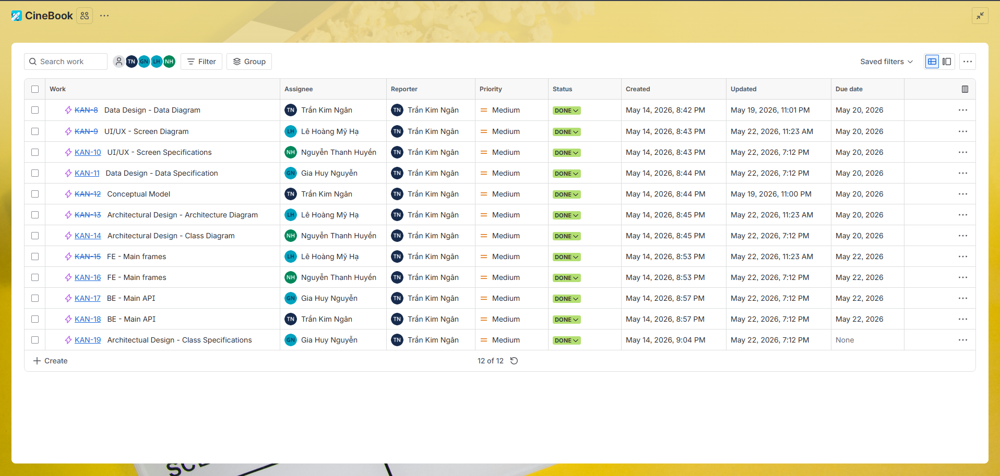

  <em>Hình 1: Bảng Jira phân công task</em>

## 2. Conceptual Model
> Written by: 23120060 - Trần Kim Ngân   
Reviewed by: 23120049 - Nguyễn Thanh Huyền

  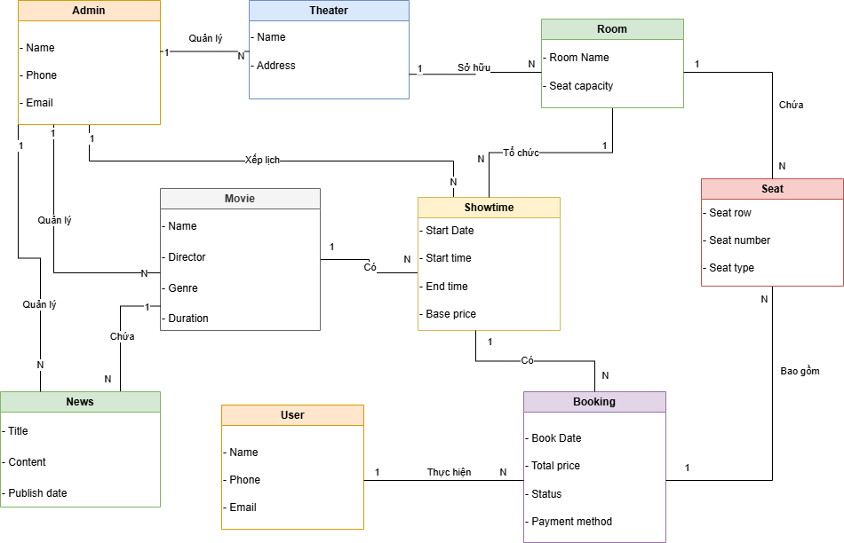

  <em>Hình 2: Conceptual Model</em>

### 1. Mô tả chi tiết các Thực thể
* **Theater:** Đại diện cho một chi nhánh rạp phim.
* **Room:** Đại diện cho một phòng chiếu cụ thể bên trong một rạp. Mỗi phòng sẽ có một sức chứa ghế cố định.
* **Seat:** Đại diện cho từng vị trí ghế ngồi vật lý riêng biệt bên trong một phòng chiếu, có nhiều loại ghế (Ghế thường, ghế VIP) tuỳ vào từng phòng chiếu.
* **Movie:** Đại diện cho một bộ phim đã được cấp phép bản quyền để trình chiếu trong toàn bộ chuỗi rạp.
* **Showtime:** Đại diện cho một khung giờ chiếu cụ thể được lên lịch cho một bộ phim tại một phòng chiếu nhất định.
* **User (Người dùng):** Đại diện cho khách hàng đã đăng ký tài khoản và tương tác với hệ thống để thực hiện đặt vé.
* **Admin:** Đại diện cho người vận hành hệ thống, quản lý phim, suất chiếu và doanh thu của rạp.
* **Booking:** Đại diện cho một giao dịch giữ chỗ thành công của khách hàng cho các vị trí ghế cụ thể trong một suất chiếu, bao gồm cả thông tin trạng thái thanh toán.
* **News**: Đại diện cho các bài viết, tin tức hoặc sự kiện liên quan đến bộ phim do rạp đăng tải.

### 2. Phân tích Mối quan hệ:
* **Theater sở hữu Room (Mối quan hệ 1:N):** Một rạp chiếu có thể có nhiều phòng chiếu phim bên trong, nhưng mỗi phòng chiếu bắt buộc chỉ thuộc về quản lý của một rạp duy nhất.
* **Room chứa Seat (Mối quan hệ 1:N):** Một phòng chiếu sẽ chứa nhiều chiếc ghế ngồi vật lý. Mỗi chiếc ghế ngồi được gắn cố định với duy nhất một phòng chiếu.
* **Room tổ chức Showtime (Mối quan hệ 1:N):** Một phòng chiếu có thể tổ chức nhiều suất chiếu nối đuôi nhau trong suốt cả ngày, nhưng một suất chiếu cụ thể chỉ được phép diễn ra tại một phòng chiếu duy nhất.
* **Movie có các Showtime (Mối quan hệ 1:N):** Một bộ phim có thể được xếp lịch vào nhiều suất chiếu khác nhau để phục vụ khán giả, nhưng mỗi suất chiếu tại một thời điểm chỉ phát duy nhất một bộ phim.
*** Movie Chứa News (Mối quan hệ 1:N)**: Một bộ phim có thể đính kèm hoặc liên kết với nhiều bài viết tin tức (News) truyền thông về phim đó.
* **User thực hiện Booking (Mối quan hệ 1:N):** Một khách hàng có thể thực hiện nhiều giao dịch đặt vé khác nhau theo thời gian, nhưng mỗi đơn đặt vé chỉ thuộc sở hữu của duy nhất một tài khoản người dùng.
* **Booking bao gồm Seat (Mối quan hệ 1:N):** Một giao dịch đặt vé của khách hàng có thể bao gồm một hoặc nhiều chiếc ghế được chọn cùng lúc (Ví dụ: Đặt vé theo nhóm, đi xem phim theo cặp). Các chiếc ghế này sẽ được khóa trạng thái đi kèm với mã đơn đặt vé đó trong suốt suất chiếu diễn ra.
* **Admin (Mối quan hệ 1:N):** Quản trị viên có thể tạo và quản lý nhiều Phim (`Movie`), nhiều Suất chiếu (`Showtime`), nhiều Tin tức của phim (`News`) trên hệ thống.

## 3. Architectural Design

### 3.1 Architecture Diagram
> Written by: 23120038 - Lê Hoàng Mỹ Hạ  
Reviewed by: 23120049 - Nguyễn Thanh Huyền

#### 3.1.1 System Decomposition Tree Diagram

Hình dưới đây mô tả sơ đồ phân rã hệ thống (System Decomposition Tree Diagram) của CineBook. Hệ thống được chia thành nhiều tầng và module chức năng nhằm đảm bảo tính tổ chức, khả năng mở rộng và dễ bảo trì trong quá trình phát triển.

CineBook được phân rã thành bốn thành phần chính:

- **Presentation Tier**: Bao gồm toàn bộ giao diện tương tác với người dùng như trang chủ, đăng nhập/đăng ký, chi tiết phim, chọn ghế, thanh toán, chatbot và dashboard quản trị.
- **Logic Tier**: Chứa các module xử lý nghiệp vụ như xác thực người dùng, quản lý phim và suất chiếu, đặt vé, thanh toán VietQR, recommendation AI, báo cáo doanh thu và tài liệu API.
- **Data Tier**: Bao gồm các thành phần lưu trữ dữ liệu như PostgreSQL Database, ChromaDB vector store và media storage.
- **External / Runtime Services**: Bao gồm các dịch vụ ngoài hệ thống như Ollama Local LLM, VietQR Banking App và môi trường trình duyệt web.

Việc phân rã theo module giúp hệ thống giảm coupling giữa các thành phần, đồng thời hỗ trợ phát triển độc lập và dễ dàng mở rộng chức năng trong tương lai.

  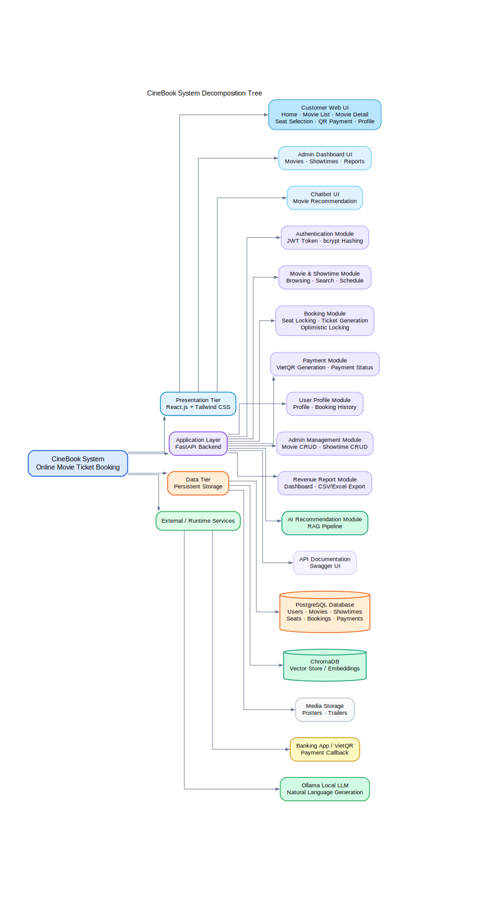

  <em>Hình 3.1.1: System Decomposition Tree Diagram của hệ thống CineBook</em>

---

#### 3.1.2 Overall System Architecture Diagram
Hình dưới đây mô tả kiến trúc tổng thể (Overall System Architecture Diagram) của hệ thống CineBook theo mô hình Client–Server đa tầng.

Trong kiến trúc này:

- Người dùng và quản trị viên truy cập hệ thống thông qua trình duyệt web.
- Frontend được xây dựng bằng React.js và Tailwind CSS, chịu trách nhiệm hiển thị giao diện và gửi request đến backend thông qua REST API.
- Backend được phát triển bằng FastAPI, xử lý toàn bộ nghiệp vụ hệ thống như authentication, booking flow, payment processing, admin operations và AI recommendation.
- PostgreSQL được sử dụng để lưu trữ dữ liệu quan hệ và dữ liệu giao dịch.
- ChromaDB đóng vai trò vector database phục vụ semantic retrieval cho chatbot recommendation.
- Ollama Local LLM được tích hợp để sinh phản hồi hội thoại và recommendation bằng ngôn ngữ tự nhiên.
- VietQR được sử dụng để xử lý thanh toán QR-code và callback giao dịch.

Kiến trúc này cho phép tách biệt rõ ràng giữa giao diện, xử lý nghiệp vụ và lưu trữ dữ liệu, từ đó giúp hệ thống dễ mở rộng và dễ triển khai hơn.

  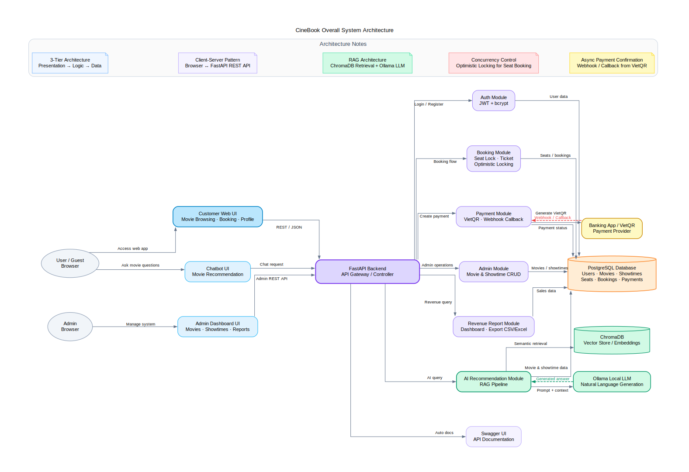

<em>Hình 3.1.2: Overall System Architecture Diagram của hệ thống CineBook</em>

---

#### 3.1.3 Architectural Characteristics & Design Approach
> Written by: 23120038 - Lê Hoàng Mỹ Hạ  
Reviewed by: 23120047 - Nguyễn Gia Huy

Hệ thống CineBook áp dụng nhiều đặc điểm kiến trúc và nguyên tắc thiết kế nhằm đảm bảo hiệu năng, khả năng mở rộng và bảo trì lâu dài.

##### Client–Server Architecture
Hệ thống được xây dựng theo mô hình Client–Server, trong đó frontend đóng vai trò client và backend FastAPI đóng vai trò server xử lý nghiệp vụ.

##### Multi-Tier Architecture
Kiến trúc hệ thống được chia thành nhiều tầng gồm:
- Presentation Tier
- Logic Tier
- Data Tier
- External Services

Việc phân tầng giúp giảm sự phụ thuộc giữa các thành phần và tăng khả năng mở rộng hệ thống.

##### Modular Architecture
Các chức năng như authentication, booking, payment, AI recommendation, reporting và admin management được xây dựng thành các module độc lập. Điều này giúp việc phát triển, kiểm thử và bảo trì trở nên dễ dàng hơn.

##### RESTful API Communication
Frontend và backend giao tiếp với nhau thông qua REST API sử dụng dữ liệu JSON. Swagger/OpenAPI được tích hợp để hỗ trợ tài liệu hóa và kiểm thử API.

##### AI-Enhanced Recommendation System
Hệ thống recommendation sử dụng kiến trúc RAG (Retrieval-Augmented Generation), kết hợp:
- PostgreSQL để truy xuất dữ liệu phim
- ChromaDB để semantic retrieval
- Ollama Local LLM để sinh phản hồi hội thoại

Kiến trúc này giúp chatbot có khả năng hỗ trợ recommendation theo ngữ cảnh và tương tác tự nhiên với người dùng.

##### Security Considerations
Hệ thống áp dụng nhiều cơ chế bảo mật:
- JWT Authentication
- bcrypt password hashing
- HTTPS communication
- Token expiration
- Role-based access control cho admin dashboard

Những đặc điểm kiến trúc trên giúp CineBook có nền tảng phù hợp cho việc mở rộng tính năng và triển khai thực tế trong tương lai.

### 3.2 Class Diagram
> Written by: 23120049 - Nguyễn Thanh Huyền  
Reviewed by: 23120047 - Nguyễn Gia Huy
   
  

### 3.3 Class Specifications
> Written by: 23120047 - Nguyễn Gia Huy  
Reviewed by: 23120060 - Trần Kim Ngân

#### 3.3.1 Lớp `Role`

| Thuộc tính / Phương thức | Loại | Mô tả |
| :--- | :--- | :--- |
| `role_id: SERIAL` | Thuộc tính | Khóa chính định danh vai trò. |
| `role_name: TEXT` | Thuộc tính | Tên vai trò trong hệ thống (ví dụ: `'user'`, `'admin'`). |
| `getRoleName(): TEXT` | Phương thức | Trả về tên của vai trò. |

**Ràng buộc:** `role_name` phải là duy nhất (UNIQUE) và không được để trống (NOT NULL).

---

#### 3.3.2 Lớp `Account`

| Thuộc tính / Phương thức | Loại | Mô tả |
| :--- | :--- | :--- |
| `account_id: SERIAL` | Thuộc tính | Khóa chính định danh tài khoản. |
| `email: TEXT` | Thuộc tính | Địa chỉ email dùng để đăng nhập, phải là duy nhất. |
| `password: TEXT` | Thuộc tính | Mật khẩu đã được băm (bcrypt) trước khi lưu. |
| `role_id: INT` | Thuộc tính | Khóa ngoại liên kết tới `Role`, xác định quyền hạn của tài khoản. |
| `validateCredentials(email, password): BOOL` | Phương thức | Xác thực email và mật khẩu khi đăng nhập. |
| `generateJWT(): TEXT` | Phương thức | Tạo JWT access token sau khi đăng nhập thành công. |
| `updatePassword(newHash): VOID` | Phương thức | Cập nhật mật khẩu đã được băm mới. |

**Ràng buộc:** `email` phải UNIQUE và NOT NULL. `password` không được lưu plaintext. `role_id` tham chiếu `Role(role_id)` với ON DELETE RESTRICT.

---

#### 3.3.3 Lớp `Customer`

| Thuộc tính / Phương thức | Loại | Mô tả |
| :--- | :--- | :--- |
| `customer_id: INT` | Thuộc tính | Khóa chính, đồng thời là khóa ngoại tham chiếu `Account(account_id)`. |
| `name: TEXT` | Thuộc tính | Họ và tên đầy đủ của khách hàng. |
| `phone: TEXT` | Thuộc tính | Số điện thoại liên hệ. |
| `getProfile(): CustomerDTO` | Phương thức | Trả về thông tin cá nhân (không bao gồm mật khẩu). |
| `updateProfile(name, phone): VOID` | Phương thức | Cập nhật họ tên và số điện thoại. |
| `getBookingHistory(): List<Booking>` | Phương thức | Trả về danh sách các đơn đặt vé đã thực hiện. |

**Ràng buộc:** `customer_id` tham chiếu `Account(account_id)` với quan hệ 1-1. `name` và `phone` NOT NULL.

---

#### 3.3.4 Lớp `Admin`

| Thuộc tính / Phương thức | Loại | Mô tả |
| :--- | :--- | :--- |
| `admin_id: INT` | Thuộc tính | Khóa chính, đồng thời là khóa ngoại tham chiếu `Account(account_id)`. |
| `name: TEXT` | Thuộc tính | Tên hiển thị của quản trị viên. |
| `manageMovie(action, data): VOID` | Phương thức | Thêm, sửa hoặc xóa thông tin phim. |
| `manageShowtime(action, data): VOID` | Phương thức | Tạo lịch chiếu hàng loạt hoặc hủy suất chiếu. |
| `manageNews(action, data): VOID` | Phương thức | Đăng tải và cập nhật tin tức/sự kiện rạp. |
| `viewRevenueReport(filter): ReportDTO` | Phương thức | Xem báo cáo doanh thu theo phim hoặc khoảng thời gian. |

**Ràng buộc:** `admin_id` tham chiếu `Account(account_id)` với quan hệ 1-1. `name` NOT NULL.

---

#### 3.3.5 Lớp `Theater`

| Thuộc tính / Phương thức | Loại | Mô tả |
| :--- | :--- | :--- |
| `theater_id: SERIAL` | Thuộc tính | Khóa chính tự động tăng. |
| `name: TEXT` | Thuộc tính | Tên cụm rạp (ví dụ: "Galaxy Nguyễn Du"). |
| `address: TEXT` | Thuộc tính | Địa chỉ chi tiết của rạp. |
| `getRooms(): List<Room>` | Phương thức | Trả về danh sách phòng chiếu thuộc rạp này. |

**Ràng buộc:** `name` và `address` NOT NULL.

---

#### 3.3.6 Lớp `Room`

| Thuộc tính / Phương thức | Loại | Mô tả |
| :--- | :--- | :--- |
| `room_id: SERIAL` | Thuộc tính | Khóa chính tự động tăng. |
| `theater_id: INT` | Thuộc tính | Khóa ngoại tham chiếu `Theater(theater_id)`. |
| `name: TEXT` | Thuộc tính | Tên phòng chiếu (ví dụ: "Phòng 1", "IMAX"). |
| `seat_capacity: INT` | Thuộc tính | Tổng số ghế trong phòng. |
| `getSeats(): List<Seat>` | Phương thức | Trả về danh sách toàn bộ ghế trong phòng. |
| `getShowtimes(date): List<Showtime>` | Phương thức | Trả về lịch chiếu trong ngày của phòng này. |

**Ràng buộc:** `seat_capacity > 0`, NOT NULL. `theater_id` ON DELETE CASCADE.

---

#### 3.3.7 Lớp `Seat`

| Thuộc tính / Phương thức | Loại | Mô tả |
| :--- | :--- | :--- |
| `seat_id: SERIAL` | Thuộc tính | Khóa chính tự động tăng. |
| `room_id: INT` | Thuộc tính | Khóa ngoại tham chiếu `Room(room_id)`. |
| `seat_row: CHAR(255)` | Thuộc tính | Ký hiệu hàng ghế (ví dụ: 'A', 'B'). |
| `seat_num: INT` | Thuộc tính | Số thứ tự ghế trong hàng. |
| `seat_type: TEXT` | Thuộc tính | Loại ghế: `'Standard'` hoặc `'VIP'`. |
| `getSeatLabel(): TEXT` | Phương thức | Trả về nhãn ghế dạng kết hợp (ví dụ: `'D5'`). |
| `getPrice(): FLOAT` | Phương thức | Trả về đơn giá vé tương ứng với loại ghế. |

**Ràng buộc:** `(room_id, seat_row, seat_num)` UNIQUE để không trùng ghế trong cùng phòng. `seat_num > 0`, NOT NULL.

---

#### 3.3.8 Lớp `Movie`

| Thuộc tính / Phương thức | Loại | Mô tả |
| :--- | :--- | :--- |
| `movie_id: SERIAL` | Thuộc tính | Khóa chính tự động tăng. |
| `title: TEXT` | Thuộc tính | Tên bộ phim. |
| `duration: INT` | Thuộc tính | Thời lượng phim (phút). |
| `genre: TEXT` | Thuộc tính | Thể loại phim. |
| `language: TEXT` | Thuộc tính | Ngôn ngữ. |
| `release_date: DATE` | Thuộc tính | Ngày khởi chiếu. |
| `poster_url: TEXT` | Thuộc tính | URL ảnh poster. |
| `director: TEXT` | Thuộc tính | Tên đạo diễn. |
| `status: TEXT` | Thuộc tính | Trạng thái: `'now_showing'` hoặc `'coming_soon'`. |
| `description: TEXT` | Thuộc tính | Tóm tắt nội dung phim. |
| `imdb_id: TEXT` | Thuộc tính | Mã IMDb để đồng bộ dữ liệu. |
| `imdb_rating: FLOAT` | Thuộc tính | Điểm đánh giá IMDb. |
| `imdb_votes: INT` | Thuộc tính | Số lượt bình chọn trên IMDb. |
| `getShowtimes(date): List<Showtime>` | Phương thức | Trả về danh sách suất chiếu của phim theo ngày. |
| `getNews(): List<MovieNews>` | Phương thức | Trả về danh sách tin tức liên quan đến phim. |

**Ràng buộc:** `title`, `duration`, `language`, `status` NOT NULL. `imdb_id` UNIQUE nếu có giá trị.

---

#### 3.3.9 Lớp `MovieNews`

| Thuộc tính / Phương thức | Loại | Mô tả |
| :--- | :--- | :--- |
| `news_id: SERIAL` | Thuộc tính | Khóa chính tự động tăng. |
| `movie_id: INT` | Thuộc tính | Khóa ngoại tham chiếu `Movie(movie_id)`. |
| `title: TEXT` | Thuộc tính | Tiêu đề bài viết tin tức. |
| `content: TEXT` | Thuộc tính | Nội dung chi tiết. |
| `image_url: TEXT` | Thuộc tính | Hình ảnh minh họa. |
| `published_at: TIMESTAMP(0)` | Thuộc tính | Thời điểm xuất bản, mặc định là `NOW()`. |
| `getRelatedMovie(): Movie` | Phương thức | Trả về đối tượng phim liên quan đến bài viết. |

**Ràng buộc:** `title`, `content`, `published_at` NOT NULL.

---

#### 3.3.10 Lớp `Showtime`

| Thuộc tính / Phương thức | Loại | Mô tả |
| :--- | :--- | :--- |
| `showtime_id: SERIAL` | Thuộc tính | Khóa chính tự động tăng. |
| `movie_id: INT` | Thuộc tính | Khóa ngoại tham chiếu `Movie(movie_id)`. |
| `room_id: INT` | Thuộc tính | Khóa ngoại tham chiếu `Room(room_id)`. |
| `start_time: TIMESTAMP(0)` | Thuộc tính | Thời điểm bắt đầu suất chiếu. |
| `end_time: TIMESTAMP(0)` | Thuộc tính | Thời điểm kết thúc suất chiếu. |
| `day_type: TEXT` | Thuộc tính | Loại ngày (VD: Weekday, Weekend) để tính giá. |
| `isConflict(roomId, start, end): BOOL` | Phương thức | Kiểm tra xem suất chiếu mới có trùng phòng/giờ không. |
| `getAvailableSeats(): List<ShowSeat>` | Phương thức | Trả về danh sách ghế còn trống của suất chiếu này. |

**Ràng buộc:** `(room_id, start_time)` UNIQUE để không trùng lịch chiếu cùng phòng. `end_time > start_time`, NOT NULL.

---

#### 3.3.11 Lớp `ShowSeat`

| Thuộc tính / Phương thức | Loại | Mô tả |
| :--- | :--- | :--- |
| `show_seat_id: SERIAL` | Thuộc tính | Khóa chính tự động tăng. |
| `showtime_id: INT` | Thuộc tính | Khóa ngoại tham chiếu `Showtime(showtime_id)`. |
| `seat_id: INT` | Thuộc tính | Khóa ngoại tham chiếu `Seat(seat_id)`. |
| `booking_id: INT` | Thuộc tính | Khóa ngoại tham chiếu `Booking(booking_id)`. |
| `status: TEXT` | Thuộc tính | Trạng thái ghế: `'Available'`, `'Holding'`, `'Sold'`. |
| `hold_expires_at: TIMESTAMP(0)` | Thuộc tính | Thời điểm hết hạn giữ chỗ tạm thời. |
| `hold(bookingId, ttlMinutes): VOID` | Phương thức | Đặt trạng thái `'Holding'` và ghi thời gian hết hạn. |
| `release(): VOID` | Phương thức | Giải phóng ghế về `'Available'` khi hết giờ giữ hoặc hủy. |
| `confirm(bookingId): VOID` | Phương thức | Chuyển trạng thái sang `'Sold'` sau khi thanh toán thành công. |

**Ràng buộc:** `(showtime_id, seat_id)` UNIQUE để không có hai bản ghi trùng ghế trùng suất.

---

#### 3.3.12 Lớp `Booking`

| Thuộc tính / Phương thức | Loại | Mô tả |
| :--- | :--- | :--- |
| `booking_id: SERIAL` | Thuộc tính | Khóa chính tự động tăng. |
| `customer_id: INT` | Thuộc tính | Khóa ngoại tham chiếu `Customer(customer_id)`. |
| `showtime_id: INT` | Thuộc tính | Khóa ngoại tham chiếu `Showtime(showtime_id)`. |
| `booking_date: TIMESTAMP(0)` | Thuộc tính | Thời điểm tạo đơn đặt vé, mặc định `NOW()`. |
| `total_price: BIGINT` | Thuộc tính | Tổng tiền của đơn hàng (VND, không dùng float để tránh sai số). |
| `status: TEXT` | Thuộc tính | Trạng thái đơn: `'pending'`, `'paid'`, `'cancelled'`. |
| `getBookingItems(): List<BookingItem>` | Phương thức | Trả về danh sách chi tiết ghế đặt thuộc đơn hàng này. |
| `getSeats(): List<ShowSeat>` | Phương thức | Trả về danh sách ghế thuộc đơn đặt vé này. |
| `getPayment(): Payment` | Phương thức | Trả về thông tin giao dịch thanh toán liên quan. |
| `cancel(): VOID` | Phương thức | Hủy đơn hàng và giải phóng các ghế đang giữ. |

**Ràng buộc:** `total_price >= 0`, NOT NULL. `status` NOT NULL, mặc định `'pending'`.

---

#### 3.3.13 Lớp `Payment`

| Thuộc tính / Phương thức | Loại | Mô tả |
| :--- | :--- | :--- |
| `payment_id: SERIAL` | Thuộc tính | Khóa chính tự động tăng. |
| `booking_id: INT` | Thuộc tính | Khóa ngoại tham chiếu `Booking(booking_id)`. |
| `payment_method: TEXT` | Thuộc tính | Phương thức thanh toán (ví dụ: `'VietQR'`, `'MoMo'`). |
| `amount: FLOAT(53)` | Thuộc tính | Số tiền thực tế đã thanh toán. |
| `payment_time: TIMESTAMP(0)` | Thuộc tính | Thời điểm giao dịch được xác nhận. |
| `transaction_id: TEXT` | Thuộc tính | Mã giao dịch từ cổng thanh toán (dùng để đối chiếu webhook). |
| `generateQR(): TEXT` | Phương thức | Tạo nội dung mã VietQR tương ứng với số tiền đơn hàng. |
| `verifyWebhook(payload): BOOL` | Phương thức | Xác thực callback từ cổng thanh toán, đảm bảo tính toàn vẹn giao dịch. |
| `markPaid(): VOID` | Phương thức | Cập nhật trạng thái đơn hàng liên kết sang `'paid'`. |

**Ràng buộc:** `transaction_id` UNIQUE để tránh xử lý trùng webhook. `booking_id` ON DELETE RESTRICT.

---

#### 3.3.14 Lớp `Promotion`

| Thuộc tính / Phương thức | Loại | Mô tả |
| :--- | :--- | :--- |
| `promo_id: SERIAL` | Thuộc tính | Khóa chính tự động tăng. |
| `customer_id: INT` | Thuộc tính | Khóa ngoại tham chiếu `Customer(customer_id)`. |
| `title: TEXT` | Thuộc tính | Tiêu đề của chương trình khuyến mãi. |
| `content: TEXT` | Thuộc tính | Nội dung khuyến mãi chi tiết. |
| `published_at: TIMESTAMP(0)` | Thuộc tính | Thời điểm phát hành tin khuyến mãi. |
| `getPromotionsByCustomer(customerId): List<Promotion>` | Phương thức | Trả về danh sách khuyến mãi của khách hàng. |

**Ràng buộc:** `customer_id` tham chiếu `Customer(customer_id)`. Các thuộc tính `title`, `content`, `published_at` là NOT NULL.

---

#### 3.3.15 Lớp `PricingRule`

| Thuộc tính / Phương thức | Loại | Mô tả |
| :--- | :--- | :--- |
| `rule_id: SERIAL` | Thuộc tính | Khóa chính tự động tăng. |
| `seat_type: TEXT` | Thuộc tính | Loại ghế áp dụng (Standard, VIP). |
| `day_type: TEXT` | Thuộc tính | Loại ngày áp dụng (Weekday, Weekend). |
| `multiplier: INTEGER` | Thuộc tính | Hệ số nhân giá trị (ví dụ: 1 cho ngày thường, 2 cho ngày lễ). |
| `base_price: INTEGER` | Thuộc tính | Giá tiền gốc cơ bản. |
| `effective_from: DATE` | Thuộc tính | Ngày bắt đầu có hiệu lực. |
| `effective_to: DATE` | Thuộc tính | Ngày kết thúc hiệu lực. |
| `calculatePrice(): INTEGER` | Phương thức | Tính toán đơn giá dựa trên giá gốc và hệ số. |

**Ràng buộc:** `base_price >= 0`, `multiplier >= 0`. Tất cả các thuộc tính đều NOT NULL.

---

#### 3.3.16 Lớp `BookingItem`

| Thuộc tính / Phương thức | Loại | Mô tả |
| :--- | :--- | :--- |
| `item_id: SERIAL` | Thuộc tính | Khóa chính tự động tăng. |
| `booking_id: INT` | Thuộc tính | Khóa ngoại tham chiếu `Booking(booking_id)`. |
| `show_seat_id: INT` | Thuộc tính | Khóa ngoại tham chiếu `ShowSeat(show_seat_id)`. |
| `unit_price: INTEGER` | Thuộc tính | Đơn giá của ghế được chọn tại suất chiếu. |
| `rule_id: INT` | Thuộc tính | Khóa ngoại tham chiếu `PricingRule(rule_id)`. |
| `getETicket(): ETicket` | Phương thức | Trả về vé điện tử liên quan đến chi tiết đặt vé này. |

**Ràng buộc:** `booking_id` tham chiếu `Booking(booking_id)`, `show_seat_id` tham chiếu `ShowSeat(show_seat_id)`, `rule_id` tham chiếu `PricingRule(rule_id)`.

---

#### 3.3.17 Lớp `ETicket`

| Thuộc tính / Phương thức | Loại | Mô tả |
| :--- | :--- | :--- |
| `ticket_id: SERIAL` | Thuộc tính | Khóa chính tự động tăng. |
| `item_id: BIGINT` | Thuộc tính | Khóa ngoại tham chiếu `BookingItem(item_id)`. |
| `qr_code: TEXT` | Thuộc tính | Chuỗi dữ liệu mã QR code của vé để soát vé. |
| `issued_at: TIMESTAMP(0)` | Thuộc tính | Thời điểm phát hành vé. |
| `is_valid: BOOLEAN` | Thuộc tính | Trạng thái hiệu lực của vé (True: Hợp lệ, False: Đã sử dụng hoặc Hủy). |
| `validateTicket(): BOOL` | Phương thức | Soát vé và kiểm tra tính hợp lệ. |
| `invalidate(): VOID` | Phương thức | Hủy bỏ hiệu lực của vé (sau khi soát vé hoặc hoàn tiền). |

**Ràng buộc:** `item_id` tham chiếu `BookingItem(item_id)`. Các thuộc tính là NOT NULL.

---

#### 3.3.18 Lớp `AIConversation`

| Thuộc tính / Phương thức | Loại | Mô tả |
| :--- | :--- | :--- |
| `conversation_id: SERIAL` | Thuộc tính | Khóa chính định danh cuộc hội thoại. |
| `customer_id: INT` | Thuộc tính | Khóa ngoại tham chiếu `Customer(customer_id)`. |
| `started_at: TIMESTAMP(0)` | Thuộc tính | Thời gian bắt đầu cuộc trò chuyện. |
| `getMessages(): List<AIMessage>` | Phương thức | Trả về danh sách các tin nhắn trong cuộc hội thoại này. |

**Ràng buộc:** `customer_id` tham chiếu `Customer(customer_id)`. Tất cả thuộc tính NOT NULL.

---

#### 3.3.19 Lớp `AIMessage`

| Thuộc tính / Phương thức | Loại | Mô tả |
| :--- | :--- | :--- |
| `message_id: SERIAL` | Thuộc tính | Khóa chính định danh tin nhắn. |
| `conversation_id: INT` | Thuộc tính | Khóa ngoại tham chiếu `AIConversation(conversation_id)`. |
| `sender_type: TEXT` | Thuộc tính | Loại người gửi (`'user'` hoặc `'ai'`). |
| `content: TEXT` | Thuộc tính | Nội dung tin nhắn chi tiết. |
| `sent_at: TIMESTAMP(0)` | Thuộc tính | Thời gian gửi tin nhắn. |

**Ràng buộc:** `conversation_id` tham chiếu `AIConversation(conversation_id)`. Các thuộc tính NOT NULL.

## 4. Data Design

### 4.1 Data Diagram
> Written by: 23120060 - Trần Kim Ngân  
Reviewed by: 23120047 - Nguyễn Gia Huy

  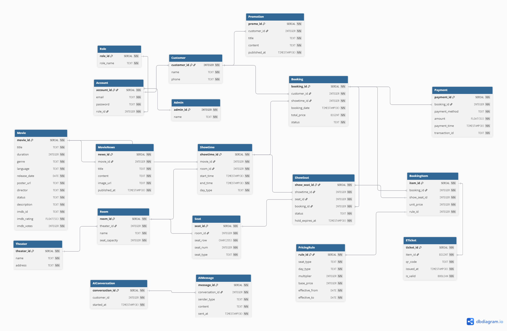

  <em>Hình 4: Data Diagram</em>

### 4.2 Data Specification
> Written by: 23120047 - Nguyễn Gia Huy     
Reviewed by: 23120060 - Trần Kim Ngân  

### Bảng `Theater` (Cụm rạp)
| Tên thuộc tính | Kiểu dữ liệu | Ràng buộc khóa | Ràng buộc giá trị | Giải thích thuộc tính |
| :--- | :--- | :--- | :--- | :--- |
| `theater_id` | SERIAL | PK | NOT NULL, UNIQUE | Mã định danh tự động tăng của cụm rạp. |
| `name` | TEXT | Không | NOT NULL | Tên hiển thị của cụm rạp. |
| `address` | TEXT | Không | NOT NULL | Địa chỉ chi tiết của rạp. |

### Bảng `Room` (Phòng chiếu)
| Tên thuộc tính | Kiểu dữ liệu | Ràng buộc khóa | Ràng buộc giá trị | Giải thích thuộc tính |
| :--- | :--- | :--- | :--- | :--- |
| `room_id` | SERIAL | PK | NOT NULL, UNIQUE | Mã định danh tự động tăng của phòng chiếu. |
| `theater_id` | INT | FK | NOT NULL, Refs `Theater(theater_id)` | Thuộc về cụm rạp nào. |
| `name` | TEXT | Không | NOT NULL | Tên phòng chiếu. |
| `seat_capacity` | INT | Không | NOT NULL, > 0 | Tổng số lượng ghế tối đa. |

### Bảng `Seat` (Ghế ngồi cố định)
| Tên thuộc tính | Kiểu dữ liệu | Ràng buộc khóa | Ràng buộc giá trị | Giải thích thuộc tính |
| :--- | :--- | :--- | :--- | :--- |
| `seat_id` | SERIAL | PK | NOT NULL, UNIQUE | Mã định danh tự động tăng của chiếc ghế. |
| `room_id` | INT | FK | NOT NULL, Refs `Room(room_id)` | Ghế này nằm cố định ở phòng nào. |
| `seat_row` | CHAR(2) | Không | NOT NULL | Ký hiệu hàng ghế (Ví dụ: 'A', 'B'). |
| `seat_num` | INT | Không | NOT NULL, > 0 | Số thứ tự của ghế. |
| `seat_type` | TEXT | Không | NOT NULL | Phân loại ghế ('Standard', 'VIP'). |

### Bảng `Movie` (Phim)
| Tên thuộc tính | Kiểu dữ liệu | Ràng buộc khóa | Ràng buộc giá trị | Giải thích thuộc tính |
| :--- | :--- | :--- | :--- | :--- |
| `movie_id` | SERIAL | PK | NOT NULL, UNIQUE | Mã định danh tự động tăng của bộ phim. |
| `title` | TEXT | Không | NOT NULL | Tên của bộ phim. |
| `duration` | INT | Không | NOT NULL, > 0 | Thời lượng của phim (phút). |
| `genre` | TEXT | Không | Cho phép NULL | Thể loại phim. |
| `language` | TEXT | Không | NOT NULL | Ngôn ngữ phim. |
| `release_date` | DATE | Không | Cho phép NULL | Ngày bộ phim khởi chiếu. |
| `poster_url` | TEXT | Không | Cho phép NULL | URL hình ảnh poster của phim. |
| `director` | TEXT | Không | Cho phép NULL | Tên đạo diễn. |
| `status` | TEXT | Không | NOT NULL | Trạng thái phát hành (Đang chiếu, Sắp chiếu). |
| `description` | TEXT | Không | Cho phép NULL | Tóm tắt nội dung phim. |
| `imdb_id` | TEXT | Không | Cho phép NULL, UNIQUE | Mã định danh của phim trên hệ thống IMDb (Dùng để đồng bộ API). |
| `imdb_rating` | FLOAT | Không | Cho phép NULL | Điểm đánh giá từ IMDb (Ví dụ: 8.5). |
| `imdb_votes` | INT | Không | Cho phép NULL | Tổng số lượt bình chọn trên IMDb. |

### Bảng `MovieNews` (Tin tức phim)
| Tên thuộc tính | Kiểu dữ liệu | Ràng buộc khóa | Ràng buộc giá trị | Giải thích thuộc tính |
| :--- | :--- | :--- | :--- | :--- |
| `news_id` | SERIAL | PK | NOT NULL, UNIQUE | Mã định danh tự động tăng của bài viết. |
| `movie_id` | INT | FK | Cho phép NULL, Refs `Movie(movie_id)` | Tin tức thuộc về phim nào. |
| `title` | TEXT | Không | NOT NULL | Tiêu đề tin tức. |
| `content` | TEXT | Không | NOT NULL | Nội dung chi tiết. |
| `image_url` | TEXT | Không | Cho phép NULL | Hình ảnh minh họa. |
| `published_at`| TIMESTAMPTZ | Không | NOT NULL, DEFAULT NOW() | Ngày giờ xuất bản. |

### Bảng `Showtime` (Suất chiếu)
| Tên thuộc tính | Kiểu dữ liệu | Ràng buộc khóa | Ràng buộc giá trị | Giải thích thuộc tính |
| :--- | :--- | :--- | :--- | :--- |
| `showtime_id` | SERIAL | PK | NOT NULL, UNIQUE | Mã định danh tự động tăng của suất chiếu. |
| `movie_id` | INT | FK | NOT NULL, Refs `Movie(movie_id)` | Suất chiếu phát bộ phim nào. |
| `room_id` | INT | FK | NOT NULL, Refs `Room(room_id)` | Suất chiếu diễn ra tại phòng nào. |
| `start_time` | TIMESTAMPTZ | Không | NOT NULL | Thời gian bắt đầu. |
| `end_time` | TIMESTAMPTZ | Không | NOT NULL | Thời gian kết thúc. |
| `day_type` | TEXT | Không | NOT NULL | Loại ngày (VD: Weekday, Weekend) để tính giá. |

### Bảng `ShowSeat` (Trạng thái ghế theo suất)
| Tên thuộc tính | Kiểu dữ liệu | Ràng buộc khóa | Ràng buộc giá trị | Giải thích thuộc tính |
| :--- | :--- | :--- | :--- | :--- |
| `show_seat_id`| SERIAL | PK | NOT NULL, UNIQUE | Mã định danh tự động tăng trạng thái ghế. |
| `showtime_id` | INT | FK | NOT NULL, Refs `Showtime(showtime_id)`| Thuộc về suất chiếu nào. |
| `seat_id` | INT | FK | NOT NULL, Refs `Seat(seat_id)` | Gắn với ghế vật lý nào. |
| `booking_id` | INT | FK | Cho phép NULL, Refs `Booking(booking_id)`| Liên kết mã đơn hàng sau khi đặt thành công. |
| `status` | TEXT | Không | NOT NULL | Trạng thái ('Available', 'Holding', 'Sold'). |
| `hold_expires_at`| TIMESTAMPTZ| Không | Cho phép NULL | Thời gian hết hạn giữ chỗ (phục vụ Redis). |

### Bảng `PricingRule` (Quy tắc tính giá)
| Tên thuộc tính | Kiểu dữ liệu | Ràng buộc khóa | Ràng buộc giá trị | Giải thích thuộc tính |
| :--- | :--- | :--- | :--- | :--- |
| `rule_id` | SERIAL | PK, FK | NOT NULL, UNIQUE, Refs `BookingItem(rule_id)`| Mã quy tắc giá. |
| `seat_type` | TEXT | Không | NOT NULL | Loại ghế áp dụng. |
| `day_type` | TEXT | Không | NOT NULL | Loại ngày áp dụng (VD: Cuối tuần, Ngày lễ). |
| `multiplier` | INTEGER | Không | NOT NULL | Hệ số nhân giá (VD: x1.5). |
| `base_price` | INTEGER | Không | NOT NULL | Giá gốc mặc định. |
| `effective_from` | DATE | Không | NOT NULL | Ngày bắt đầu áp dụng quy tắc. |
| `effective_to` | DATE | Không | NOT NULL | Ngày kết thúc hiệu lực quy tắc. |

### Bảng `AIConversation` (Phiên trò chuyện AI)
| Tên thuộc tính | Kiểu dữ liệu | Ràng buộc khóa | Ràng buộc giá trị | Giải thích thuộc tính |
| :--- | :--- | :--- | :--- | :--- |
| `conversation_id`| SERIAL | PK | NOT NULL, UNIQUE | Mã phiên chat với AI. |
| `customer_id` | INTEGER | Không | NOT NULL | Khách hàng thực hiện phiên chat. |
| `started_at` | TIMESTAMP(0)| Không | NOT NULL | Thời gian bắt đầu trò chuyện. |

### Bảng `AIMessage` (Tin nhắn AI)
| Tên thuộc tính | Kiểu dữ liệu | Ràng buộc khóa | Ràng buộc giá trị | Giải thích thuộc tính |
| :--- | :--- | :--- | :--- | :--- |
| `message_id` | SERIAL | PK | NOT NULL, UNIQUE | Mã tin nhắn trong phiên chat. |
| `conversation_id`| INTEGER | FK | NOT NULL, Refs `AIConversation(conversation_id)`| Thuộc phiên chat nào. |
| `sender_type` | TEXT | Không | NOT NULL | Phân biệt người gửi (VD: USER hoặc AI). |
| `content` | TEXT | Không | NOT NULL | Nội dung tin nhắn. |
| `sent_at` | TIMESTAMP(0)| Không | NOT NULL | Thời gian gửi tin nhắn. |

### Bảng `Role` (Vai trò hệ thống)
| Tên thuộc tính | Kiểu dữ liệu | Ràng buộc khóa | Ràng buộc giá trị | Giải thích thuộc tính |
| :--- | :--- | :--- | :--- | :--- |
| `role_id` | SERIAL | PK | NOT NULL, UNIQUE | Mã định danh tự động tăng của vai trò. |
| `role_name` | TEXT | Không | NOT NULL, UNIQUE | Tên vai trò trong hệ thống (ví dụ: `'user'`, `'admin'`). |

### Bảng `Customer` (Hồ sơ khách hàng)
| Tên thuộc tính | Kiểu dữ liệu | Ràng buộc khóa | Ràng buộc giá trị | Giải thích thuộc tính |
| :--- | :--- | :--- | :--- | :--- |
| `customer_id` | INT | PK, FK | NOT NULL, Refs `Account(account_id)` | Khóa chính đồng thời là khóa ngoại tham chiếu tài khoản (quan hệ 1-1). |
| `name` | TEXT | Không | NOT NULL | Họ và tên đầy đủ của khách hàng. |
| `phone` | TEXT | Không | NOT NULL | Số điện thoại liên hệ của khách hàng. |

### Bảng `Promotion` (Khuyến mãi)
| Tên thuộc tính | Kiểu dữ liệu | Ràng buộc khóa | Ràng buộc giá trị | Giải thích thuộc tính |
| :--- | :--- | :--- | :--- | :--- |
| `promo_id` | SERIAL | PK | NOT NULL, UNIQUE | Mã khuyến mãi tự động tăng. |
| `customer_id` | INT | FK | NOT NULL, Refs `Customer(customer_id)` | Khách hàng nhận được thông báo khuyến mãi. |
| `title` | TEXT | Không | NOT NULL | Tiêu đề của chương trình khuyến mãi. |
| `content` | TEXT | Không | NOT NULL | Nội dung khuyến mãi chi tiết. |
| `published_at` | TIMESTAMP(0) | Không | NOT NULL | Thời gian xuất bản khuyến mãi. |

### Bảng `Booking` (Đơn đặt vé)
| Tên thuộc tính | Kiểu dữ liệu | Ràng buộc khóa | Ràng buộc giá trị | Giải thích thuộc tính |
| :--- | :--- | :--- | :--- | :--- |
| `booking_id` | SERIAL | PK | NOT NULL, UNIQUE | Mã định danh tự động tăng của đơn đặt vé. |
| `customer_id` | INT | FK | NOT NULL, Refs `Customer(customer_id)` | Khách hàng thực hiện đơn đặt vé. |
| `showtime_id` | INT | FK | NOT NULL, Refs `Showtime(showtime_id)` | Suất chiếu đặt vé. |
| `booking_date` | TIMESTAMP(0) | Không | NOT NULL | Thời điểm đơn đặt vé được tạo. |
| `total_price` | BIGINT | Không | NOT NULL, ≥ 0 | Tổng tiền đơn hàng (VND). |
| `status` | TEXT | Không | NOT NULL | Trạng thái đơn đặt vé (`'pending'`, `'paid'`, `'cancelled'`). |

### Bảng `Payment` (Giao dịch thanh toán)
| Tên thuộc tính | Kiểu dữ liệu | Ràng buộc khóa | Ràng buộc giá trị | Giải thích thuộc tính |
| :--- | :--- | :--- | :--- | :--- |
| `payment_id` | SERIAL | PK | NOT NULL, UNIQUE | Mã định danh tự động tăng của giao dịch. |
| `booking_id` | INT | FK | NOT NULL, Refs `Booking(booking_id)` | Đơn đặt vé liên quan. |
| `payment_method` | TEXT | Không | NOT NULL | Phương thức thanh toán (ví dụ: `'VietQR'`, `'MoMo'`). |
| `amount` | FLOAT(53) | Không | NOT NULL, > 0 | Số tiền thanh toán. |
| `payment_time` | TIMESTAMP(0) | Không | NOT NULL | Thời điểm xác nhận giao dịch thành công. |
| `transaction_id` | TEXT | Không | NOT NULL, UNIQUE | Mã giao dịch cổng thanh toán bên thứ ba. |

### Bảng `Admin` (Hồ sơ quản trị viên)
| Tên thuộc tính | Kiểu dữ liệu | Ràng buộc khóa | Ràng buộc giá trị | Giải thích thuộc tính |
| :--- | :--- | :--- | :--- | :--- |
| `admin_id` | INT | PK, FK | NOT NULL, Refs `Account(account_id)` | Khóa chính đồng thời là khóa ngoại tham chiếu tài khoản (quan hệ 1-1). |
| `name` | TEXT | Không | NOT NULL | Tên hiển thị của quản trị viên. |

### Bảng `Account` (Tài khoản đăng nhập)
| Tên thuộc tính | Kiểu dữ liệu | Ràng buộc khóa | Ràng buộc giá trị | Giải thích thuộc tính |
| :--- | :--- | :--- | :--- | :--- |
| `account_id` | SERIAL | PK | NOT NULL, UNIQUE | Mã định danh tự động tăng của tài khoản. |
| `email` | TEXT | Không | NOT NULL, UNIQUE | Địa chỉ email dùng làm tên đăng nhập. |
| `password` | TEXT | Không | NOT NULL | Mật khẩu đã được băm. |
| `role_id` | INT | FK | NOT NULL, Refs `Role(role_id)` | Mã vai trò của tài khoản. |

### Bảng `BookingItem` (Chi tiết ghế đặt)
| Tên thuộc tính | Kiểu dữ liệu | Ràng buộc khóa | Ràng buộc giá trị | Giải thích thuộc tính |
| :--- | :--- | :--- | :--- | :--- |
| `item_id` | SERIAL | PK | NOT NULL, UNIQUE | Mã định danh chi tiết ghế đặt. |
| `booking_id` | INT | FK | NOT NULL, Refs `Booking(booking_id)` | Thuộc đơn đặt vé nào. |
| `show_seat_id` | INT | FK | NOT NULL, Refs `ShowSeat(show_seat_id)` | Ghế được chọn thuộc suất chiếu nào. |
| `unit_price` | INTEGER | Không | NOT NULL, > 0 | Đơn giá vé tại thời điểm đặt. |
| `rule_id` | INTEGER | FK | NOT NULL, Refs `PricingRule(rule_id)` | Quy tắc giá được áp dụng. |

### Bảng `ETicket` (Vé điện tử)
| Tên thuộc tính | Kiểu dữ liệu | Ràng buộc khóa | Ràng buộc giá trị | Giải thích thuộc tính |
| :--- | :--- | :--- | :--- | :--- |
| `ticket_id` | SERIAL | PK | NOT NULL, UNIQUE | Mã vé điện tử tự tăng. |
| `item_id` | BIGINT | FK | NOT NULL, Refs `BookingItem(item_id)` | Liên kết tới chi tiết ghế đặt. |
| `qr_code` | TEXT | Không | NOT NULL | Dữ liệu mã QR code của vé. |
| `issued_at` | TIMESTAMP(0) | Không | NOT NULL | Thời điểm vé được phát hành. |
| `is_valid` | BOOLEAN | Không | NOT NULL | Trạng thái hiệu lực của vé.
## 5. UI/UX

### 5.1 Screen Diagram
> Written by: Nguyễn Thanh Huyền  
Reviewed by:  
  
  
     
    
| Seq | Screen / Element | Description |
| :--- | :--- | :--- |
| 1 | **Trang chủ (Home Page)**  `home.ejs` | Màn hình chính hiển thị danh sách phim đang chiếu, sắp chiếu, banner động và thanh điều hướng chính. |
| 2 | **Chi tiết phim (Movie Detail)**  `movie-detail.ejs` | Hiển thị thông tin chi tiết phim (nội dung, đạo diễn, diễn viên) cùng khung lựa chọn suất chiếu theo ngày để bắt đầu đặt vé. |
| 3 | **Chọn ghế (Seat Selection)**  `seat-selection.ejs` | Màn hình tương tác chọn vị trí ghế trong rạp (Thường, VIP) và hiển thị tổng tiền thời gian thực. |
| 4 | **Thanh toán (Checkout)**  `checkout.ejs` | Màn hình hiển thị QR thanh toán chuyển khoản ngân hàng giả lập, tóm tắt thông tin vé đặt kèm đồng hồ đếm ngược giữ ghế. |
| 5 | **Hóa đơn xác nhận (Receipt)**  `receipt.ejs` | Hiển thị hóa đơn xác nhận giao dịch thành công, nút tải hóa đơn và nút điều hướng tới Trang cá nhân. |
| 6 | **Thông tin cá nhân & Lịch sử thanh toán (Profile & History)**  `profile.ejs` | Quản lý thông tin cá nhân (Họ tên, SĐT, Email), đồng thời hiển thị danh sách vé đã mua và chưa thanh toán. |
| 7 | **Hộp thoại Đăng nhập/Đăng ký (Auth Modal)**  `auth-modal.ejs` | Hộp thoại overlay tích hợp trên Navigation bar để người dùng đăng nhập hoặc đăng ký tài khoản tại bất kỳ trang nào mà không cần tải lại trang. |    
      
### 5.2 Screen Specifications
> Written by: 23120049 - Nguyễn Thanh Huyền  
> &nbsp;&nbsp;&nbsp;&nbsp;&nbsp;&nbsp;&nbsp;&nbsp;&nbsp;&nbsp;&nbsp;&nbsp;&nbsp;&nbsp;&nbsp;&nbsp;&nbsp;&nbsp;&nbsp;23120038 - Lê Hoàng Mỹ Hạ  
Reviewed by: 23120060 - Trần Kim Ngân

#### 5.2.1. Trang chủ (Home Screen - `home.ejs`)

Trang chủ là màn hình đầu tiên khi người dùng truy cập hệ thống CineBook. Giao diện tập trung giới thiệu phim nổi bật, hỗ trợ tìm kiếm nhanh phim/rạp chiếu và hiển thị danh sách phim theo từng nhóm như **Đang Chiếu** và **Sắp Chiếu**.

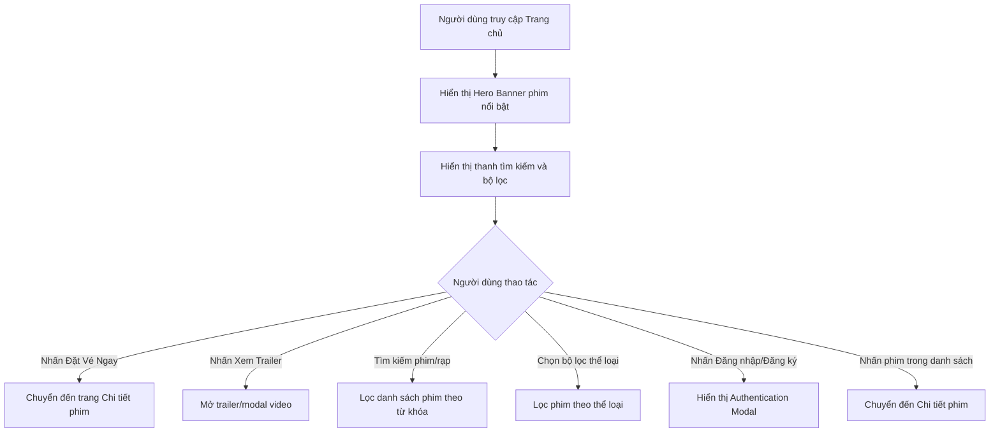

  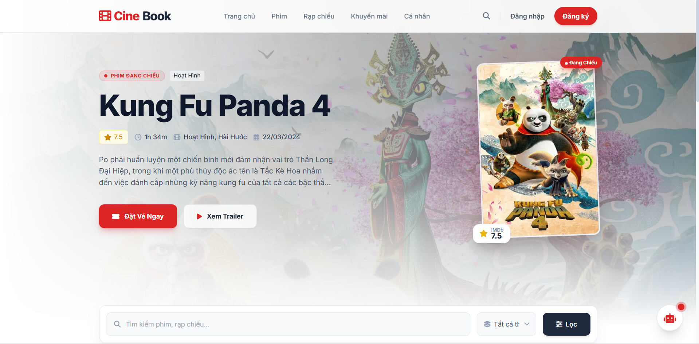

  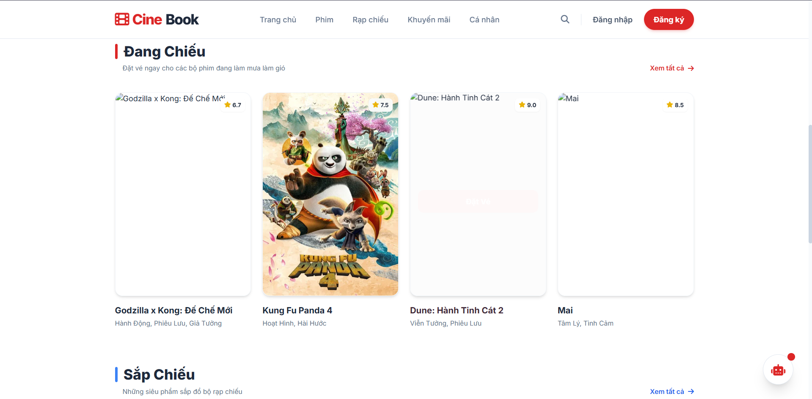

  <em>Hình 5.2.1: Giao diện Trang chủ CineBook</em>

##### Định dạng Hiển thị (Presentation Format)

*   **Thanh điều hướng chính (Navigation Bar)**:
    *   Hiển thị logo **CineBook** ở góc trái.
    *   Các mục điều hướng gồm: `Trang chủ`, `Phim`, `Rạp chiếu`, `Khuyến mãi`, `Cá nhân`.
    *   Khu vực bên phải gồm biểu tượng tìm kiếm, nút `Đăng nhập` và nút `Đăng ký`.
    *   Nút `Đăng ký` dùng nền đỏ nổi bật, chữ trắng, bo tròn lớn và có hiệu ứng đổ bóng nhẹ.

*   **Khu vực Hero Banner phim nổi bật**:
    *   Hiển thị phim nổi bật chính, ví dụ: **Kung Fu Panda 4**.
    *   Nền sử dụng ảnh phim được làm mờ và phủ gradient trắng để đảm bảo chữ dễ đọc.
    *   Bên trái hiển thị:
        *   Nhãn trạng thái `PHIM ĐANG CHIẾU`.
        *   Nhãn thể loại phim, ví dụ: `Hoạt Hình`.
        *   Tên phim cỡ lớn, font đậm.
        *   Thông tin nhanh gồm điểm đánh giá, thời lượng, thể loại và ngày phát hành.
        *   Mô tả ngắn của phim.
        *   Hai nút hành động: `Đặt Vé Ngay` và `Xem Trailer`.
    *   Bên phải hiển thị poster phim dạng thẻ nổi, bo góc, có viền trắng và nhãn điểm IMDb.

*   **Thanh tìm kiếm và bộ lọc**:
    *   Đặt phía dưới Hero Banner.
    *   Ô tìm kiếm có placeholder: `Tìm kiếm phim, rạp chiếu...`.
    *   Bên phải có dropdown lọc thể loại, mặc định là `Tất cả`.
    *   Nút `Lọc` sử dụng nền xanh đậm, icon bộ lọc và chữ trắng.
    *   Toàn bộ cụm tìm kiếm nằm trong khung trắng bo góc lớn, có shadow nhẹ.

*   **Danh sách phim Đang Chiếu**:
    *   Tiêu đề `Đang Chiếu` có thanh nhấn màu đỏ ở bên trái.
    *   Phụ đề mô tả: `Đặt vé ngay cho các bộ phim đang làm mưa làm gió`.
    *   Danh sách phim hiển thị dạng lưới nhiều cột.
    *   Mỗi thẻ phim gồm:
        *   Poster phim.
        *   Điểm đánh giá ở góc trên bên phải.
        *   Tên phim.
        *   Thể loại phim.
        *   Nút `Đặt Vé` khi hover vào thẻ.
    *   Góc phải khu vực có liên kết `Xem tất cả`.

*   **Danh sách phim Sắp Chiếu**:
    *   Tiêu đề `Sắp Chiếu` có thanh nhấn màu xanh ở bên trái.
    *   Phụ đề mô tả: `Những siêu phẩm sắp đổ bộ rạp chiếu`.
    *   Cách trình bày tương tự khu vực Đang Chiếu nhưng dùng để hiển thị các phim chưa mở bán chính thức.

*   **Nút Chatbot nổi**:
    *   Hiển thị ở góc phải dưới màn hình.
    *   Dạng nút tròn màu trắng, icon robot màu đỏ.
    *   Có chấm đỏ nhỏ thể hiện trạng thái thông báo hoặc hỗ trợ trực tuyến.

##### Xử lý Sự kiện (Event Handling)

*   **Sự kiện Nhấn nút Đăng nhập/Đăng ký**:
    *   Khi người dùng nhấn `Đăng nhập`, hệ thống mở modal đăng nhập.
    *   Khi người dùng nhấn `Đăng ký`, hệ thống mở modal đăng ký.
    *   Nền trang chủ phía sau bị làm mờ để tập trung vào hộp thoại xác thực.

*   **Sự kiện Nhấn Đặt Vé Ngay**:
    *   Khi người dùng nhấn nút `Đặt Vé Ngay` trong Hero Banner:
        *   Hệ thống chuyển sang trang chi tiết của phim nổi bật.
        *   URL điều hướng có thể có dạng:
            `/movie/:movieId`

*   **Sự kiện Nhấn Xem Trailer**:
    *   Khi người dùng nhấn `Xem Trailer`:
        *   Hệ thống hiển thị modal trailer hoặc mở video trailer.
        *   Người dùng có thể đóng trailer bằng nút `X` hoặc click ra ngoài vùng video.

*   **Sự kiện Tìm kiếm phim/rạp chiếu**:
    *   Khi người dùng nhập từ khóa vào ô tìm kiếm:
        *   Hệ thống lọc danh sách phim theo tên phim, thể loại hoặc rạp chiếu liên quan.
        *   Nếu không có kết quả phù hợp, hiển thị thông báo: `Không tìm thấy phim phù hợp`.

*   **Sự kiện Lọc theo thể loại**:
    *   Khi người dùng chọn dropdown thể loại và nhấn `Lọc`:
        *   Danh sách phim được cập nhật theo thể loại đã chọn.
        *   Nếu chọn `Tất cả`, hệ thống hiển thị lại toàn bộ phim.

*   **Sự kiện Hover vào thẻ phim**:
    *   Khi người dùng rê chuột vào poster phim:
        *   Thẻ phim nâng nhẹ lên.
        *   Poster có overlay mờ.
        *   Nút `Đặt Vé` xuất hiện ở giữa hoặc gần cuối poster.
    *   Khi rời chuột, thẻ phim trở về trạng thái ban đầu.

*   **Sự kiện Click vào thẻ phim**:
    *   Khi người dùng click vào poster hoặc tên phim:
        *   Hệ thống điều hướng đến trang chi tiết phim tương ứng:
            `/movie/:movieId`  

#### 5.2.2. Chi tiết phim (Movie Detail Screen - `movie-detail.ejs`)

Màn hình Chi tiết phim cung cấp đầy đủ thông tin về bộ phim, mô tả nội dung, đạo diễn, diễn viên và lịch chiếu theo từng cụm rạp để người dùng lựa chọn suất chiếu phù hợp trước khi tiến hành đặt ghế.

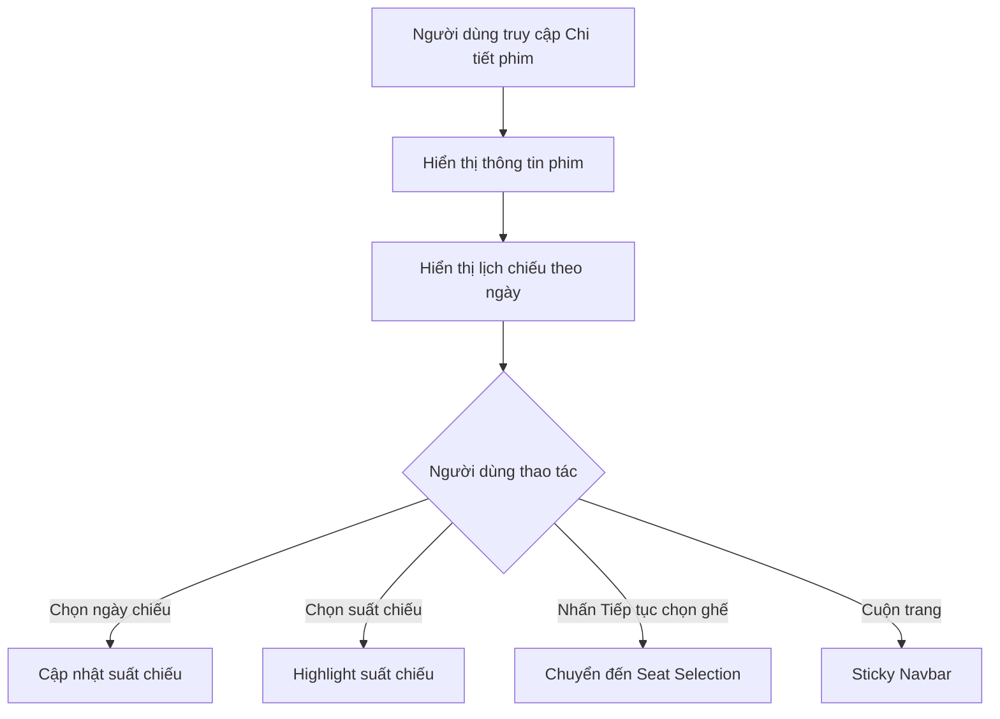

  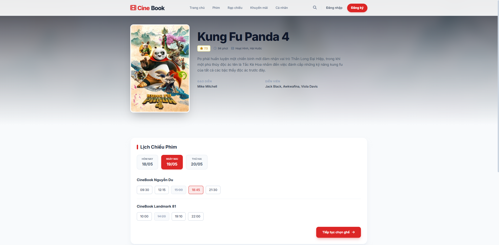

  <em>Hình 5.2.2: Giao diện Chi tiết phim và Lịch chiếu</em>

##### Định dạng Hiển thị (Presentation Format)

*   **Thanh điều hướng chính (Navigation Bar)**:
    *   Hiển thị logo CineBook phía trên cùng.
    *   Các mục điều hướng gồm: `Trang chủ`, `Phim`, `Rạp chiếu`, `Khuyến mãi`, `Cá nhân`.
    *   Bên phải gồm icon tìm kiếm, nút `Đăng nhập` và `Đăng ký`.
    *   Navbar sử dụng nền trắng bán trong suốt và đổ bóng nhẹ khi cuộn trang.

*   **Khu vực Hero Movie Detail**:
    *   Nền sử dụng ảnh phim được blur mạnh kết hợp overlay gradient xám trắng để tăng độ tương phản chữ.
    *   Layout chia hai cột:
        *   Bên trái là poster phim dạng card nổi.
        *   Bên phải là thông tin phim.
    *   Poster phim:
        *   Bo góc lớn.
        *   Viền trắng mờ.
        *   Shadow đậm tạo chiều sâu.
    *   Thông tin phim:
        *   Tên phim cỡ rất lớn, font đậm.
        *   Badge điểm IMDb màu vàng nhạt.
        *   Metadata:
            * Thời lượng phim.
            * Thể loại.
            * Ngày khởi chiếu.
        *   Mô tả nội dung phim.
        *   Thông tin đạo diễn và diễn viên.

*   **Khu vực Lịch Chiếu Phim (Showtime Section)**:
    *   Khung nền trắng bo góc lớn.
    *   Tiêu đề `Lịch Chiếu Phim` có thanh nhấn đỏ bên trái.
    *   Khu vực chọn ngày:
        *   Các nút ngày hiển thị dạng pill button.
        *   Ngày đang chọn dùng nền đỏ CineBook, chữ trắng.
        *   Ngày chưa chọn dùng nền trắng/xám nhạt.
    *   Danh sách cụm rạp:
        *   Ví dụ:
            * `CineBook Nguyễn Du`
            * `CineBook Landmark 81`
    *   Suất chiếu:
        *   Hiển thị dạng button bo góc nhỏ.
        *   Suất khả dụng:
            * Nền trắng.
            * Viền xanh/xám.
        *   Suất đã hết:
            * Gạch ngang.
            * Opacity thấp.
            * Không thể click.
        *   Suất đang chọn:
            * Viền đỏ.
            * Chữ đỏ.
            * Shadow nhẹ.

*   **Nút hành động chính**:
    *   Nút `Tiếp tục chọn ghế`:
        * Nền đỏ CineBook.
        * Icon mũi tên trắng.
        * Shadow đỏ nổi bật.
        * Hover nâng nhẹ.

##### Xử lý Sự kiện (Event Handling)

*   **Sự kiện Chọn ngày chiếu**
    *   Khi người dùng nhấn vào một ngày:
        * Hệ thống cập nhật trạng thái `.active`.
        * Render lại danh sách suất chiếu tương ứng với ngày được chọn.
        * Các ngày khác quay về trạng thái mặc định.

*   **Sự kiện Chọn suất chiếu**
    *   Khi người dùng nhấn vào một suất chiếu hợp lệ:
        * Hệ thống highlight suất chiếu vừa chọn.
        * Lưu thông tin:
            * Ngày chiếu.
            * Giờ chiếu.
            * Rạp chiếu.
        * Chỉ cho phép tồn tại một suất đang active tại cùng thời điểm.

*   **Sự kiện Chọn suất đã hết**
    *   Với suất chiếu có trạng thái sold-out:
        * Không cho phép click.
        * Cursor chuyển sang `not-allowed`.
        * Không thực hiện bất kỳ hành động nào.

*   **Sự kiện Nhấn Tiếp tục chọn ghế**
    *   Điều kiện:
        * Người dùng phải chọn một suất chiếu hợp lệ.
    *   Nếu chưa chọn:
        * Hiển thị thông báo:
            `Vui lòng chọn suất chiếu trước khi tiếp tục`.
    *   Nếu hợp lệ:
        * Điều hướng sang màn hình chọn ghế:
            `/seat-selection/:bookingId`
        * Đồng thời truyền tham số:
            * movieId
            * cinema
            * showtime
            * date

*   **Sự kiện Responsive Layout**
    *   Khi màn hình nhỏ hơn Tablet:
        * Layout chuyển từ 2 cột thành 1 cột.
        * Poster nằm phía trên.
        * Thông tin phim và lịch chiếu nằm bên dưới.
    *   Các suất chiếu tự wrap xuống dòng.  

#### 5.2.3. Màn hình Chọn Ghế (Seat Selection Screen - `seat-selection.ejs`)

Màn hình cho phép khách hàng theo dõi sơ đồ rạp chiếu, trạng thái ghế, chọn vị trí ngồi và xem bảng tính tiền thời gian thực dưới áp lực thời gian giữ vé.

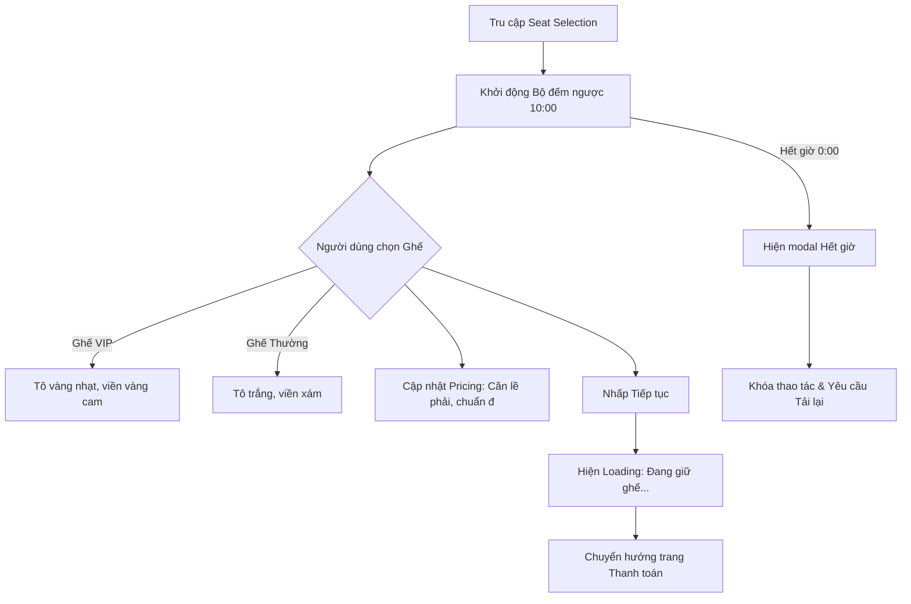

   

  <em>Hình 5.2.3: Màn hình Chọn ghế</em>

##### Định dạng Hiển thị
*   **Thanh tiến trình & Thời gian giữ ghế (Header Progress & Timer Bar)**:
    *   Bảng đếm ngược thời gian giữ ghế ở trên cùng (đếm ngược 10 phút). Khi thời gian dưới `02:00` phút, văn bản và icon đồng hồ sẽ chuyển sang màu đỏ cảnh báo và nhấp nháy liên tục (hiệu ứng `.timer-urgent`).
*   **Màn hình chiếu giả lập (Screen Guide)**:
    *   Đường cong ánh sáng gradient xanh sáng mô phỏng vị trí màn chiếu, có viền đổ bóng lan tỏa.
*   **Sơ đồ Ghế ngồi (Theater Seat Grid)**:
    *   Ma trận 10 dòng (Hàng A đến J) x 10 cột.
    *   Phân loại ghế trực quan bằng màu sắc:
        *   **Ghế VIP (Vị trí trung tâm: Hàng D, E, F, G và Cột 3, 4, 5, 6)**: Nền màu vàng mật ong nhạt (`#fef3c7`), viền cam vàng (`#f59e0b`).
        *   **Ghế Thường (Các vị trí còn lại)**: Nền màu trắng tinh khiết (`#ffffff`), viền xám đen (`#a1a1aa`).
        *   **Ghế đã chọn (Selected)**: Nền màu xanh dương đậm (`#2563eb`), viền xanh đậm hơn (`#1d4ed8`), hiển thị kèm biểu tượng dấu tích ($\checkmark$) màu trắng ở giữa.
        *   **Ghế đã bán (Sold)**: Nền xám nhạt (`#d4d4d8`), mờ 50%, biểu tượng ghế bị khóa hoặc gạch chéo, không thể tương tác.
*   **Chú thích loại ghế (Legend Bar)**:
    *   Đặt ngay dưới sơ đồ phòng chiếu gồm 4 mẫu ghế thu nhỏ đại diện cho: Ghế thường, Ghế VIP, Ghế đang chọn, Ghế đã bán để người dùng tham khảo.
*   **Khung tính giá thời gian thực (Bottom Ticket Summary & Pricing)**:
    *   **Hộp nhãn danh sách ghế (Selected Seats Badge)**: Danh sách ghế đang chọn hiển thị dạng các viên thuốc (Chips) bo tròn, áp dụng đúng màu sắc sơ đồ: VIP màu vàng cam nhạt, Thường màu trắng viền xám.
    *   **Bảng tính tiền chi tiết (Pricing Breakdown)**:
        *   Căn lề theo cấu trúc: Tên loại ghế + số lượng ở lề trái; Thành tiền ở sát lề phải).
        *   Định dạng tiền tệ Việt: Dùng dấu chấm hàng nghìn/triệu và ký tự `đ` ở cuối (Ví dụ: `VIP seat x2` $\rightarrow$ `200.000 đ`).

##### Xử lý Sự kiện (Event Handling)
*   **Sự kiện Click chọn ghế (Seat Toggle Event)**:
    *   *Điều kiện kiểm tra*: Không cho phép click vào ghế đã bán (`.seat-sold`). Giới hạn tối đa chọn 10 ghế/giao dịch.
    *   *Hành vi*: Khi click vào ghế trống, ghế chuyển sang trạng thái `.seat-selected` (hoặc ngược lại nếu click vào ghế đang chọn). 
    *   *Cập nhật giao diện*: Thêm/Xóa mã ghế vào mảng `selectedSeats`. Gọi hàm `updateBottomBar()` để render lại danh sách chip ghế và tính toán lại phần bảng giá (`#pricing-breakdown`):
        $$\text{Tổng tiền} = (\text{Số ghế thường} \times \text{giá vé thường}) + (\text{Số ghế VIP} \times \text{giá vé VIP})$$
*   **Sự kiện Bộ đếm giây hoạt động (Timer Interval Tick)**:
    *   Bộ đếm ngược chạy chu kỳ 1 giây.
    *   Nếu thời gian đạt `02:00`, áp dụng class `.timer-urgent` tạo hiệu ứng chớp tắt màu đỏ khẩn cấp.
    *   Nếu thời gian chạm `00:00`, kích hoạt hiển thị modal cảnh báo quá giờ `#timeout-overlay`. Khóa toàn bộ tương tác trên sơ đồ ghế. Người dùng bắt buộc phải nhấn "Tải lại trang" để đặt vé lại từ đầu.
*   **Sự kiện Nhấp nút Tiếp tục (Submit Selection)**:
    *   *Kiểm tra tính hợp lệ*: Kiểm tra mảng `selectedSeats.length > 0`. Nếu trống, hiển thị thông báo yêu cầu chọn ít nhất 1 vị trí ngồi.
    *   *Hành vi*: Kích hoạt modal phủ màn hình `#loading-overlay` hiển thị vòng xoay spinner và dòng chữ chạy hiệu ứng dấu chấm động: `"Đang giữ ghế của bạn..."`.
    *   *Chuyển hướng*: Sau 1.5 giây giả lập giữ ghế thành công trên hệ thống, điều hướng sang trang Thanh toán theo định dạng URL:
        `/checkout/:bookingId?title=[Tên Phim]&seats=[Danh sách ghế]&price=[Tổng tiền]`

---

#### 5.2.4. Màn hình Thanh Toán (Payment Screen - `checkout.ejs`)

Giao diện hiển thị cổng quét mã QR giả lập thanh toán, tóm tắt chi phí chi tiết và nút kích hoạt hoàn thành hóa đơn demo.

  

  <em>Hình 5.2.4: Màn hình Thanh toán</em>

##### Định dạng Hiển thị (Presentation Format)
*   **Bố cục chia hai cột chuyên nghiệp (Split Screen Layout)**:
    *   **Cột bên trái (Cổng thanh toán QR)**:
        *   Khung ảnh giả lập mã QR thanh toán đặt trang trọng trên nền xám nhạt bo góc, có đường viền nét đứt thẩm mỹ.
        *   Dòng thông báo hướng dẫn: *"Quét mã để thanh toán bằng ứng dụng ngân hàng của bạn"*.
        *   Hộp cảnh báo trạng thái: Nền vàng nhạt (`#fffbeb`), có biểu tượng xoay spinner màu cam biểu thị trạng thái *"Đang chờ xác nhận thanh toán"* thời gian thực.
    *   **Cột bên phải (Tóm tắt Đơn đặt vé - Sticky Summary Panel)**:
        *   Thẻ tóm tắt hiển thị tên phim, loại phòng chiếu (`Standard` hoặc `IMAX`).
        *   Mục số lượng vé hiển thị tiếng Việt đồng bộ: `x[Số lượng] Vé` (Ví dụ: `x3 Vé`).
        *   Danh sách nhãn ghế đã chọn: Hiển thị dưới dạng các Badge bo góc tròn, kế thừa chuẩn màu sắc sơ đồ (VIP màu vàng cam nhạt, Thường màu trắng viền xám).
        *   Chi tiết giá: Tạm tính, phí dịch vụ (`0đ`), và Tổng cộng hiển thị cỡ chữ lớn font đậm đi kèm đuôi tiền tệ `đ`.

##### Xử lý Sự kiện (Event Handling)
*   **Khởi chạy trang (Page Initialization)**:
    *   Đọc các tham số truy vấn từ URL: `seats`, `price`, `title`.
    *   Cập nhật dữ liệu vào các thẻ HTML tương ứng trên trang. Phân tách danh sách ghế bằng dấu phẩy `,`. Với mỗi ghế, kiểm tra tọa độ hàng (D-G) và cột (3-6) để áp dụng chính xác màu nền, màu viền và màu chữ đại diện cho dòng ghế VIP hoặc Thường.
*   **Sự kiện Thanh toán Thành công**:
    *   Khi người dùng đã Thanh toán Thành công (Giả lập bằng nút Demo)"*:
        *   Trình duyệt tự động lấy mã `bookingId` từ đường dẫn hiện tại (hoặc tự sinh mã ngẫu nhiên dạng `BK-[Số ngẫu nhiên]`).
        *   Thực hiện chuyển hướng người dùng sang trang Hóa đơn điện tử với toàn bộ tham số chi tiết qua URL:
            `/receipt/:bookingId?seats=[Danh sách ghế]&price=[Tổng tiền]&title=[Tên Phim]`

---

#### 5.2.5. Màn hình Hóa Đơn (Receipt Screen - `receipt.ejs`)

Giao diện cung cấp biên lai xác nhận đặt vé thành công, chứa cuống vé kiểm duyệt mã vạch và tính năng xuất tệp ảnh chất lượng cao để sử dụng khi vào phòng chiếu.  

  

  <em>Hình 5.2.5: Màn hình Hóa đơn</em>

  
##### Định dạng Hiển thị (Presentation Format)
*   **Giao diện Biên lai trên màn hình (On-Screen Layout)**:
    *   **Bên trái (Biên lai chính - Main Info Card)**:
        *   Biên banner màu xanh lá cây đậm sang trọng với biểu tượng dấu tích xanh nhấp nháy nhẹ nhàng, tiêu đề: `"Đặt vé Thành công!"`, phụ đề: *"Giao dịch của bạn đã được xử lý thành công."*
        *   Khối thông tin chính màu xanh lam nhạt hiển thị 3 cột: Phim, Suất chiếu (`19:30, 07/05/2026`), Rạp chiếu (`Galaxy Cinema - Nguyễn Du`).
        *   Khu vực hiển thị ghế: Tự động render hộp màu VIP/Thường tương ứng với từng ghế đã mua.
        *   Tổng tiền thanh toán hiển thị font siêu đậm màu xanh lá cây kèm hậu tố `đ` (Ví dụ: `450.000 đ`).
        *   Bảng tra cứu kiểm toán: Mã đặt vé (Mã Booking), Mã giao dịch hệ thống tự tạo, Phương thức thanh toán (*Chuyển khoản / Quét mã QR*).
    *   **Bên phải (Cuống vé kiểm duyệt - Access Control Stub)**:
        *   Nền xám nhạt được ngăn cách bằng đường kẻ đứt mô phỏng đường xé vé thủ công.
        *   Tiêu đề cuống vé: `"Vé soát vào cổng"`.
        *   Mã vạch độ tương phản cao đi kèm chuỗi số định danh font chữ monospace bên dưới.
        *   Nút hành động:
            1.  **Nút Tải hóa đơn**: Nền xanh dương đậm, đổ bóng hiệu ứng kính mờ, đi kèm icon tải xuống.
            2.  **Nút Xem vé của tôi**: Nền trắng viền xanh dương, liên kết trực tiếp tới trang cá nhân.
*   **Thẻ Biên lai ẩn xuất file ảnh (`#capture-container`)**:
    *   Một thẻ Div ẩn hoàn toàn khỏi màn hình người dùng. Khi sử dụng thẻ này, thư viện xuất ảnh sẽ tạo ra một tấm vé điện tử sắc nét, chuyên nghiệp, vừa vặn lưu trữ trên điện thoại thông minh.

##### Xử lý Sự kiện (Event Handling)
*   **Sự kiện Khởi tạo & Định dạng Tự động (Onload Populate)**:
    *   Trích xuất dữ liệu `seats`, `price`, `title` từ URL.
    *   Lấy mã đặt vé `bookingId` từ đường dẫn hệ thống.
    *   Tự động sinh chuỗi Mã giao dịch kiểm soát dạng `TXN + các chữ số của Booking ID` (bù thêm số 0 để đảm bảo tối thiểu 8 ký tự).
    *   Chuyển đổi tiền tệ sang dạng chuỗi tiếng Việt có dấu chấm hàng nghìn và đuôi `đ`.
    *   Duyệt qua danh sách ghế để vẽ các hộp màu ghế VIP/Thường đồng bộ hoàn hảo cho cả khung hiển thị màn hình và khung vé ẩn chụp ảnh.
*   **Sự kiện Tải ảnh hóa đơn điện tử (Download Receipt Click)**:
    *   *Hành vi khởi động*: Vô hiệu hóa nút tải để ngăn người dùng nhấp đúp. Thay thế nội dung nút bằng biểu tượng vòng xoay spinner và chữ tiếng Việt: `"Đang tải..."`.
    *   *Tiến trình chụp ảnh*:
        1.  Gọi thư viện `html2canvas` nhắm mục tiêu vào thẻ `#capture-container`.
        2.  Cấu hình tham số `scale: 2.0` để nhân đôi mật độ điểm ảnh (Retina Quality), bật hỗ trợ CORS hình ảnh và đặt màu nền bleed là màu xám nhạt `#f4f4f5`.
        3.  Khi canvas được dựng xong, trích xuất dữ liệu ảnh dạng Base64 PNG.
        4.  Tự động tạo một thẻ liên kết ẩn `<a>` với tên tệp tải về dạng: `CineBook-Ve-[Mã đặt vé].png` và giả lập kích hoạt sự kiện click để tải tệp xuống máy khách.
    *   *Hành vi hoàn tất*: Khôi phục trạng thái nút gốc (bật lại tính năng nhấp và trả lại nhãn tên nút kèm biểu tượng tải).
    *   *Xử lý ngoại lệ*: Nếu quá trình dựng ảnh thất bại, bắt lỗi `catch()`, khôi phục trạng thái nút và hiển thị hộp cảnh báo tiếng Việt: *"Không thể tải ảnh hóa đơn. Vui lòng thử lại hoặc kiểm tra quyền truy cập của trình duyệt."*

---

#### 5.2.6. Màn hình Tài Khoản (Profile Screen - `profile.ejs`)

Giao diện quản lý hồ sơ cá nhân và hiển thị toàn bộ biên niên sử các giao dịch đặt vé trực tuyến kèm trạng thái thanh toán tương ứng.  

  

  <em>Hình 5.2.6: Màn hình Tài khoản</em>

##### Định dạng Hiển thị (Presentation Format)
*   **Thẻ Hồ sơ cá nhân (Personal Profile Card)**:
    *   Hiển thị Họ và tên (`Lê Hoàng Mỹ Hạ`), Số điện thoại, Email dạng các ô thông tin ngăn nắp, có biểu tượng chỉ dẫn trực quan.
    *   Nút Chỉnh sửa hình cây bút nhỏ nhắn ở góc phải thẻ.
*   **Lịch sử giao dịch (Transaction History)**:
    *   Danh sách các vé hiển thị dạng lưới 2 cột hiện đại.
    *   Mỗi thẻ giao dịch chứa:
        *   Tiêu đề tên phim chữ đậm lớn.
        *   Nhãn trạng thái thanh toán dạng viên thuốc bo tròn:
            *   **Đã thanh toán**: Màu xanh lá cây nhạt (`bg-green-50 text-green-700 border-green-200`).
            *   **Chưa thanh toán**: Màu đỏ nhạt (`bg-red-50 text-red-600 border-red-200`).
        *   Thông tin chi tiết suất chiếu, phòng chiếu, bắp nước combo đi kèm.
        *   **Màu sắc danh sách ghế**: Các ghế được mua hiển thị chuẩn màu theo cấu trúc phòng vé (Ví dụ: Ghế `F5` VIP hiển thị hộp vàng cam, ghế `F10` thường hiển thị hộp trắng viền xám).
        *   **Nút hành động dưới đáy thẻ**:
            *   Với vé đã thanh toán: Nút trắng viền xám *"Xem mã QR vé"*.
            *   Với vé chưa thanh toán: Nút đỏ cam nổi bật *"Thanh toán ngay (QR)"*.

##### Xử lý Sự kiện (Event Handling)
*   **Sự kiện Mở & Lưu Chỉnh sửa thông tin cá nhân (Profile Edit Modal)**:
    *   Khi nhấp vào biểu tượng cây bút, hiển thị Modal form chỉnh sửa thông tin nổi lên màn hình (hiệu ứng chuyển động mượt mà `.scale-100 .opacity-100`).
    *   *Ràng buộc dữ liệu đầu vào (Validation)*:
        *   Họ tên không được để trống hoặc chứa ký tự đặc biệt.
        *   Email bắt buộc tuân thủ đúng định dạng đuôi `@gmail.com`.
        *   Mật khẩu mới (nếu đổi) yêu cầu độ dài tối thiểu 8 ký tự.
    *   Khi lưu thành công, cập nhật thông tin hiển thị tức thì trên thẻ hồ sơ cá nhân và đóng modal.
*   **Sự kiện Nhấp Xem mã QR vé (Open QR Modal)**:
    *   Khi nhấp chọn *"Xem mã QR vé"* trên thẻ vé đã thanh toán, hiển thị popup chứa cuống vé kiểm duyệt thu nhỏ, mã vạch phản quang chất lượng cao để nhân viên soát vé quét tại cửa phòng chiếu. Nhấp ra ngoài vùng modal hoặc nhấp dấu X để đóng popup nhanh chóng.
*   **Sự kiện Nhấp nút Thanh toán ngay (Unpaid Ticket Action)**:
    *   Với giao dịch chưa hoàn tất thanh toán (Ví dụ: vé Kung Fu Panda 4): khi khách hàng nhấp *"Thanh toán ngay (QR)"*, hệ thống kích hoạt sự kiện chuyển hướng tự động về trang Thanh toán chuyên biệt kèm thông số đồng bộ:
        `/checkout/BK-KUNGFUPANDA?seats=F5,F10&price=170000&title=Kung Fu Panda 4`
        *Trang thanh toán nhận được tham số này sẽ tự động hiển thị 1 ghế VIP `F5` vàng cam và 1 ghế thường `F10` trắng viền xám đồng bộ.*

---

##### Bảng tổng hợp Lớp Style và Mã Màu Giao diện tương ứng

| Loại phần tử | Lớp Style CSS | Màu Nền (Background) | Màu Viền (Border) | Màu Chữ (Text) |  
| :--- | :--- | :--- | :--- | :--- |  
| **Ghế VIP Trống** | `.seat-vip-available` | `#fef3c7` (Vàng mật ong) | `#f59e0b` (Vàng cam) | `#b45309` (Nâu cam) |  
| **Ghế Thường Trống** | `.seat-available` | `#ffffff` (Trắng tinh) | `#a1a1aa` (Xám kẽm) | `#27272a` (Đen chì) |  
| **Ghế Đang Chọn** | `.seat-selected` | `#2563eb` (Xanh dương) | `#1d4ed8` (Xanh đậm) | `#ffffff` (Trắng) |  
| **Ghế Đã Bán** | `.seat-sold` | `#d4d4d8` (Xám nhạt) | Không có | `#71717a` (Xám) |  
| **Trạng thái Đã mua** | `bg-green-50` | `#f0fdf4` (Xanh lá nhạt) | `#bbf7d0` (Xanh lá) | `#15803d` (Xanh lá đậm)|  
| **Trạng thái Chờ** | `bg-red-50` | `#fef2f2` (Đỏ hồng nhạt) | `#fecaca` (Hồng nhạt) | `#b91c1c` (Đỏ đậm) |    
 

#### 5.2.7. Hộp thoại Đăng nhập/Đăng ký (Authentication Modal - `auth-modal.ejs`)

Hộp thoại xác thực cho phép người dùng đăng nhập hoặc tạo tài khoản mới trực tiếp trên trang chủ mà không cần chuyển hướng sang trang khác. Giao diện được thiết kế dạng modal nổi trung tâm với nền làm mờ (backdrop blur) giúp tập trung trải nghiệm người dùng.

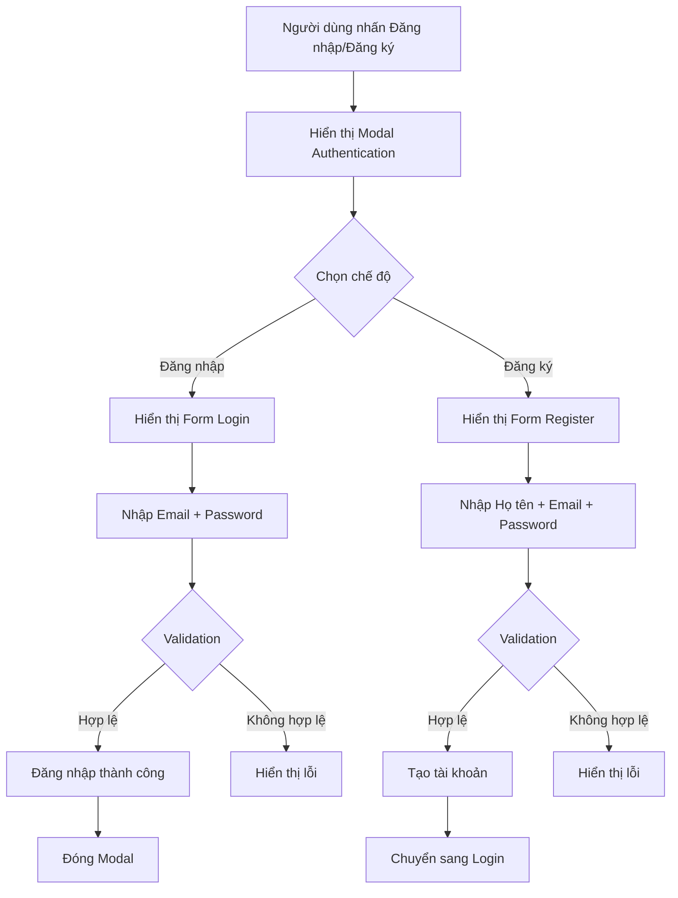

  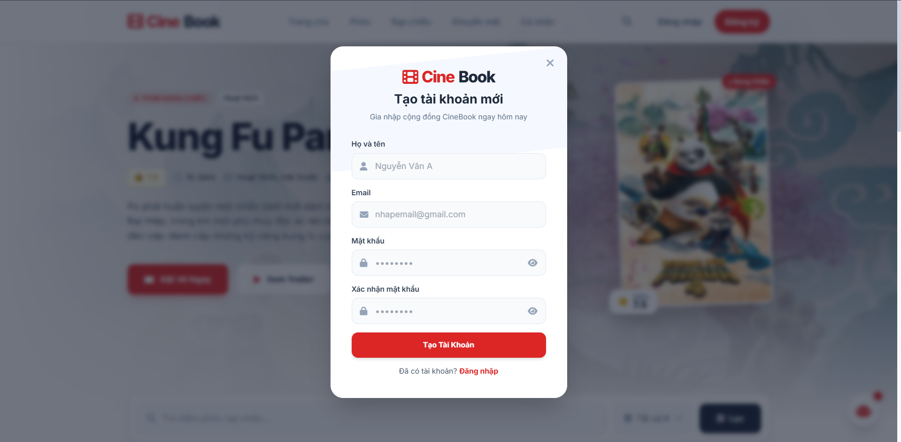

  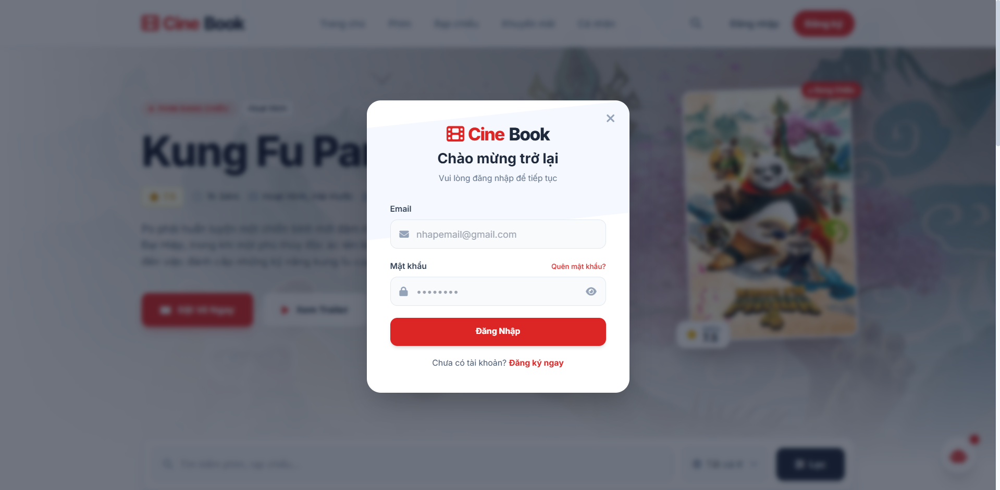

  <em>Hình 5.2.7: Hộp thoại Đăng ký/Đăng nhập CineBook</em>

##### Định dạng Hiển thị (Presentation Format)

*   **Lớp nền phủ (Backdrop Overlay)**:
    *   Khi modal mở, toàn bộ giao diện phía sau bị làm tối bằng lớp phủ màu đen bán trong suốt (`rgba(0,0,0,0.45)`).
    *   Áp dụng hiệu ứng `backdrop-blur` để làm mờ nội dung nền phía sau.
    *   Modal luôn hiển thị ở chính giữa màn hình với `z-index` cao.

*   **Khung Modal Authentication**:
    *   Nền trắng bo góc lớn (`border-radius: 24px`).
    *   Đổ bóng mềm (`box-shadow`) tạo cảm giác nổi trên giao diện.
    *   Hiệu ứng xuất hiện:
        * `opacity: 0 → 1`
        * `transform: scale(0.95 → 1)`

*   **Logo & Header**:
    *   Logo CineBook hiển thị ở phía trên trung tâm modal.
    *   Tiêu đề động theo chế độ:
        * `Chào mừng trở lại` với đăng nhập.
        * `Tạo tài khoản mới` với đăng ký.
    *   Subtitle:
        * `Vui lòng đăng nhập để tiếp tục`
        * `Gia nhập cộng đồng CineBook ngay hôm nay`

*   **Input Form**:
    *   Input nền xám nhạt (`#f8fafc`), bo góc lớn.
    *   Icon minh họa bên trái:
        * User icon cho Họ tên.
        * Mail icon cho Email.
        * Lock icon cho Password.
    *   Placeholder màu xám.
    *   Khi focus:
        * Border chuyển đỏ CineBook (`#ef4444`).
        * Shadow đỏ nhẹ quanh input.

*   **Password Toggle Visibility**:
    *   Icon con mắt (`eye icon`) nằm bên phải ô mật khẩu.
    *   Cho phép chuyển đổi:
        * `type="password"`
        * `type="text"`

*   **Nút hành động chính (Primary CTA Button)**:
    *   Nền đỏ CineBook.
    *   Font chữ trắng đậm.
    *   Shadow đỏ nổi bật.
    *   Hover:
        * Nâng nhẹ (`translateY(-2px)`).
        * Shadow đậm hơn.

*   **Nút chuyển đổi chế độ**:
    *   Dòng chữ:
        * `Chưa có tài khoản? Đăng ký ngay`
        * `Đã có tài khoản? Đăng nhập`
    *   Phần CTA màu đỏ nổi bật và underline khi hover.

*   **Nút đóng Modal**:
    *   Icon `X` góc phải trên.
    *   Hover chuyển đỏ.

##### Xử lý Sự kiện (Event Handling)

*   **Sự kiện Mở Modal Authentication**
    *   Khi người dùng nhấn `Đăng nhập` hoặc `Đăng ký` trên Navbar:
        * Hiển thị overlay.
        * Render đúng form tương ứng.
        * Khóa cuộn nền (`overflow: hidden`).

*   **Sự kiện Đóng Modal**
    *   Modal sẽ đóng khi:
        * Nhấn nút `X`.
        * Click ra ngoài vùng modal.
        * Nhấn phím `ESC`.
    *   Khi đóng:
        * Gỡ overlay blur.
        * Cho phép cuộn trang trở lại.

*   **Sự kiện Chuyển đổi Login/Register**
    *   Khi nhấn `Đăng ký ngay`:
        * Ẩn form login.
        * Hiển thị form register.
        * Chuyển đổi title/subtitle tương ứng.
    *   Ngược lại với `Đăng nhập`.

*   **Validation Form Đăng nhập**
    *   Email:
        * Không được để trống.
        * Phải đúng định dạng email.
    *   Password:
        * Không được rỗng.
        * Tối thiểu 8 ký tự.
    *   Nếu lỗi:
        * Hiển thị viền đỏ.
        * Xuất message lỗi dưới input.

*   **Validation Form Đăng ký**
    *   Họ tên:
        * Không được để trống.
        * Không chứa ký tự đặc biệt.
    *   Email:
        * Phải đúng định dạng `@gmail.com`.
    *   Password:
        * Tối thiểu 8 ký tự.
    *   Confirm Password:
        * Phải trùng khớp với Password.

*   **Sự kiện Toggle Password Visibility**
    *   Khi người dùng nhấn icon mắt:
        * Nếu input đang ẩn:
            * Chuyển sang hiển thị text.
        * Nếu đang hiển thị:
            * Chuyển lại chế độ password.
    *   Icon thay đổi tương ứng giữa `eye` và `eye-off`.

*   **Sự kiện Submit Đăng nhập**
    *   Khi validation thành công:
        * Hiển thị loading spinner trong button:
            `Đang đăng nhập...`
        * Giả lập gọi API xác thực.
        * Sau 1 giây:
            * Đóng modal.
            * Navbar cập nhật trạng thái đã đăng nhập.

*   **Sự kiện Submit Đăng ký**
    *   Khi đăng ký thành công:
        * Hiển thị toast:
            `Tạo tài khoản thành công!`
        * Tự động chuyển sang form đăng nhập.
        * Điền sẵn email vừa đăng ký.

  
## 6. AI Usage Declaration

Gemini, Google, gemini.google.com, truy cập lúc 14:20, 18/05/2026, prompt: “Tôi đang làm dự án rạp chiếu phim CineBook sử dụng kiến trúc Multi-Tier với FastAPI và PostgreSQL. Hãy gợi ý cho tôi cấu trúc chi tiết của phần Conceptual Model bao gồm các thực thể chính như Theater, Room, Showtime, Movie, Booking và các mối quan hệ logic giữa chúng để tôi vẽ sơ đồ.”, sử dụng làm nền tảng ý tưởng cho phần thiết kế mô hình khái niệm tại Mục 2. Conceptual Model; AI đưa ra danh sách thực thể và phân tích mối quan hệ 1:N,nhóm đã chỉnh sửa và bổ sung thực thể News cùng Admin để phù hợp với yêu cầu hệ thống.

Gemini, Google, gemini.google.com, truy cập lúc 09:45, 19/05/2026, prompt: “Viết các đặc tả lớp (Class Specifications) bằng Markdown dưới dạng bảng cho hệ thống đặt vé phim. Cần đầy đủ các thuộc tính, phương thức và ràng buộc dữ liệu cho các lớp: Showtime, ShowSeat, Booking, Payment, PricingRule.”, sử dụng để chuẩn hóa tài liệu kỹ thuật tại Mục 3.3 Class Specifications; AI sinh cấu trúc bảng mặc định, nhóm đã cập nhật lại kiểu dữ liệu tương thích với PostgreSQL (SERIAL, TIMESTAMPTZ, BIGINT) và bổ sung các phương thức nghiệp vụ thực tế như verifyWebhook() hay generateQR().

Gemini, Google, gemini.google.com, truy cập lúc 16:15, 21/05/2026, prompt: “Thiết kế đặc tả giao diện (Screen Specifications) bằng tiếng Việt cho màn hình Chọn Ghế (seat-selection.ejs) và màn hình Hóa Đơn (receipt.ejs) của một web đặt vé phim. Yêu cầu mô tả kỹ định dạng hiển thị trực quan (mã màu ghế VIP, ghế thường) và xử lý sự kiện đếm ngược giữ ghế, sự kiện chụp ảnh bằng html2canvas.”, sử dụng cho việc hoàn thiện tài liệu UI/UX tại Mục 5.2 Screen Specifications; AI đã hỗ trợ lên khung mô tả sự kiện chi tiết và bảng tổng hợp style mã màu, nhóm đã đồng bộ hóa các tham số URL truyền nhận dữ liệu giữa các màn hình thực tế trong mã nguồn.

## 7. Presentation
Video thuyết trình: [LINK]()

## 8. Reflective Report
Sau quá trình áp dụng template hiện tại để triển khai và hoàn thiện tài liệu thiết kế cho hệ thống đặt vé phim CineBook, nhóm phát triển đã rút ra những đánh giá thực tế về tính hữu dụng và các điểm hạn chế của cấu trúc template này.

### 8.1 Thành phần hữu dụng nhất trong Template
Qua thực tế làm việc nhóm, Mục 3.3 Class Specifications (Đặc tả các lớp) kết hợp với Mục 5.2 Screen Specifications (Đặc tả màn hình) là hai thành phần mang lại giá trị thực tiễn cao nhất.

- Định hướng chính xác cho giai đoạn Coding: Việc phân tách rõ ràng các thuộc tính, phương thức kèm theo ràng buộc chi tiết (ví dụ: các ràng buộc UNIQUE, NOT NULL, hay các phương thức nghiệp vụ cốt lõi như verifyWebhook(), generateQR()) giúp thành viên đảm nhận phần Backend (FastAPI) có thể lập trình chính xác cấu trúc dữ liệu mà không tốn thời gian phân vân hay làm sai lệch logic.

- Đồng bộ hóa giao diện và dữ liệu (Frontend - Backend alignment): Phần đặc tả màn hình (Screen Specifications) quy định rất kỹ cách thức truyền nhận dữ liệu qua URL parameters (như seats, price, title) và cơ chế đồng bộ mã màu giữa sơ đồ phòng vé với trang thanh toán/hồ sơ cá nhân. Điều này giúp thành viên làm Frontend biết chính xác cần render giao diện ra sao, tạo ra sự khớp nối hoàn hảo khi ghép nối hệ thống.

- Kiểm soát tốt trạng thái thời gian thực: Việc tài liệu hóa kỹ lưỡng các kịch bản bất thường (như hết giờ đếm ngược 10 phút, lỗi thư viện chụp ảnh html2canvas) giúp nhóm chủ động cài đặt các giải pháp xử lý ngoại lệ (Exception Handling) ngay từ đầu, giảm thiểu tối đa bugs phát sinh khi vận hành thử nghiệm.

### 8.2 Thành phần ít hữu ích/Gây khó khăn nhất trong Template

Ngược lại, Mục 3.2 Class Diagram (Sơ đồ lớp tĩnh) và sự trùng lặp giữa Conceptual Model (Mục 2) với Data Diagram (Mục 4.1) là những phần ít mang lại hiệu quả thực tế nhất trong quá trình phát triển dự án.

- Sự cồng kềnh và khó duy trì của Class Diagram: Hệ thống CineBook được xây dựng theo kiến trúc Client-Server đa tầng kết hợp FastAPI (Backend RESTful API) và React.js (Frontend). Việc cố gắng ép các API Endpoints và các hàm xử lý bất đồng bộ vào một sơ đồ lớp hướng đối tượng (OOP) truyền thống tạo ra một sơ đồ cực kỳ đồ sộ. Sơ đồ này rất khó đọc ở giao diện màn hình thông thường và gần như trở nên lỗi thời ngay lập tức khi nhóm thay đổi nhỏ cấu trúc Router trong FastAPI.

- Trùng lặp thông tin giữa Mô hình Khái niệm và Sơ đồ Dữ liệu: Sự phân tách giữa Conceptual Model (Mô tả thực thể/quan hệ ở mức khái niệm) và Data Diagram (Sơ đồ cơ sở dữ liệu quan hệ vật lý) tạo ra cảm giác lặp lại dư thừa. Đối với các dự án có quy mô vừa và nhỏ như CineBook, việc phải viết lại hai lần mô tả chi tiết cho cùng các thực thể/bảng dữ liệu (như Theater, Room, Seat, Movie...) gây tốn khá nhiều thời gian chuẩn bị tài liệu của nhóm.
