# Testing

## Table of Contents
1. [Member Contribution Assessment](#1-member-contribution-assessment)
2. [Test plan](#2-test-plan)
3. [Test cases](#3-test-cases)
4. [AI Usage Declaration](#4-ai-usage-declaration)
5. [Presentation](#5-presentation)
6. [Reflective Report](#6-reflective-report)

---

## 1. Member Contribution Assessment

**23120038 - Lê Hoàng Mỹ Hạ - Contribution (25%)**

**23120047 - Nguyễn Gia Huy - Contribution (25%)**

**23120049 - Nguyễn Thanh Huyền - Contribution (25%)**

**23120060 - Trần Kim Ngân - Contribution (25%)**

  

  <em>Hình 1: Bảng Jira phân công task</em>

## 2. Test plan

> Written by: 23120060 - Trần Kim Ngân       
Reviewed by:  23120047 - Nguyễn Gia Huy

Hệ thống áp dụng chiến lược kiểm thử hộp đen (Black-box Testing) tập trung chủ yếu vào việc xác minh các chức năng nghiệp vụ và luồng dữ liệu của hệ thống đặt vé phim CineBook. 

* **Đối tượng kiểm thử (Testing Objects):**
  * **Về mặt Chức năng:** Kiểm thử toàn bộ 5 phân hệ tính năng cốt lõi của hệ thống bao gồm: Quản lý tài khoản (Đăng ký, đăng nhập, phân quyền); Quản lý phim và suất chiếu phía Admin; Tìm kiếm & Bộ lọc phim/suất chiếu; Đặt ghế trực quan theo thời gian thực; Thanh toán tích hợp cổng MoMo/VNPAY và Xuất vé điện tử (ETicket) chứa mã QR.
  * **Về mặt Tài liệu:** Kiểm thử tính đúng đắn, logic của hệ thống dựa trên tài liệu Đặc tả yêu cầu phần mềm (SRS), sơ đồ thiết kế cơ sở dữ liệu (ERD), và các bản thiết kế giao diện người dùng (UI/UX) trên Figma.
* **Kỹ thuật kiểm thử áp dụng (Testing Techniques):**
  * **Kiểm thử phân vùng tương đương & Phân tích giá trị biên:** Áp dụng để bắt lỗi và kiểm tra tính hợp lệ của các trường nhập liệu đầu vào (Form validation) như: định dạng Email, độ dài Số điện thoại, tính bảo mật của Mật khẩu, hoặc kiểm tra giới hạn số lượng ghế được chọn trong một giao dịch.
  * **Kiểm thử dựa trên luồng nghiệp vụ:** Thiết kế các kịch bản kiểm thử đi hết một vòng quy trình trải nghiệm của khách hàng từ lúc chọn phim, lọc suất chiếu, giữ ghế cho đến khi thực hiện giao dịch thanh toán trực tuyến thành công và nhận vé điện tử.
  * **Kiểm thử chuyển trạng thái:** Áp dụng đặc biệt cho logic đặt ghế trực quan real-time (Trạng thái ghế chuyển đổi động giữa Trống - Đang chọn - Đã bán) và trạng thái của hóa đơn đặt vé (Chờ thanh toán - Đã thanh toán - Đã hủy do quá thời gian giữ ghế).
* **Độ bao phủ kiểm thử:** 
  * Nhóm cam kết thiết kế bộ kiểm thử bao phủ tất cả các kịch bản có thể xảy ra cho từng tính năng được chọn. 
  * Bộ kịch bảntập trung vào luồng vận hành thành công và bao phủ chặt chẽ các luồng ngoại lệ và xử lý lỗi hệ thống như: chặn trùng lặp tài khoản, chặn Admin xếp trùng lịch phòng chiếu, xử lý xung đột giữ ghế đồng thời giữa hai người dùng, và hoàn tác giải phóng trạng thái ghế khi người dùng chủ động hủy giao dịch hoặc hết thời gian chờ thanh toán.

## 3. Test cases

### 3.1 List of test cases

> Written by: 23120060 - Trần Kim Ngân       
Reviewed by:  23120049 - Nguyễn Thanh Huyền

**Danh sách feature chính được chọn để kiểm thử**
1. **Quản lý tài khoản (Account Management):** Xác thực thông tin, phân quyền Admin/Customer và bảo mật đăng nhập.
2. **Quản lý phim và suất chiếu (Movie & Showtime Admin-control):** Luồng Admin thiết lập dữ liệu phim, phòng chiếu và cấu hình khung giờ xem phim.
3. **Tìm kiếm & Bộ lọc (Search & Dynamic Filter):** Khách hàng tìm phim và lọc suất chiếu theo cụm rạp, ngày chiếu thực tế.
4. **Đặt ghế trực quan Real-time (Real-time Seat Selection):** Luồng xử lý tương tác chọn ghế, hủy chọn ghế và đồng bộ trạng thái khóa ghế theo thời gian thực.
5. **Thanh toán & Xuất vé (Payment & Ticketing):** Xử lý giao dịch qua cổng MoMo/VNPAY, cập nhật trạng thái hóa đơn, quản lý thời gian giữ ghế và xuất vé điện tử chứa mã QR.

| Seq | Test case | Feature | Description |
| :--- | :--- | :--- | :--- |
| **TC01** | Đăng ký tài khoản khách hàng thất bại khi trùng Email/SĐT | Quản lý tài khoản | Luồng lỗi: Hệ thống chặn trùng lặp dữ liệu và báo lỗi trực quan. |
| **TC02** | Đăng nhập hệ thống thất bại khi nhập sai mật khẩu | Quản lý tài khoản | Luồng lỗi: Hệ thống chặn truy cập, bảo mật thông tin tài khoản. |
| **TC03** | Đăng nhập tài khoản Admin hệ thống thành công | Quản lý tài khoản | Luồng đúng: Kiểm tra phân quyền truy cập vào trang Dashboard Admin. |
| **TC04** | Admin thêm phim mới thất bại do sai định dạng file poster | Quản lý phim và suất chiếu | Luồng lỗi: Thử tải lên file .docx/.pdf thay vì file ảnh, hệ thống phải chặn. |
| **TC05** | Admin tạo suất chiếu mới thành công cho một bộ phim | Quản lý phim và suất chiếu | Luồng đúng: Xếp lịch chiếu vào một phòng và khung giờ cụ thể hợp lệ. |
| **TC06** | Admin tạo suất chiếu thất bại do trùng lịch phòng chiếu | Quản lý phim và suất chiếu | Luồng lỗi: Xếp lịch mới đè lên khung giờ của phim khác đang chiếu cùng phòng. |
| **TC07** | Tìm kiếm phim hiển thị giao diện trống khi nhập từ khóa vô nghĩa | Tìm kiếm & Bộ lọc | Luồng biên: Nhập chuỗi ký tự lạ, hệ thống báo "Không tìm thấy phim phù hợp". |
| **TC08** | Lọc phim theo thể loại và trạng thái chiếu thành công   | Tìm kiếm & Bộ lọc | Luồng đúng: Hiển thị chính xác các phim theo bộ lọc. |
| **TC09** | Chọn ghế trống thành công trên sơ đồ phòng chiếu | Đặt ghế trực quan Real-time | Luồng đúng: Ghế đổi sang màu "Đang chọn" và tính đúng giá tiền tương ứng. |
| **TC10** | Khóa ghế real-time khi có user khác đang nhanh tay giữ trước | Đặt ghế trực quan Real-time | Luồng xung đột: Ngăn chặn tài khoản thứ hai click chọn trùng ghế đang xử lý. |
| **TC11** | Hủy chọn ghế đã chọn (Deselect) thành công | Đặt ghế trực quan Real-time | Luồng đúng: Khách hàng click lại ghế đang chọn, ghế trả về màu trắng, trừ tiền. |
| **TC12** | Khách hàng thanh toán đặt vé thành công qua cổng MoMo/VNPAY | Thanh toán & Xuất vé | Luồng đúng: Trừ tiền chính xác, chuyển trạng thái đơn hàng sang "Đã thanh toán". |
| **TC13** | Khách hàng chủ động hủy giao dịch tại trang thanh toán của bên thứ ba | Thanh toán & Xuất vé | Luồng ngoại lệ: User bấm "Quay lại" tại trang MoMo/VNPAY, hệ thống hoàn tác ghế trống. |
| **TC14** | Tự động hủy giữ ghế khi hết thời gian chờ thanh toán (Timeout) | Thanh toán & Xuất vé | Luồng lỗi hệ thống: Hết thời gian giữ ghế (5-10p) mà chưa thanh toán, ghế tự nhả ra. |
| **TC15** | Kiểm tra xuất vé điện tử (ETicket) thành công kèm mã QR hợp lệ | Thanh toán & Xuất vé | Luồng đúng: Sau khi thanh toán, hệ thống sinh mã QR chứa thông tin ID vé chính xác. |

### 3.2 Test case specifications

Dựa trên ảnh bạn gửi thì **TC01, TC02, TC03 đã có Actual Output cụ thể**, nên mình sẽ cập nhật lại cho đúng với kết quả thực tế thay vì để chung chung.

---

### 3.2.1 TC01 – Đăng ký tài khoản khách hàng thất bại khi trùng Email/SĐT

**Written by:** 23120038 - Lê Hoàng Mỹ Hạ  
**Edited by:**  
**Reviewed by:**  

| Test case           | Content                                                                                                                           |
| ------------------- | --------------------------------------------------------------------------------------------------------------------------------- |
| **Related feature** | Quản lý tài khoản (Account Management)                                                                                            |
| **Context**         | Người dùng đăng ký tài khoản mới bằng Email đã tồn tại trong hệ thống.                                                            |
| **Input Data**      | Họ tên: Nguyễn Văn A   Email: [miha@gmail.com](mailto:miha@gmail.com)   Mật khẩu: miha1234   Xác nhận mật khẩu: miha1234 |
| **Expected Output** | Hệ thống từ chối tạo tài khoản và hiển thị thông báo lỗi: "Email này đã được sử dụng".                                            |
| **Test steps**      | 1. Mở form Đăng ký.   2. Nhập thông tin hợp lệ nhưng Email đã tồn tại.   3. Nhấn nút "Tạo Tài Khoản".                       |
| **Actual Output**   | Hệ thống hiển thị thông báo lỗi màu đỏ: **"Email này đã được sử dụng"** và không tạo tài khoản mới.                               |
| **Result**          | Passed                                                                                                                            |  

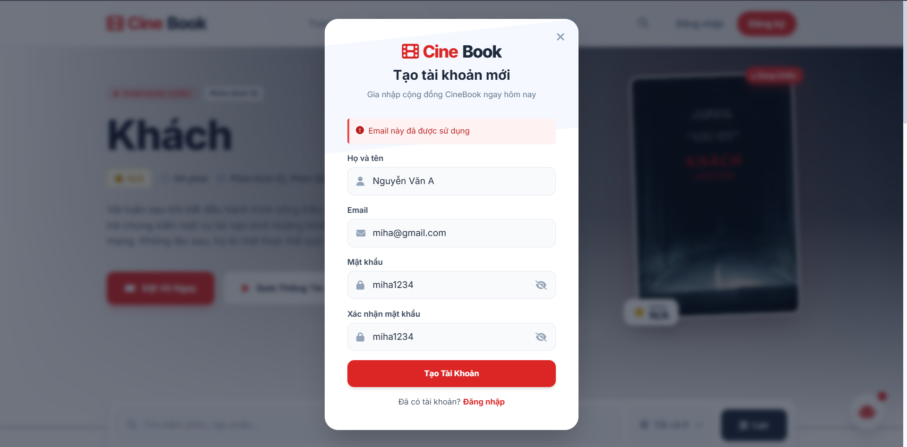
---

### 3.2.2 TC02 – Đăng nhập hệ thống thất bại khi nhập sai mật khẩu

**Written by:** 23120038 - Lê Hoàng Mỹ Hạ  
**Edited by:**  
**Reviewed by:**  

| Test case           | Content                                                                                                                |
| ------------------- | ---------------------------------------------------------------------------------------------------------------------- |
| **Related feature** | Quản lý tài khoản (Account Management)                                                                                 |
| **Context**         | Người dùng đã có tài khoản hợp lệ nhưng nhập sai mật khẩu khi đăng nhập.                                               |
| **Input Data**      | Email: [miha@gmail.com](mailto:miha@gmail.com)   Mật khẩu: admin123                                                 |
| **Expected Output** | Hệ thống từ chối đăng nhập và hiển thị thông báo lỗi: "Email hoặc mật khẩu không chính xác".                           |
| **Test steps**      | 1. Mở form Đăng nhập.   2. Nhập Email hợp lệ.   3. Nhập mật khẩu không đúng.   4. Nhấn nút "Đăng Nhập".       |
| **Actual Output**   | Hệ thống hiển thị thông báo lỗi màu đỏ: **"Email hoặc mật khẩu không chính xác"** và không cho phép truy cập hệ thống. |
| **Result**          | Passed                                                                                                                 |  
  
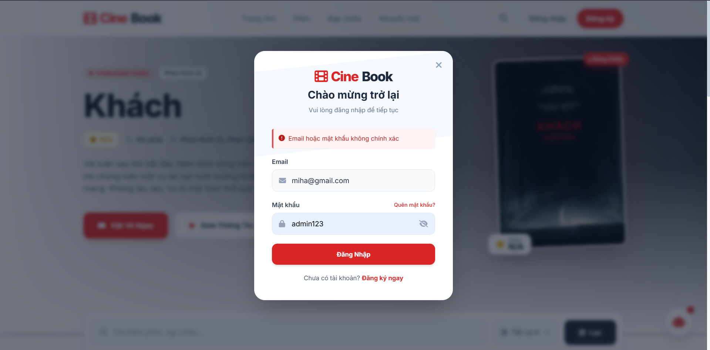
---

### 3.2.3 TC03 – Đăng nhập tài khoản Admin hệ thống thành công

**Written by:** 23120038 - Lê Hoàng Mỹ Hạ  
**Edited by:**  
**Reviewed by:**  

| Test case           | Content                                                                                                                                                                         |
| ------------------- | ------------------------------------------------------------------------------------------------------------------------------------------------------------------------------- |
| **Related feature** | Quản lý tài khoản (Account Management)                                                                                                                                          |
| **Context**         | Quản trị viên đăng nhập bằng tài khoản Admin hợp lệ để truy cập khu vực quản trị.                                                                                               |
| **Input Data**      | Username: [admin@gmail.com](mailto:admin@gmail.com)   Password: admin123                                                                                                     |
| **Expected Output** | Hệ thống xác thực thành công và chuyển hướng đến Dashboard Admin.                                                                                                               |
| **Test steps**      | 1. Truy cập trang Admin Login.   2. Nhập Username: [admin@gmail.com](mailto:admin@gmail.com).   3. Nhập Password: admin123.   4. Nhấn nút "Đăng nhập vào Admin Panel". |
| **Actual Output**   | Hệ thống xác thực thành công và điều hướng đến giao diện Dashboard Admin.                                                                                                       |
| **Result**          | Passed                                                                                                                                                                          | 
   
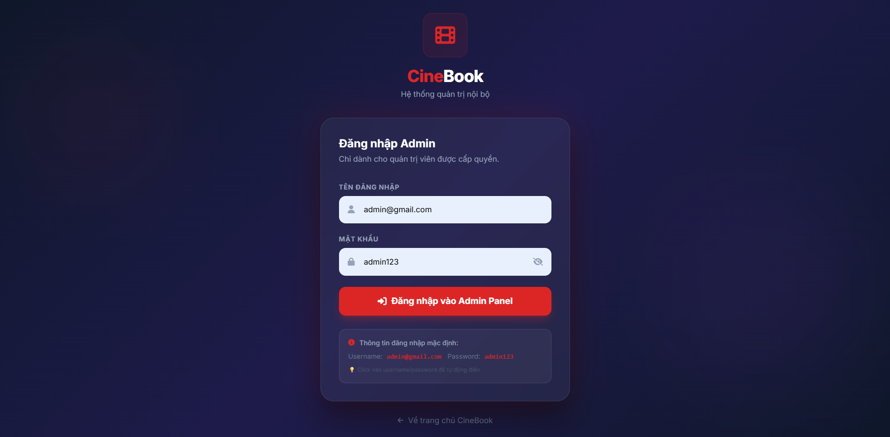
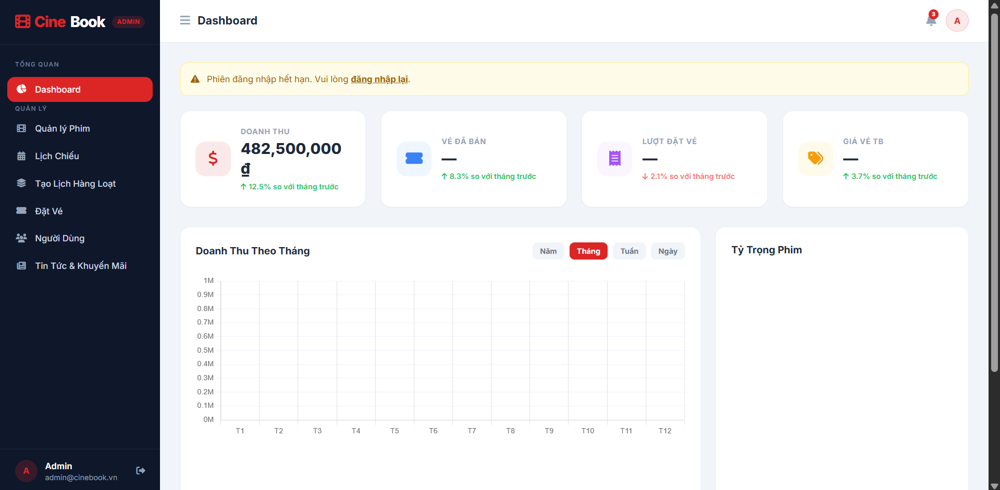
---

### 3.2.4 TC04 – Admin thêm phim mới thất bại do sai định dạng file poster

**Written by:** 23120038 - Lê Hoàng Mỹ Hạ  
**Edited by:**  
**Reviewed by:**  

| Test case           | Content                                                                                                                                                         |
| ------------------- | --------------------------------------------------------------------------------------------------------------------------------------------------------------- |
| **Related feature** | Quản lý phim và suất chiếu (Movie & Showtime Admin-control)                                                                                                     |
| **Context**         | Quản trị viên thực hiện thêm phim mới nhưng tải lên file poster không phải định dạng hình ảnh hợp lệ.                                                           |
| **Input Data**      | Tên phim: Avengers Endgame   Poster: poster.docx hoặc poster.pdf                                                                                             |
| **Expected Output** | Hệ thống từ chối upload file và hiển thị thông báo lỗi định dạng.                                                                                               |
| **Test steps**      | 1. Đăng nhập Admin.   2. Mở chức năng Thêm phim mới.   3. Nhập đầy đủ thông tin phim.   4. Chọn file .pdf hoặc .docx làm poster.   5. Nhấn nút Lưu. |
| **Actual Output**   | Hệ thống chặn thao tác lưu phim và hiển thị thông báo: **"Chỉ chấp nhận file JPG, PNG hoặc JPEG"**.                                                             |
| **Result**          | Passed                                                                                                                                                          |

#### 3.2.5 **TC05 - Admin tạo suất chiếu mới thành công cho một bộ phim**
> Written by: 23120049 - Nguyễn Thanh Huyền  
Reviewed by:   

| Test case | TC05 |
| :-------- | :----------|
| **Related feature**| Quản lý phim và suất chiếu |
| **Context** | Admin đã đăng nhập vào hệ thống quản trị (Dashboard Admin) và đang ở giao diện "Dashboard". |
| **Input Data**| - Chọn phim: "Khách" (Thời lượng: 94 phút). - Chọn cụm rạp & Phòng chiếu: Rạp Chinemabook Landmark  - Phòng số 3. - Chọn ngày chiếu: từ ngày 9/5/2026 tới 11/5/2026. - Chọn khung giờ bắt đầu: 13:00. - Định dạng chiếu = IMAX - Giá vé cơ bản = 100.000  |
| **Expected Output**| 1. Hệ thống kiểm tra phòng chiếu số 3 hoàn toàn trống trong khoảng từ 13:00 đến 14:49 (94 phút phim + 15 phút dọn phòng). 2. Lưu dữ liệu thành công, hệ thống hiển thị thông báo "Đã lưu thành công 3 suất chiếu!" |
| **Test steps**| **Bước 1:** Truy cập trang quản trị, chọn mục "Tạo lịch chiếu hàng loạt". **Bước 2:** Nhập đầy đủ thông tin hợp lệ vào các trường dữ liệu. **Bước 3:** Bấm nút "Tạo lịch chiếu". **Bước 4:** Kiểm tra thông tin hiển thị và bấm nút "Lưu lịch chiếu". |
| **Actual Output** | Hệ thống hoạt động đúng như mong đợi. |
| **Result** | Passed |  
  
    
    
    
    
    
    
    

  <em>Hệ thống báo tạo suất chiếu thành công</em>

    
#### 3.2.6 TC06 - Admin tạo suất chiếu thất bại do trùng lịch phòng chiếu  
> Written by: 23120049 - Nguyễn Thanh Huyền  
Reviewed by:   
  
| Test case | TC06 |
| :-------- | :----------|
| **Related feature**| Quản lý phim và suất chiếu |
| **Context** | Admin đã đăng nhập vào hệ thống quản trị. Phòng số 2 hiện đã có 3 suất chiếu khác từ ngày 9/5/2026 đến ngày 11/5/2026, bắt đầu từ 16:00 |
| **Input Data**| - Chọn phim: "Phim Dune: Hành tinh cát 2" (Thời lượng: 166 phút). - Chọn cụm rạp & Phòng chiếu: Cinebook Landmark81 - Phòng số 2. - Chọn ngày chiếu: 9/5/2026 đến 11/5/2026. - Chọn khung giờ bắt đầu: 16:00  - Click nút "Lưu suất chiếu". |
| **Expected Output**| 1. Hệ thống thực hiện kiểm tra, phát hiện khung giờ 16:00 bị trùng  với suất chiếu đang có. 2. Hệ thống không lưu dữ liệu và đưa ra thông báo: "Lỗi xung đột suất chiếu", kèm theo thông tin cụ thể về lỗi. 3. Giữ nguyên các thông tin Admin đã nhập để Admin có thể sửa lại giờ. |
| **Test steps**| **Bước 1:** Vào giao diện Tạo lịch chiếu hàng loạt **Bước 2:** Nhập một suất chiếu mới với thông tin trùng lắp để cố tình đè lên khung giờ của suất chiếu đã tồn tại. **Bước 3:** Bấm nút "Tạo lịch chiếu". **Bước 4:** Bấm nút "Lưu lịch chiếu". **Bước 5:** Xác nhận hệ thống chặn lại và hiển thị đúng thông báo lỗi trùng lịch. |
| **Actual Output** | Hệ thống hoạt động đúng như mong đợi. |
| **Result** | Passed |   
    
    
       
     
     
     
    
    

  <em>Màn hình báo lỗi</em>

    
#### 3.2.7 TC07 - Tìm kiếm phim hiển thị giao diện trống khi nhập từ khóa vô nghĩa  
> Written by: 23120049 - Nguyễn Thanh Huyền  
Reviewed by:   
  
| Test case | TC07 |
| :-------- | :----------|
| **Related feature**| Tìm kiếm & Bộ lọc |
| **Context** | User đang ở trang chủ |
| **Input Data**| - Nhập chuỗi ký tự vô nghĩa vào ô tìm kiếm: `@#$khongco_phimnay123`|
| **Expected Output**| 1. Hệ thống thực hiện tìm kiếm và không trả về bất kỳ bộ phim nào. 2. Giao diện vùng kết quả hiển thị thông điệp: "Không tìm thấy phim" 3. Giao diện hiển thị nút "Đặt lại bộ lọc" |
| **Test steps**| **Bước 1:** Truy cập trang Phim trên giao diện người dùng. **Bước 2:** Nhập chuỗi ký tự lạ, vô nghĩa hoặc không tồn tại trong database. **Bước 3:** Xác nhận giao diện hiển thị đúng thông báo trống và không xảy ra lỗi hệ thống (Crash/Error 500). |
| **Actual Output** | Hệ thống hoạt động đúng như mong đợi. |
| **Result** | Passed |  
      
    
   
### 3.2.8 TC08 - Lọc phim theo thể loại và trạng thái chiếu thành công  
> Written by: 23120049 - Nguyễn Thanh Huyền  
Reviewed by:   

| Test case | TC08 |
| :-------- | :----------|
| **Related feature**| Tìm kiếm & Bộ lọc |
| **Context** | User đang ở trang chủ |
| **Input Data**| - Thể loại: viễn tưởng - Trạng thái: Sắp chiếu |
| **Expected Output**| 1. Hệ thống ngay lập tức lọc và tải lại danh sách suất chiếu. 2. Chỉ hiển thị chính xác các phim thuộc thể loại "viễn tưởng" và có tình trạng chiếu "Sắp chiếu". 3. Các suất chiếu thể loại khác hoặc tình trạng khác hoàn toàn bị ẩn đi. |
| **Test steps**| **Bước 1:** Truy cập vào trang Phim. **Bước 2:** Click chọn một Thể loại cụ thể và chọn một Trạng thái trên thanh bộ lọc. **Bước 3:** Quan sát danh sách suất chiếu hiển thị bên dưới. **Bước 4:** Đối chiếu các phim hiển thị xem có khớp 100% với điều kiện đã chọn hay không. |
| **Actual Output** | Hệ thống hoạt động đúng như mong đợi. |
| **Result** | Passed |  
    
  
    
#### 3.2.9 TC09

> Written by: 23120060 - Trần Kim Ngân       
Reviewed by:  23120047 - Nguyễn Gia Huy

| Test case | TC09 |
| :-------- | :----------|
| Related feature| Đặt vé xem phim / Sơ đồ ghế ngồi |
| Context | User đã chọn phim, rạp, suất chiếu và đang ở màn hình sơ đồ phòng chiếu. |
| Input Data| - Click chọn 1 ghế Thường   - Click chọn tiếp 1 ghế VIP   - Click nút "Xác nhận thanh toán".|
| Expected Output| 1. Khi click chọn ghế: Các ghế lập tức đổi sang màu "Đang chọn". Ô tổng số tiền cập nhật theo thời gian thực (Real-time UI) và tính đúng: 70.000 + 85.000 = 155.000 VNĐ.   2. Khi bấm "Xác nhận thanh toán": Hệ thống chuyển hướng sang trang thanh toán VNPay thành công, đồng thời gửi tín hiệu kích hoạt trạng thái "Holding" cho 2 ghế A5, G6 trên sơ đồ để các user khác không đặt được. |
| Test steps| Bước 1: Truy cập giao diện chọn ghế của một suất chiếu còn trống nhiều ghế.   Bước 2: Click chọn lần lượt 1 ghế Thường và 1 ghế VIP. Kiểm tra màu sắc ghế và phần hiển thị tổng tiền xem có cập nhật ngay lập tức và tính đúng hay không.   Bước 3: Bấm nút "Xác nhận thanh toán".  Bước 4: Xác nhận hệ thống chuyển hướng sang cổng VNPay thành công và các ghế vừa chọn đã chuyển sang trạng thái bị block.|
| Actual Output | Hệ thống hoạt động đúng như mong đợi. |
| Result | Passed |

  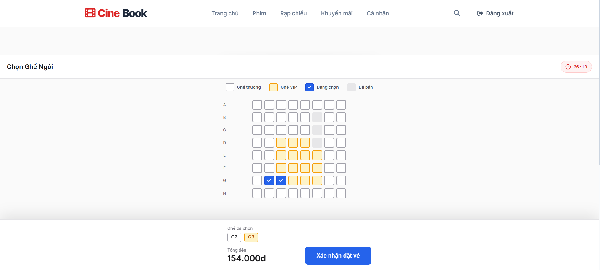

  <em>Hình 3.2.9.1: Sau khi chọn 2 ghế</em>

  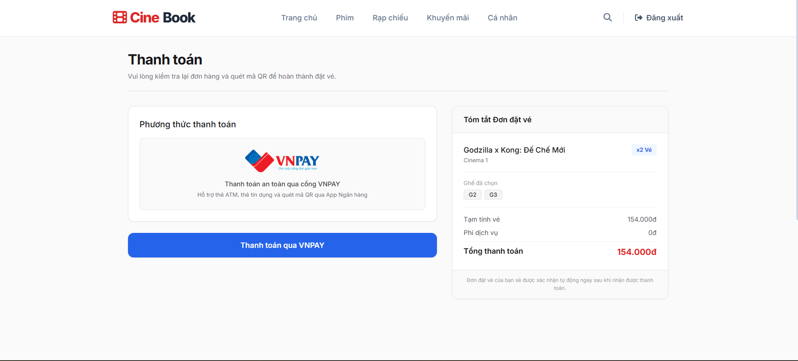

  <em>Hình 3.2.9.2: Sau khi bấm chọn thanh toán -> chuyển sang màn hình đặt vé -> các vé đánh dấu holding</em>

  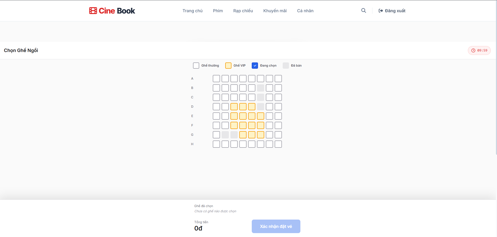

  <em>Hình 3.2.9.3: Người dùng khác xem sẽ thấy ghế đã được bán</em>

#### 3.2.10 TC10

> Written by: 23120060 - Trần Kim Ngân       
Reviewed by:  23120038 - Lê Hoàng Mỹ Hạ

| Test case | TC10 |
| :-------- | :----------|
| Related feature| Đặt vé xem phim / Sơ đồ ghế ngồi |
| Context | Cả User A và User B đều đang ở màn hình sơ đồ ghế của cùng một suất chiếu. Cả hai đang cùng nhắm vào một ghế trống |
| Input Data| - User A chọn ghế F6 và bấm "Xác nhận thanh toán" trước một bước. - Ngay lập tức sau đó, User B cũng click chọn ghế F6 trên màn hình của mình.|
| Expected Output| 1. Ngay khi User A bấm thanh toán, ghế F6 trên màn hình của User B phải lập tức đổi sang màu "Đã khoá".  2. User B không thể click vào ghế F6 nữa (Ghế bị disable).   3. Trường hợp mạng chậm: Nếu User B vẫn kịp bấm chọn và gửi request lên, Backend FastAPI phải check database và trả về lỗi: "Ghế đã có người giữ, vui lòng chọn ghế khác" chứ không được ghi đè dữ liệu. |
| Test steps| Bước 1: Mở 2 trình duyệt đại diện cho User A và User B cùng vào một suất chiếu.  Bước 2: User A click chọn ghế F6 và bấm "Xác nhận thanh toán".  Bước 3: Quan sát màn hình của User B xem ghế F6 có đổi trạng thái hay không.  Bước 4: Thử dùng tài khoản User B click vào ghế F6 và kiểm tra xem hệ thống có chặn lại hoặc hiển thị thông báo lỗi hay không.|
| Actual Output | Các trường hợp đều giống như mong đợi. Nhưng khi User A bấm thanh toán, User B phải load lại trang mới thấy ghế đó "Đã khoá" nhưng User B vẫn cố bấm thanh toán -> Báo lỗi do có người khác đã đặt |
| Result | Passed |

  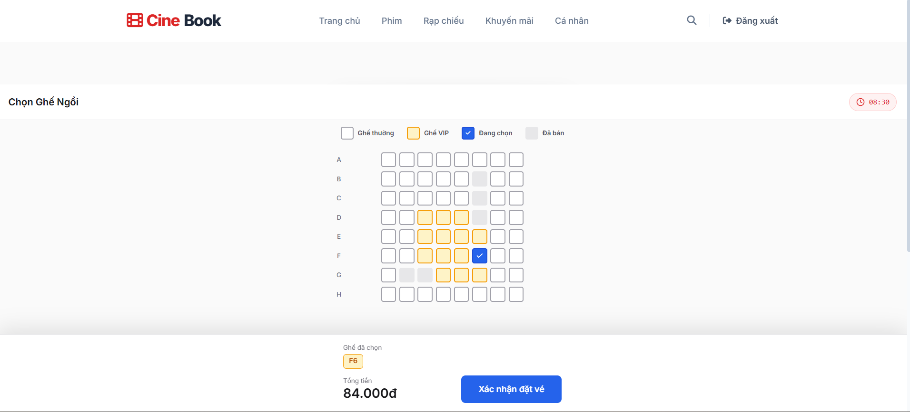

  <em>Hình 3.2.10.1: User B khi bấm chọn cùng lúc với vé đã mua của User A</em>

  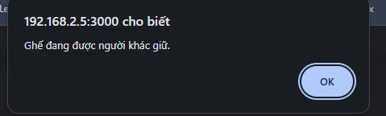

  <em>Hình 3.2.10.2: Hiện thông báo ghế đã được bán</em>

  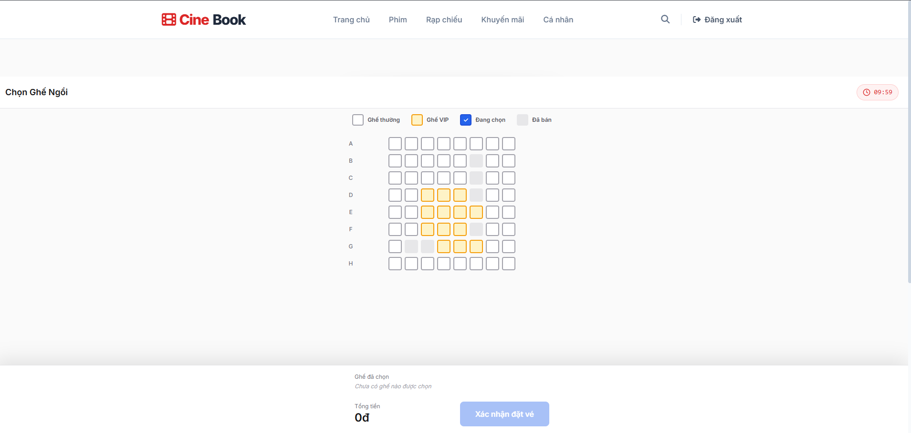

  <em>Hình 3.2.10.3: Nếu User B bấm F5 load lại trang sẽ hiện ghế đã được bán</em>

#### 3.2.11 TC11

> Written by: 23120060 - Trần Kim Ngân       
Reviewed by:  23120049 - Nguyễn Thanh Huyền

| Test case | TC11 |
| :-------- | :----------|
| Related feature| Đặt vé xem phim / Sơ đồ ghế ngồi |
| Context | User đã chọn sẵn một hoặc nhiều ghế trên sơ đồ phòng chiếu (ghế đang có màu "Đang chọn") và đang ở màn hình sơ đồ. |
| Input Data| - Giả định trạng thái ban đầu: Đang chọn 2 ghế: D2 (Thường: 70k) và D3 (VIP: 84k). Tổng tiền hiện tại là 154.000 VNĐ.  - Hành động đầu vào: Click lại một lần nữa vào ghế VIP để hủy chọn.|
| Expected Output| 1. Ghế G10 lập tức chuyển từ màu "Đang chọn" quay về màu trắng (Ghế trống).  2. Ô hiển thị danh sách vé cập nhật giảm xuống, chỉ còn hiển thị: "Ghế đã chọn: A5".  3. Tổng số tiền thanh toán nhảy real-time, trừ đi 110k của ghế G10 và hiển thị đúng: 80.000 VNĐ.  4. Trường hợp đặc biệt: Nếu hủy chọn nốt ghế cuối cùng (không còn ghế nào được chọn), nút "Xác nhận thanh toán" phải tự động bị vô hiệu hóa (Disable). |
| Test steps| Bước 1: Truy cập giao diện chọn ghế và click chọn 2 ghế bất kỳ (Ví dụ: D2 giá 70k và D3 giá 84k). Kiểm tra tổng tiền hiển thị 154k.  Bước 2: Click lại vào ghế D3 trên sơ đồ.  Bước 3: Quan sát màu sắc của ghế D3 xem đã đổi về màu trắng (ghế trống) chưa, và kiểm tra xem tổng tiền có giảm ngay lập tức về 70k hay không.  Bước 4: Click tiếp vào ghế D2 để hủy chọn nốt ghế cuối cùng. Kiểm tra xem nút "Xác nhận thanh toán" có bị disable hay không.|
| Actual Output | Hệ thống hoạt động đúng như mong đợi. |
| Result | Passed |

  

  <em>Hình 3.2.11.1: User đang chọn 2 ghế</em>

  

  <em>Hình 3.2.11.2: User bỏ chọn 1 ghế VIP, tiền tự cập nhật</em>

  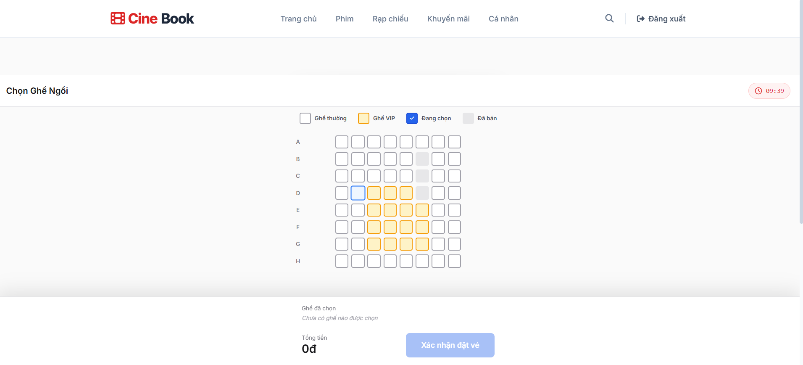

  <em>Hình 3.2.11.3: User bỏ chọn ghế còn lại, tiền trả về 0, không thể xác nhận thanh toán</em>

#### 3.2.12 TC12

| Test case | Khách hàng thanh toán đặt vé thành công qua cổng VNPAY |
| :--- | :--- |
| **Related feature** | Thanh toán (Payment) |
| **Context** | Người dùng đã đăng nhập, đã chọn ghế và đang ở trang Checkout. |
| **Input Data** | Tài khoản đã đăng nhập, đơn hàng đang chờ thanh toán, thẻ test VNPAY Sandbox (NCB: `9704198526191432198` / `NGUYEN VAN A` / `07/15` / OTP `123456`) |
| **Expected Output** | Trình duyệt chuyển sang trang VNPAY Sandbox → sau khi nhập thẻ và xác nhận → tự động quay về trang Receipt hiển thị "Đặt vé Thành công!" kèm thông tin phim, ghế và tổng tiền. |
| **Test steps** | **Bước 1:** Vào trang Checkout, quan sát thông tin đơn hàng và nút "Thanh toán qua VNPAY"   **Bước 2:** Click nút "Thanh toán qua VNPAY" → trình duyệt chuyển sang trang VNPAY Sandbox   **Bước 3:** Chọn phương thức Thẻ ATM, chọn ngân hàng NCB, nhập thông tin thẻ test → nhập OTP `123456` → xác nhận   **Bước 4:** Quan sát trang tự động quay về → hiển thị trang Receipt "Đặt vé Thành công!" với đầy đủ thông tin vé |
| **Actual Output** | Tất cả các bước thực hiện thành công. Trang Checkout hiển thị đúng thông tin đơn hàng. Nút "Thanh toán qua VNPAY" hoạt động, trình duyệt chuyển sang trang VNPAY Sandbox. Sau khi nhập thông tin thẻ NCB và OTP `123456`, trình duyệt tự động quay về trang Receipt hiển thị "Đặt vé Thành công!" kèm đầy đủ thông tin phim, ghế và tổng tiền. Trạng thái đơn hàng cập nhật "Đã thanh toán" trong trang Profile. |
| **Result** | Passed |

  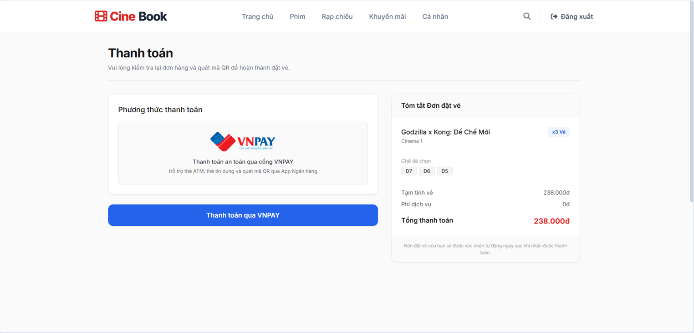

  <em>Hình 3.2.12.1: Trang Checkout hiển thị thông tin đơn hàng và nút thanh toán VNPAY</em>

  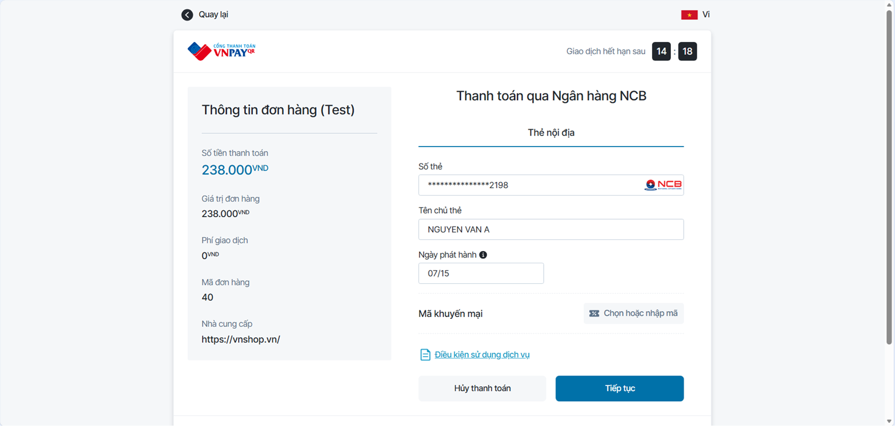

  <em>Hình 3.2.12.2: Trang VNPAY Sandbox - nhập thông tin thẻ NCB thành công</em>

  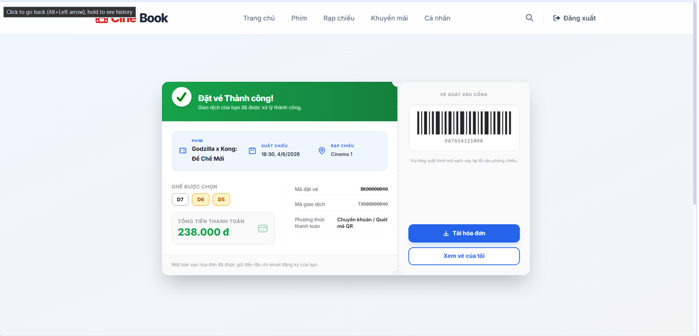

  <em>Hình 3.2.12.3: Trang Receipt hiển thị "Đặt vé Thành công!" sau khi thanh toán</em>

---

#### 3.2.13 TC13

| Test case | Khách hàng thoát khỏi trang thanh toán VNPAY mà không hoàn tất |
| :--- | :--- |
| **Related feature** | Thanh toán (Payment) |
| **Context** | Người dùng đã đăng nhập, đã click "Thanh toán qua VNPAY" và đang ở trang VNPAY Sandbox. Có 2 cách thoát: nhấn nút **"Hủy thanh toán"** (cancel chủ động) hoặc nhấn nút **"Quay lại"** (back navigation về trang trước). |
| **Input Data** | Tài khoản đã đăng nhập, đang ở trang thanh toán VNPAY Sandbox |
| **Expected Output** | Cả 2 trường hợp: sau khi thoát khỏi trang VNPAY → ghế đã chọn phải được hoàn trả về trạng thái trống để người khác có thể đặt. |
| **Test steps** | **Trường hợp A — Nhấn "Hủy thanh toán":**   Bước 1: Click "Thanh toán qua VNPAY" → vào trang VNPAY Sandbox   Bước 2: Nhấn nút "Hủy thanh toán"   Bước 3: Quan sát trang tự động quay về → kiểm tra ghế đã chọn có trở về trạng thái trống không    **Trường hợp B — Nhấn "Quay lại" (back):**   Bước 1: Click "Thanh toán qua VNPAY" → vào trang VNPAY Sandbox   Bước 2: Nhấn nút "← Quay lại" ở góc trên trang VNPAY (back navigation)   Bước 3: Vào lại trang chọn ghế → kiểm tra ghế đã chọn có trở về trạng thái trống không |
| **Actual Output** | **Trường hợp A ("Hủy thanh toán"):** Trình duyệt quay về trang Profile, ghế được hoàn trả về trạng thái trống. Hoạt động đúng.    **Trường hợp B ("Quay lại"):** Trình duyệt điều hướng ngược lại nhưng ghế KHÔNG được hoàn trả — vẫn ở trạng thái đã giữ. Người dùng không thể chọn lại các ghế đó cho đến khi hết 10 phút timeout. |
| **Result** | Trường hợp A: Passed — Trường hợp B: Failed |

  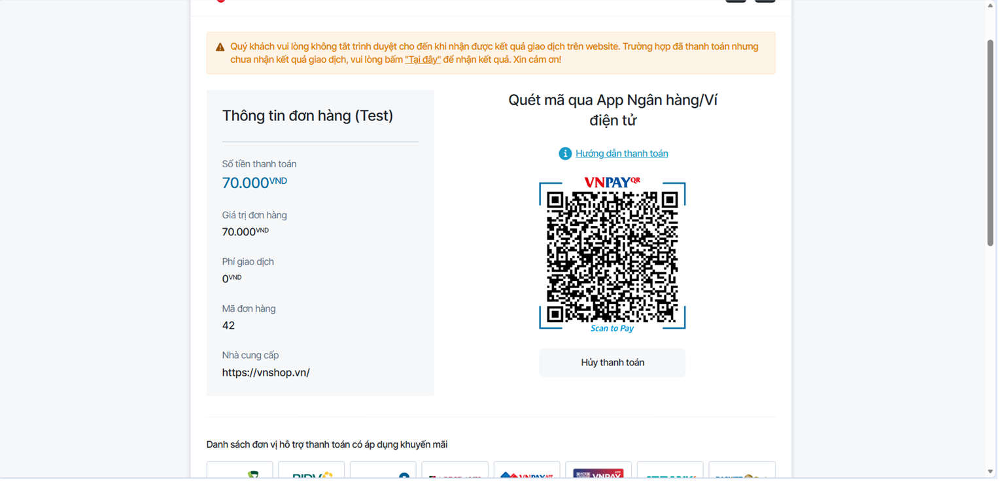

  <em>Hình 3.2.13.1: Trang VNPAY Sandbox - người dùng đang ở màn hình thanh toán</em>

  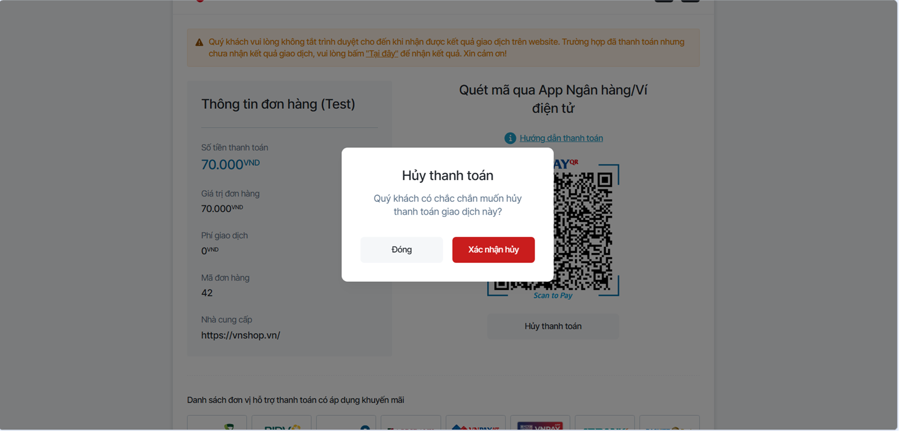

  <em>Hình 3.2.13.2a: Trường hợp A - Nhấn "Hủy thanh toán", trình duyệt quay về và ghế được hoàn trả trạng thái trống</em>

  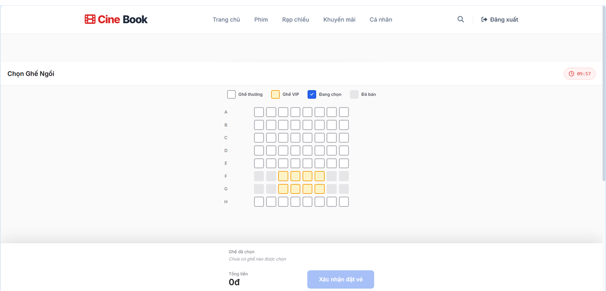

  <em>Hình 3.2.13.2b: Trường hợp B - Nhấn "Quay lại", ghế vẫn ở trạng thái đã giữ</em>

  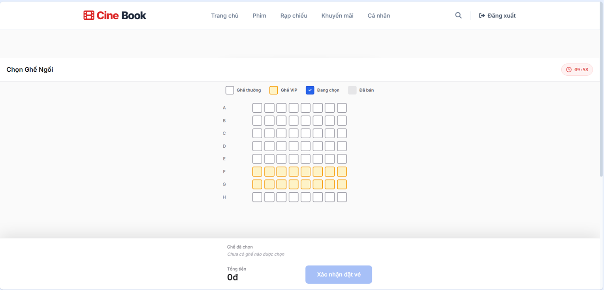

  <em>Hình 3.2.13.3a: Ghế được hoàn trả ở Trường hợp A</em>

---

#### 3.2.14 TC14

| Test case | Hệ thống tự động hủy giữ ghế khi hết thời gian chờ thanh toán |
| :--- | :--- |
| **Related feature** | Thanh toán (Payment) |
| **Context** | Người dùng đã đăng nhập, vừa xác nhận chọn ghế và đang ở trang Checkout. Đồng hồ đếm ngược 10 phút bắt đầu chạy. |
| **Input Data** | Tài khoản đã đăng nhập, đã chọn ghế, không thực hiện thanh toán trong 10 phút |
| **Expected Output** | Sau 10 phút không thanh toán → hệ thống hiển thị thông báo hết thời gian và tự động hủy phiên giữ ghế. Quay lại trang chọn ghế, các ghế đã chọn trước đó trở về trạng thái trống. |
| **Test steps** | **Bước 1:** Chọn ghế → xác nhận đặt vé → chuyển sang trang Checkout, quan sát đồng hồ đếm ngược   **Bước 2:** Không thực hiện thanh toán, chờ hết 10 phút   **Bước 3:** Quan sát thông báo hết thời gian xuất hiện   **Bước 4:** Quay lại trang chọn ghế → kiểm tra các ghế đã chọn trước đó đã trở về trạng thái trống |
| **Actual Output** | Sau 10 phút không thanh toán, hệ thống hiển thị thông báo hết thời gian và tự động hủy phiên giữ ghế. Quay lại trang chọn ghế, các ghế đã chọn trước đó trở về trạng thái trống, có thể chọn lại bình thường. |
| **Result** | Passed |

  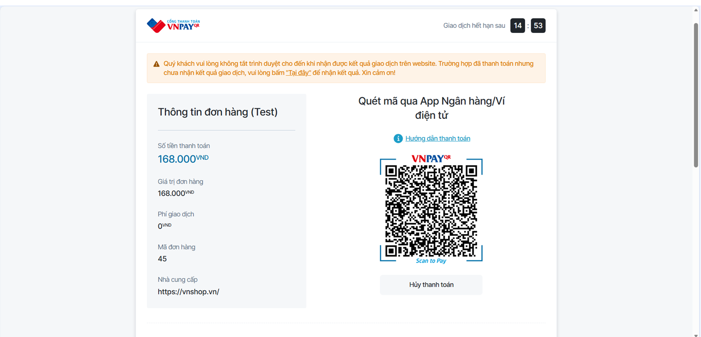

  <em>Hình 3.2.14.1: Hệ thống hiển thị thông báo hết thời gian và tự động hủy phiên giữ ghế sau 10 phút không thanh toán</em>

  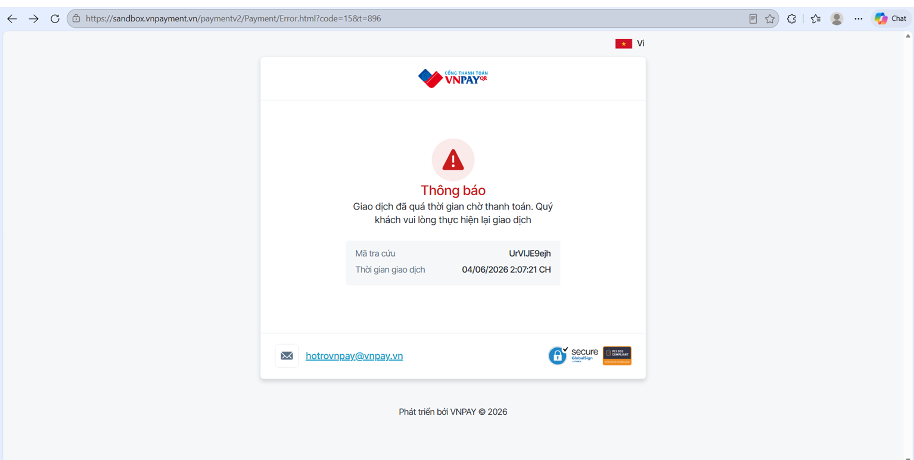

  <em>Hình 3.2.14.2: Hết hạn thanh toán - Trang web gửi thông báo cho người dùng </em>

---

#### 3.2.15 TC15

| Test case | Xem vé điện tử và mã QR sau khi thanh toán thành công |
| :--- | :--- |
| **Related feature** | Xuất vé (Ticketing) |
| **Context** | Người dùng đã hoàn thành thanh toán thành công (TC12), có ít nhất một đơn hàng đã thanh toán. |
| **Input Data** | Tài khoản đã đăng nhập, có đơn hàng đã thanh toán thành công |
| **Expected Output** | Trang Profile hiển thị đơn hàng với nhãn "Đã thanh toán" và nút "Xem mã QR vé". Khi click → popup hiển thị mã QR cho từng ghế đã đặt. Trang Receipt hiển thị đầy đủ thông tin vé và cho phép tải hóa đơn về máy. |
| **Test steps** | **Bước 1:** Vào trang Profile → tìm đơn hàng có nhãn "Đã thanh toán"   **Bước 2:** Click nút "Xem mã QR vé" → quan sát popup hiện ra với mã QR   **Bước 3:** Kiểm tra số lượng QR hiển thị khớp với số ghế đã đặt   **Bước 4:** Vào trang Receipt → click "Tải hóa đơn" → kiểm tra file ảnh được tải về máy |
| **Actual Output** | Trang Profile hiển thị đơn hàng với nhãn "Đã thanh toán" và nút "Xem mã QR vé". Click vào nút → popup hiển thị đúng số mã QR khớp với số ghế đã đặt. Trang Receipt hiển thị đầy đủ thông tin vé. Click "Tải hóa đơn" → file ảnh được tải về máy thành công. |
| **Result** | Passed |

  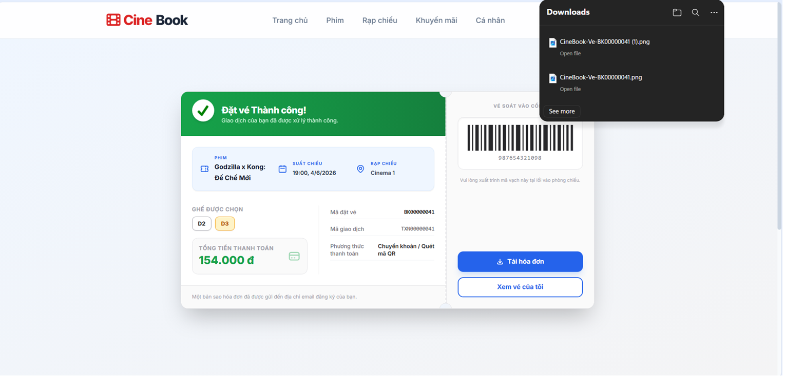

  <em>Hình 3.2.15.1: Trang Profile hiển thị đơn hàng "Đã thanh toán" và cho phép download vé điện tử</em>

## 4. AI Usage Declaration

Gemini, Google, gemini.google.com, truy cập lúc 16:27, 02/06/2026, prompt: “Lên kế hoạch kiểm thử (Test Plan) và lập danh sách 15 kịch bản kiểm thử (Test Cases) cho hệ thống đặt vé phim CineBook tập trung vào 5 feature chính, bao gồm luồng Admin và đặt ghế real-time.”, sử dụng cho việc hoàn thiện Mục 2. Test Plan và Mục 3.1 List of test cases; AI đã hỗ trợ xây dựng chiến lược kiểm thử hộp đen và liệt kê các kịch bản bao phủ luồng ngoại lệ, nhóm đã tinh chỉnh lại luồng nghiệp vụ cho khớp với sơ đồ ERD thực tế và tự thực hiện kiểm thử thủ công

## 5. Presentation

Video thuyết trình: [LINK](https://youtu.be/IcsHp-PFUWs)

## 6. Reflective Report

### Các phần hữu ích

#### A. Đối tượng kiểm thử gắn liền với trạng thái dữ liệu
- Lý do hữu ích: Giúp Backend định hình chính xác logic xử lý xung đột trong Database và giúp Frontend thiết kế UI linh hoạt.
- Ví dụ cụ thể: Trong tính năng Đặt ghế trực quan Real-time (TC09, TC10, TC11), việc định nghĩa rõ luồng chuyển trạng thái ghế (Trống $\rightarrow$ Đang chọn $\rightarrow$ Đã bán) ép buộc đội ngũ Backend phải hiện thực hóa cơ chế khóa dữ liệu (Locking mechanism/Websocket) để xử lý việc hai người dùng cùng nhấn chọn một ghế tại một thời điểm. Nếu không có định hướng này từ Test Plan, hệ thống rất dễ gặp lỗi bất đồng bộ dữ liệu (Race Condition).

#### B. Đặc tả kịch bản ngoại lệ / Luồng lỗi
- Lý do hữu ích: Giúp đội ngũ lập trình xây dựng các hàm bắt lỗi (Error Handling / Validation) chặt chẽ, ngăn chặn hệ thống bị sập khi vận hành thực tế.
- Ví dụ cụ thể: Kịch bản TC14 (Tự động hủy giữ ghế khi hết thời gian chờ thanh toán) và TC06 (Admin tạo suất chiếu thất bại do trùng lịch phòng). Các kịch bản này chỉ ra rằng hệ thống không chỉ chạy luồng đúng, mà Backend bắt buộc phải cài đặt một cơ chế lắng nghe sự kiện để tự động giải phóng ghế trong database sau 5-10 phút, hoặc viết câu lệnh IF-ELSE để check trùng giờ chiếu trước khi lưu một Showtime mới.

#### C. Bảng danh sách rút gọn phân loại theo Feature
- Lý do hữu ích: Tạo ra một góc nhìn tổng quan giúp trưởng nhóm theo dõi tiến độ và kiểm tra độ bao phủ của mã nguồn xem đã code đủ tính năng chưa.
